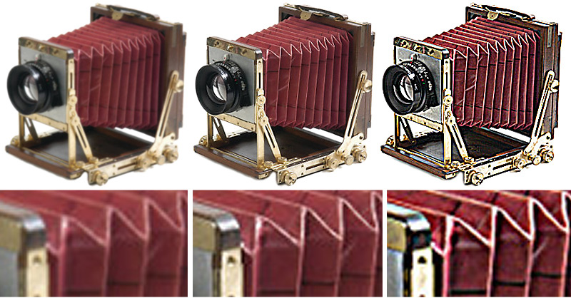

# Ajustes preestablecidos de imagen {#image-presets}

Un ajuste preestablecido de imagen es esencialmente una fórmula que contiene todos los ajustes necesarios para crear una imagen con un tamaño, formato, calidad y nitidez específicos. Los ajustes preestablecidos de imagen son un componente clave del tamaño dinámico.

Si consulta las direcciones URL de casi cualquier cliente de Dynamic Media Classic, es probable que vea un ajuste preestablecido de imagen en uso. Simplemente busque $name$ al final de la dirección URL (con cualquier palabra o palabra sustituida por name).

Los ajustes preestablecidos de imagen acortan la URL, por lo que en lugar de escribir varias instrucciones de servicio de imágenes por solicitud, puede escribir un único ajuste preestablecido de imagen. Por ejemplo, estas dos direcciones URL producen la misma imagen JPEG de 300 x 300 con nitidez, pero la segunda utiliza un ajuste preestablecido de imagen:

El verdadero valor de los ajustes preestablecidos de imagen es que cualquier administrador de la empresa puede actualizar la definición de ese ajuste preestablecido de imagen y afectar a todas las imágenes que utilicen ese formato, sin cambiar ningún código web. Verá los resultados de cualquier cambio en un ajuste preestablecido de imagen después de que se borre la caché de la URL.

>[!IMPORTANT]
>
>Al cambiar el tamaño de una imagen, la relación de aspecto, la relación entre la anchura de la imagen y su altura, siempre debe mantenerse proporcional para que la imagen no se distorsione.

Un ajuste preestablecido de imagen tiene un signo de dólar ($) a ambos lados del nombre y sigue el signo de interrogación (?) separador.

>[!TIP]
>
>Cree un ajuste preestablecido de imagen por tamaño de imagen único en el sitio. Por ejemplo, si necesita una imagen de 350 X 350 para la página de detalles del producto, una imagen de 120 X 120 para las páginas de navegación/búsqueda y una imagen de 90 X 90 para un artículo de venta cruzada/destacado, necesitará tres ajustes preestablecidos de imagen, independientemente de que tenga 500 imágenes o 500 000.

- Obtenga más información sobre [Ajustes preestablecidos de imagen](https://experienceleague.adobe.com/docs/dynamic-media-classic/using/image-sizing/setting-image-presets.html).
- Obtenga información sobre cómo [Crear un ajuste preestablecido de imagen](https://experienceleague.adobe.com/docs/dynamic-media-classic/using/image-sizing/setting-image-presets.html#creating-an-image-preset).

## Ajustes preestablecidos de imagen y enfoque

Los ajustes preestablecidos de imagen suelen cambiar el tamaño de una imagen y cada vez que se cambia el tamaño de una imagen a partir de su tamaño original, se debe agregar nitidez. Esto se debe a que el cambio de tamaño hace que muchos píxeles se fusionen y fusionen en un espacio más pequeño, lo que hace que la imagen parezca suave y borrosa. El enfoque aumenta el contraste de los bordes y las áreas de alto contraste de una imagen.

Esperamos que las imágenes de alta resolución que cargue en Dynamic Media Classic no necesiten ningún enfoque cuando se vean a tamaño completo, cuando se acerquen a ellas. Sin embargo, a un tamaño menor, normalmente es deseable un cierto enfoque.

>[!TIP]
>
>Siempre se afilan al cambiar el tamaño de las imágenes. Esto significa que tendrá que añadir nitidez a cada ajuste preestablecido de imagen (y ajuste preestablecido de visualizador, que analizaremos más adelante).
>
>Si tus imágenes no se ven bien, lo más probable es que se deba a que necesitan nitidez o quizás la calidad haya sido mala para empezar.

La nitidez que hay que añadir es totalmente subjetiva. A algunas personas les gustan las imágenes más suaves, mientras que a otras les gustan mucho. Es fácil mejorar una imagen ejecutando una combinación de filtros de nitidez en una imagen. Sin embargo, también es fácil ir por encima y enfocar una imagen en exceso.

El gráfico siguiente muestra tres niveles de nitidez. De derecha a izquierda no hay nitidez, sólo la cantidad correcta, y demasiado.

Dynamic Media Classic permite tres tipos de nitidez: Enfoque simple, modo de remuestreo y máscara de enfoque.

Obtenga más información sobre [Opciones de enfoque de Dynamic Media Classic](https://experienceleague.adobe.com/docs/dynamic-media-classic/using/master-files/sharpening-image.html#sharpening_an_image).

## Recursos adicionales

[Guía de ajustes preestablecidos de imagen](https://www.adobe.com/content/dam/www/us/en/experience-manager/pdfs/dynamic-media-image-preset-guide.pdf). Configuración que se debe utilizar para optimizar la calidad de imagen y la velocidad de carga.

[La Imagen Es Todo Lo Que Figura En La Parte 2: Nunca es solo un desenfoque: calidad frente a velocidad](https://theblog.adobe.com/image-is-everything-part-2-its-never-just-a-blur-quality-versus-speed/). Una entrada de blog que habla sobre el uso de ajustes preestablecidos de imagen para ofrecer imágenes de alta calidad y de carga rápida.
