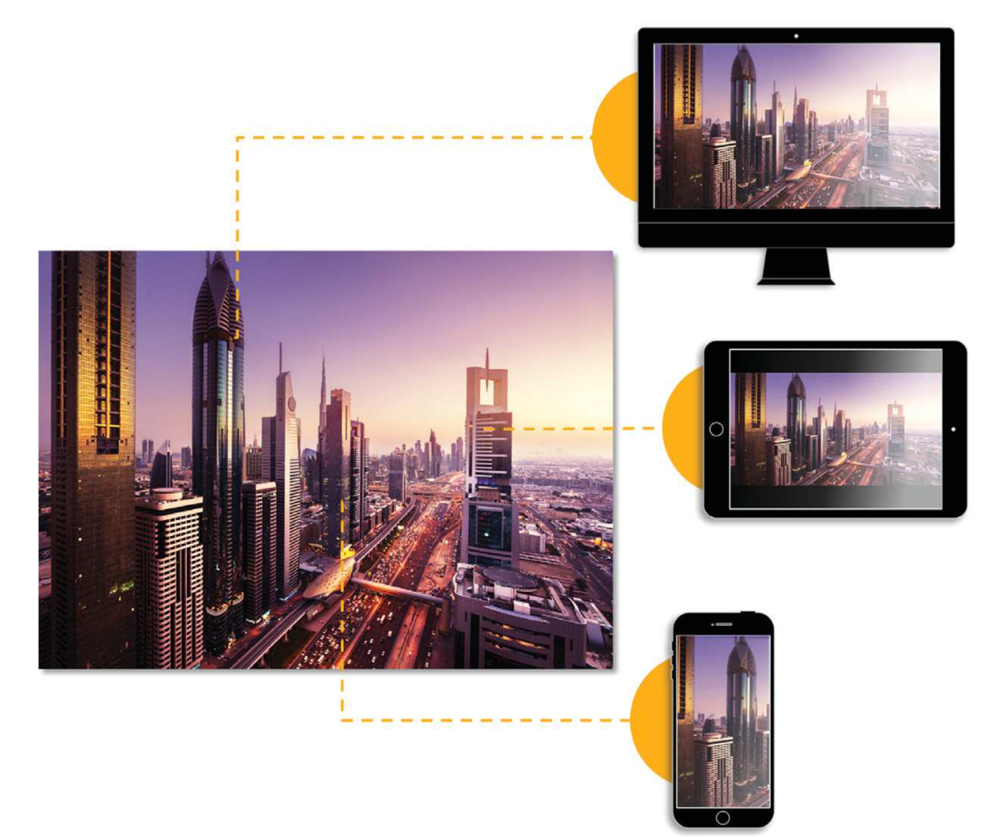

# Imágenes inteligentes {#smart-imaging}

Uno de los aspectos más importantes de la experiencia del cliente en su sitio web o sitio móvil o aplicación es el tiempo de carga de la página. Los clientes a menudo abandonan un sitio o una aplicación si una página tarda demasiado en cargarse. Las imágenes constituyen la mayor parte del tiempo de carga de la página. Las imágenes inteligentes de Dynamic Media Classic mejoran el rendimiento del envío de imágenes al optimizar automáticamente el formato y la calidad de las imágenes en función de las funciones del navegador del cliente. Para ello, aprovecha las capacidades de Adobe Sensei AI y trabaja con los ajustes preestablecidos de imagen existentes. Las imágenes inteligentes reducen el tamaño de las imágenes en un 30% o más — que se traduce en cargas de página más rápidas y mejores experiencias de los clientes.

Smart Imaging también se beneficia del aumento de rendimiento añadido que supone la integración total con el mejor servicio Premium de Adobe. Este servicio encuentra la ruta de Internet óptima entre servidores, redes y puntos de interrelación que tiene la latencia y/o la tasa de pérdida de paquetes más baja que la ruta predeterminada en Internet.

Obtenga más información sobre [Imágenes inteligentes](https://docs.adobe.com/content/help/en/experience-manager-64/assets/dynamic/imaging-faq.html).

## Ventajas de las imágenes inteligentes

Dado que las imágenes constituyen la mayor parte del tiempo de carga de una página, la mejora del rendimiento con las imágenes inteligentes puede tener un impacto profundo en los KPI comerciales, como una mayor conversión, el tiempo invertido en el sitio y una menor tasa de salida hacia otro sitio.

## Funcionamiento de las imágenes inteligentes

Como se ha señalado anteriormente, las imágenes inteligentes aprovechan las capacidades de Adobe Sensei AI y funcionan con los ajustes preestablecidos de imagen existentes para convertir automáticamente imágenes a formatos de imagen de próxima generación óptimos, como WebP, al tiempo que mantienen la fidelidad visual.

Obtenga más información sobre [Cómo funciona la imagen inteligente](https://docs.adobe.com/content/help/en/experience-manager-64/assets/dynamic/imaging-faq.html#how-does-smart-imaging-work), incluidos detalles como los formatos de imagen admitidos (y qué sucede si no utiliza esos formatos) y su impacto en los ajustes preestablecidos de imagen existentes que se están utilizando.

## Efectos de las imágenes inteligentes

Es probable que tenga que realizar cambios en las direcciones URL, los ajustes preestablecidos de imagen y el código del sitio para aprovechar las imágenes inteligentes. Si cumple los requisitos previos para utilizar imágenes inteligentes y solo está trabajando con imágenes en los formatos de imagen JPEG y PNG admitidos, no tiene que realizar ningún cambio.

Las imágenes inteligentes funcionan con imágenes enviadas a través de HTTP, HTTPS y HTTP/2.

>[!NOTE]
>
>Al pasar a Imágenes inteligentes, se borra la caché en la CDN. La caché en la CDN se genera de nuevo en uno o dos días.

Las imágenes inteligentes se incluyen en la licencia existente de Dynamic Media Classic. No hay costos adicionales para esta función. Para aprovecharlo, debe cumplir dos requisitos: tienen una CDN integrada en Adobe y un dominio dedicado. A continuación, debe activarlo para su cuenta porque no se habilita automáticamente.

Activación de inicios de imágenes inteligentes mediante el envío de asistencia técnica mediante una solicitud de |crear un caso de soporte| [https://helpx.adobe.com/enterprise/admin-guide.html/enterprise/using/support-for-experience-cloud.ug.html](https://helpx.adobe.com/enterprise/admin-guide.html/enterprise/using/support-for-experience-cloud.ug.html). La asistencia técnica trabajará con usted para configurar un dominio personalizado que asociará con las imágenes inteligentes. Cambiará un parámetro relacionado con el almacenamiento en caché (Tiempo de vida o TTL) y la compatibilidad borrará la caché. También puede realizar un paso de ensayo opcional, si lo desea, antes de ir a producción. A continuación, cuando las imágenes inteligentes estén activadas, entregará a los clientes imágenes de menor tamaño, pero con la misma calidad que solicitaron. Esto significa que experimentan tiempos de carga de página más rápidos. y todo esto se realiza automáticamente porque Adobe Sensei ayuda a elegir el tamaño más eficiente.

Una vez habilitadas las imágenes inteligentes, deberá comprobar que funcionan correctamente.

Probablemente tenga más preguntas sobre las imágenes inteligentes. Hemos compilado una lista de preguntas más frecuentes con respuestas. Lea las [preguntas más frecuentes](https://docs.adobe.com/content/help/en/experience-manager-64/assets/dynamic/imaging-faq.html).

## Recursos adicionales

Vea el [seminario web a petición del Generador de aptitudes para el rendimiento de la página de optimización de Dynamic Media Classic](https://seminars.adobeconnect.com/pzc1gw0cihpv) para obtener más información sobre las imágenes inteligentes.
