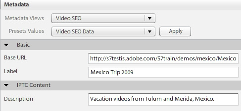

# Información general de vídeo {#video-overview}

Dynamic Media Classic incluye conversión automática de vídeo durante la carga, flujo continuo de vídeo a equipos de escritorio y dispositivos móviles, y conjuntos de vídeos adaptables optimizados para la reproducción según el dispositivo y el ancho de banda. Uno de los aspectos más importantes del vídeo es que el flujo de trabajo es sencillo: está diseñado para que cualquiera pueda usarlo, aunque no estén muy familiarizados con la tecnología de vídeo.

Al final de esta sección del tutorial, sabrá cómo:

- Cargar y codificar vídeo (transcodificar) a diferentes tamaños y formatos
- Elija entre los ajustes preestablecidos de vídeo disponibles para cargar
- Añadir o editar un ajuste preestablecido de codificación de vídeo
- Previsualización de vídeos en un visor de vídeo
- Distribución de vídeo en sitios web y móviles
- Añadir rótulos y marcadores de capítulo a vídeo
- Personalización y publicación de visores de vídeo para usuarios de escritorio y móviles

>[!NOTE]
>
>Todas las direcciones URL de este capítulo son solo ilustrativas; no son vínculos activos.

## Vídeo de descripción general de Dynamic Media Classic

Primero vamos a conocer mejor las posibilidades de vídeo mediante Dynamic Media Classic.

### Funciones y capacidades

La plataforma de vídeo de Dynamic Media Classic oferta todas las partes de la solución de vídeo: la carga, conversión y gestión de vídeos; la capacidad de agregar rótulos y marcadores de capítulo a un vídeo; y la capacidad de utilizar ajustes preestablecidos para una reproducción sencilla.

Facilita la publicación de vídeos adaptables de alta calidad para transmitir en varias pantallas, incluidos los dispositivos móviles de escritorio, iOS, Android, BlackBerry y Windows. Un conjunto de vídeos adaptable agrupa versiones del mismo vídeo codificadas con diferentes velocidades de bits y formatos, como 400 kbps, 800 kbps y 1000 kbps. El equipo de escritorio o dispositivo móvil detecta el ancho de banda disponible.

Además, la calidad de vídeo se cambia de forma dinámica automáticamente si las condiciones de red cambian en el escritorio o en el dispositivo móvil. Además, si un cliente entra en el modo de pantalla completa en un equipo de escritorio, el conjunto de vídeos adaptable responde con una mejor resolución, lo que mejora la experiencia de visualización del cliente. El uso de conjuntos de vídeos adaptables le ofrece la mejor reproducción posible para los clientes que reproducen vídeos de Dynamic Media Classic en varios dispositivos y pantallas.

### Administración de vídeo

Trabajar con vídeo puede ser más complejo que trabajar con imágenes digitales fijas. Con el vídeo, se trata de numerosos formatos y estándares y de la incertidumbre de si la audiencia podrá reproducir los clips. Dynamic Media Classic facilita el trabajo con vídeo, proporcionando muchas herramientas potentes &quot;bajo el capó&quot;, pero eliminando la complejidad de trabajar con ellas.

Dynamic Media Classic reconoce y puede trabajar con muchos formatos de origen diferentes disponibles. Sin embargo, leer el video es solo una parte del esfuerzo — también debe convertir el vídeo a un formato compatible con Web. Dynamic Media Classic se encarga de esto permitiéndole convertir vídeo a vídeo H.264.

La conversión del vídeo usted mismo puede resultar muy complicada usando las muchas herramientas profesionales y entusiastas disponibles. Dynamic Media Classic lo mantiene sencillo al ofrecer ajustes preestablecidos fáciles que se han optimizado para diferentes ajustes de calidad. Sin embargo, si desea algo más personalizado, también puede crear sus propios ajustes preestablecidos.

Si tiene muchos vídeos, apreciará la capacidad de administrar todos sus recursos junto con sus imágenes y otros medios en Dynamic Media Classic. Puede organizar, catalogar y buscar sus recursos, incluidos los recursos de vídeo, con una sólida compatibilidad con metadatos de XMP.

### Reproducción de vídeo

De manera similar al problema de conversión de vídeo para que sea accesible y amigable con la Web, es el problema de la implementación e implementación de vídeo en el sitio. Elegir si comprar un reproductor o construir uno propio, haciéndolo compatible con varios dispositivos y pantallas, y luego mantener los reproductores puede ser una ocupación a tiempo completo.

Nuevamente, el enfoque de Dynamic Media Classic es permitirle elegir el ajuste preestablecido y el visor que se adapte a sus necesidades. Dispone de muchas opciones de visor diferentes y una biblioteca con numerosos ajustes preestablecidos disponibles.

Puede distribuir fácilmente vídeos a la Web y a los dispositivos móviles, ya que Dynamic Media Classic admite vídeo HTML5, lo que significa que puede hacer destinatario a los usuarios que ejecutan varios navegadores, así como a los usuarios de las plataformas Android e iOS. El vídeo de flujo continuo permite una reproducción suave de contenido de alta definición o más largo, mientras que el vídeo progresivo HTML5 tiene ajustes preestablecidos optimizados para la pantalla pequeña.

Los ajustes preestablecidos de visor para vídeo se pueden configurar parcialmente en función del tipo de visor.

Al igual que todos los visores, la integración se realiza mediante una única URL de Dynamic Media Classic por visor o vídeo.

>[!NOTE]
>
>La práctica recomendada es utilizar los visores de vídeo HTML5 de Dynamic Media Classic. Los ajustes preestablecidos utilizados en los visores de vídeo HTML5 son reproductores de vídeo sólidos. Al combinar en un solo reproductor la capacidad de diseñar los componentes de reproducción mediante HTML5 y CSS, tener una reproducción incrustada y utilizar flujo adaptable y progresivo en función de la capacidad del explorador, se amplía el alcance del contenido de medios enriquecidos a los usuarios de escritorio, tablet y móvil, y se garantiza una experiencia de vídeo optimizada.

Una última nota sobre el vídeo de Dynamic Media Classic que puede aplicarse a algunos clientes: no todas las compañías pueden tener la conversión automática, el flujo continuo o los ajustes preestablecidos de vídeo activados para su cuenta. Si, por algún motivo, no puede acceder a las direcciones URL para el flujo continuo de vídeo, este puede ser el motivo. Todavía podrá cargar y publicar vídeo descargado progresivamente y tendrá acceso a todos los visores de vídeo. Sin embargo, para aprovechar todas las funciones de vídeo de Dynamic Media Classic, debe ponerse en contacto con el administrador de cuentas o con el administrador de ventas para habilitar estas funciones.

Obtenga más información sobre [Vídeo en Dynamic Media Classic](https://docs.adobe.com/content/help/en/dynamic-media-classic/using/video/quick-start-video.html).

## Vídeo 101

### Conceptos y terminología básicos de vídeo

Antes de empezar, hablemos de algunos términos con los que debería estar familiarizado para trabajar con el vídeo. Estos conceptos no son específicos de Dynamic Media Classic, y si va a administrar vídeo para un sitio web profesional, le convendría obtener más información sobre el tema. Recomendaremos algunos recursos al final de esta sección.

- **Codificación/transcodificación.** La codificación es el proceso de aplicación de la compresión de vídeo para convertir datos de vídeo sin comprimir y sin procesar en un formato que facilita el trabajo. La transcodificación, aunque similar, hace referencia a la conversión de un método de codificación a otro.

   - Los archivos de vídeo principales creados con software de edición de vídeo suelen ser demasiado grandes y no tienen el formato adecuado para su envío a los destinos en línea. Normalmente se codifican para una reproducción rápida en el escritorio y para la edición, pero no para el envío en la web.
   - Para convertir vídeo digital al formato y las especificaciones adecuados para la reproducción en diferentes pantallas, los archivos de vídeo se transcodifican a un tamaño de archivo más pequeño y eficaz, lo que resulta óptimo para su envío a la Web y a los dispositivos móviles.

- **Compresión de vídeo.** La reducción de la cantidad de datos utilizados para representar imágenes de vídeo digital es una combinación de compresión de imágenes espaciales y compensación de movimiento temporal.

   - La mayoría de las técnicas de compresión tienen pérdida, lo que significa que descartan datos para lograr un tamaño menor.
   - Por ejemplo, el vídeo DV se comprime relativamente poco y permite editar fácilmente el material de origen, aunque es demasiado grande para utilizarlo en la Web o incluso para colocarlo en un DVD.

- **Formatos de archivo.** El formato es un contenedor, similar a un archivo ZIP, que determina cómo se organizan los archivos en el archivo de vídeo, pero no suele ser como se codifican.

   - Los formatos de archivos comunes para vídeo de origen incluyen Windows Media (WMV), QuickTime (MOV), Microsoft AVI y MPEG, entre otros. Los formatos publicados por Dynamic Media Classic son MP4.
   - Un archivo de vídeo suele contener varias pistas: una pista de vídeo (sin audio) y una o varias pistas de audio (sin vídeo) — que están interrelacionadas y sincronizadas.
   - El formato de archivo de vídeo determina cómo se organizan estas distintas pistas de datos y metadatos.

- **Códec.** Un códec de vídeo describe el algoritmo mediante el cual se codifica un vídeo mediante el uso de compresión. El audio también se codifica mediante un códec de audio.

   - Los códecs minimizan la cantidad de información necesaria para reproducir vídeo. En lugar de información sobre cada fotograma individual, solo se almacena la información sobre las diferencias entre un fotograma y el siguiente.
   - Dado que la mayoría de los vídeos cambian poco de un fotograma al siguiente, los códecs permiten tasas de compresión altas, lo que da como resultado tamaños de archivo más pequeños.
   - Un reproductor de vídeo descodifica el vídeo según su códec y, a continuación, muestra una serie de imágenes o fotogramas en la pantalla.
   - Los códecs de vídeo comunes incluyen H.264, On2 VP6 y H.263.

- **Resolución.** Altura y anchura del vídeo en píxeles.

   - El tamaño del vídeo de origen viene determinado por la cámara y la salida del software de edición. Una cámara HD suele crear vídeo de alta resolución de 1920 x 1080; sin embargo, para reproducirlo sin problemas en la Web, se puede reducir la resolución (cambiar el tamaño) a una resolución más pequeña, como 1280 x 720, 640 x 480 o más pequeña.
   - La resolución tiene un impacto directo en el tamaño del archivo, así como en el ancho de banda necesario para reproducir ese vídeo.

- **Mostrar proporción de aspecto.** Proporción de anchura de un vídeo con respecto a la altura de un vídeo. Cuando la proporción de aspecto del vídeo no coincide con la del reproductor, es posible que vea &quot;barras negras&quot; o espacio vacío. Dos proporciones de aspecto comunes utilizadas para mostrar vídeo son:

   - 4:3 (1.33:1). Se utiliza para casi todo el contenido de retransmisión de TV de definición estándar.
   - 16:9 (1.78:1). Se utiliza para casi todo el contenido de TV de pantalla ancha y alta definición (HDTV) y para películas.

- **Velocidad de bits/velocidad de datos.** Cantidad de datos codificados para configurar un solo segundo de reproducción de vídeo (en kilobits por segundo).

   - Generalmente, cuanto menor sea la velocidad de bits, más deseable será para la Web porque se puede descargar más rápidamente. Sin embargo, también puede significar que la calidad es baja debido a la pérdida de compresión.
   - Un buen códec debe equilibrar la velocidad de bits baja con la calidad.

- **Velocidad de fotogramas (fotogramas por segundo o FPS).** Número de fotogramas o imágenes fijas para cada segundo de vídeo. Normalmente, la televisión norteamericana (NTSC) se emite en 29,97 FPS; La televisión europea y asiática (PAL) se emite en 25 FPS; y las películas (analógicas y digitales) suelen estar en 24 (23,976) FPS.

   - Para que las cosas resulten más confusas, también hay marcos progresivos e entrelazados. Cada marco progresivo contiene un marco de imagen completo, mientras que los marcos entrelazados contienen cada dos filas de píxeles en un marco de imagen. A continuación, los fotogramas se reproducen muy rápidamente y parecen mezclarse. La película utiliza un método de exploración progresiva, mientras que el vídeo digital suele estar entrelazado.
   - En general, no importa si el material de origen está entrelazado o no — Dynamic Media Classic conservará el método de exploración en el vídeo convertido.
   - Envío progresivo/de flujo continuo. El flujo continuo de vídeo es el envío de medios en un flujo continuo que se puede reproducir a medida que llega, mientras que el vídeo descargado progresivamente se descarga como cualquier otro archivo desde un servidor y se almacena en caché localmente en el navegador.

Con suerte, este manual le ayudará a comprender las distintas opciones que conlleva el uso de vídeo de Dynamic Media Classic.

## Flujo de trabajo de vídeo

Cuando se trabaja con vídeo en Dynamic Media Classic, se sigue un flujo de trabajo básico similar a trabajar con imágenes.

1. Inicio mediante la carga de archivos de vídeo en Dynamic Media Classic. Para ello, abra el **menú Herramientas** en la parte inferior del panel de extensión de Dynamic Media Classic y elija **Cargar en Dynamic Media Classic > Archivos en el nombre de la carpeta** o **Cargar en Dynamic Media Classic > Carpetas en el nombre de la carpeta**. &quot;Nombre de la carpeta&quot; será la carpeta que esté explorando con la extensión. Los archivos de vídeo pueden ser grandes, por lo que recomendamos el uso de FTP para cargar archivos de gran tamaño. Como parte de la carga, elija uno o varios ajustes preestablecidos de vídeo para codificar los vídeos. El vídeo se puede transcodificar a vídeo MP4 durante la carga. Consulte el tema Ajustes preestablecidos de vídeo para obtener más información sobre el uso y la creación de ajustes preestablecidos de codificación. Obtenga información sobre [Carga y codificación de vídeos](https://docs.adobe.com/content/help/en/dynamic-media-classic/using/video/uploading-encoding-videos.html).
2. Seleccione o seleccione y modifique un ajuste preestablecido de visor de vídeo y previsualización del vídeo. Puede elegir un ajuste preestablecido de visor o personalizar el suyo propio. Si está segmentando usuarios móviles, no tiene que hacer nada aquí porque las plataformas móviles no requieren un visor ni un ajuste preestablecido. Obtenga más información sobre [Vista previa de vídeos en un visor de vídeo](https://docs.adobe.com/content/help/en/dynamic-media-classic/using/video/previewing-videos-video-viewer.html) y [Añadir o editar un ajuste preestablecido de visor de vídeo](https://docs.adobe.com/content/help/en/dynamic-media-classic/using/video/previewing-videos-video-viewer.html#adding-or-editing-a-video-viewer-preset).
3. Ejecute una publicación de vídeo, obtenga la URL e integre. La diferencia principal entre este paso para el flujo de trabajo de vídeo y el flujo de trabajo de imagen es que se ejecutará una publicación de vídeo especial en lugar de (o tal vez así como) la publicación estándar del servicio de imágenes. La integración del visor de vídeo en el escritorio funciona exactamente igual que la integración del visor de imágenes; sin embargo, para los dispositivos móviles es aún más sencilla: todo lo que necesita es la dirección URL del vídeo en sí.

### Acerca de la transcodificación

La transcodificación se definió anteriormente como el proceso de conversión de un método de codificación a otro. En el caso de Dynamic Media Classic, es el proceso de convertir el vídeo de origen de su formato actual a MP4. Esto es necesario antes de que el vídeo aparezca en el navegador de escritorio o en un dispositivo móvil.

Dynamic Media Classic puede gestionar toda la transcodificación por usted, lo que supone una gran ventaja. Puede transcodificar el vídeo usted mismo y cargar los archivos ya convertidos a MP4, pero puede ser un proceso complejo que requiere un software sofisticado. A menos que sepa lo que está haciendo, normalmente no obtendrá buenos resultados en su primer intento.

Dynamic Media Classic no solo convierte los archivos por usted, sino que también facilita el uso de los ajustes preestablecidos. Realmente no necesitas saber mucho sobre el lado técnico de este proceso — todo lo que debe saber es aproximadamente el tamaño final que desea obtener del sistema y una sensación del ancho de banda que tienen los usuarios finales.

Aunque los ajustes preestablecidos son prácticos y cubren la mayoría de las necesidades, a veces se desea algo más personalizado. En ese caso, puede crear su propio ajuste preestablecido de codificación. En Dynamic Media Classic, un ajuste preestablecido de codificación se denomina ajuste preestablecido de vídeo. Esto se explicará más adelante en este capítulo.

### Acerca del flujo continuo

Otra característica importante que vale la pena destacar es el flujo de vídeo, una característica estándar de la plataforma de vídeo de Dynamic Media Classic. Los medios de transmisión se reciben constantemente y se presentan al usuario final mientras se entregan. Esto es importante y deseable por varias razones.

El flujo continuo suele requerir menos ancho de banda que la descarga progresiva, ya que solo se entrega la parte del vídeo que se ve. Los visores y el servidor de flujo continuo de vídeo de Dynamic Media Classic utilizan la detección automática del ancho de banda para ofrecer el mejor flujo posible para la conexión a Internet de un usuario.

Con el flujo continuo, los inicios de vídeo se reproducen antes que con otros métodos. También hace un uso más eficiente de los recursos de red porque solo las partes del vídeo que se ven se envían al cliente.

El otro método de envío es la descarga progresiva. En comparación con el vídeo de flujo continuo, solo hay una ventaja consistente para la descarga progresiva: no necesita un servidor de flujo continuo para distribuir el vídeo. Y esto es, por supuesto, donde entra Dynamic Media Classic. Dynamic Media Classic cuenta con un servidor de transmisión integrado en la plataforma, por lo que no necesita el coste adicional o molesto de mantener este hardware dedicado.

El vídeo de descarga progresiva se puede servir desde cualquier servidor web normal. Aunque esto puede ser conveniente y potencialmente rentable, tenga en cuenta que las descargas progresivas tienen capacidades limitadas de búsqueda y navegación y que los usuarios pueden acceder y reutilizar el contenido. En algunas situaciones, como la reproducción detrás de servidores de seguridad de red muy estrictos, el envío de flujo puede bloquearse; en estos casos, puede ser deseable revertir al envío progresivo.

La descarga progresiva es una buena opción para los aficionados o los sitios web con requisitos de poco tráfico; si no les importa si su contenido se almacena en caché en el ordenador del usuario; si solo necesitan publicar vídeos de menor duración (menos de 10 minutos); o si sus visitantes no pueden recibir vídeo de flujo continuo por alguna razón.

Tendrá que transmitir el vídeo si necesita funciones avanzadas y control sobre el envío de vídeo, y/o si necesita mostrar vídeo a audiencias más grandes (por ejemplo, varios cientos de visores simultáneos), rastrear e informar el uso o las estadísticas de visualización, o si desea oferta de los visores para obtener la mejor experiencia de reproducción interactiva.

Por último, si le preocupa proteger los medios por problemas de propiedad intelectual o de gestión de derechos, la transmisión proporciona un envío de vídeo más seguro, ya que los medios no se guardan en la caché del cliente cuando se transmiten por flujo continuo.

## Ajustes preestablecidos de vídeo

Al cargar el vídeo, puede elegir entre uno o varios ajustes preestablecidos que contengan la configuración para convertir el vídeo principal a un formato compatible con la Web mediante codificación. Los ajustes preestablecidos de vídeo tienen dos tipos: ajustes preestablecidos de vídeo adaptables y ajustes preestablecidos de codificación única.

Consulte [Ajustes preestablecidos de vídeo disponibles](https://docs.adobe.com/content/help/en/dynamic-media-classic/using/setup/application-setup.html#video-presets-for-encoding-video-files).

Los ajustes preestablecidos de vídeo adaptables se activan de forma predeterminada, lo que significa que están disponibles para la codificación. Si desea utilizar un ajuste preestablecido de codificación única, su administrador deberá activarlo para que aparezca en la lista de ajustes preestablecidos de vídeo.

Obtenga información sobre cómo [activar o desactivar ajustes preestablecidos de vídeo](https://docs.adobe.com/content/help/en/dynamic-media-classic/using/video/uploading-encoding-videos.html#activating-or-deactivating-video-encoding-presets).

Puede elegir uno de los muchos ajustes preestablecidos integrados que se incluyen con Dynamic Media Classic o puede crear el suyo propio; sin embargo, no se seleccionan ajustes preestablecidos para la carga de forma predeterminada. En otras palabras, **si no selecciona un ajuste preestablecido de vídeo en el momento de la carga, el vídeo no se convertirá y puede que no se pueda publicar**. Sin embargo, puede convertir el vídeo sin conexión y cargarlo y publicarlo correctamente. Los ajustes preestablecidos de vídeo solo son necesarios si desea que Dynamic Media Classic realice la conversión por usted.

Al cargar, seleccione un ajuste preestablecido de vídeo seleccionando **Opciones de vídeo** en el panel Opciones de trabajo. A continuación, elija si desea codificar para Equipo, Móvil o Tablet.

- El equipo es para uso de escritorio. Aquí encontrará ajustes preestablecidos más grandes (como HD) que consumen más ancho de banda.
- Móvil y Tablet crean vídeo MP4 para dispositivos como iPhone y smartphones Android. La única diferencia entre Móvil y Tablet es que los ajustes preestablecidos de Tablet suelen tener un ancho de banda mayor, ya que se basan en el uso de WiFi. Los ajustes preestablecidos móviles están optimizados para un uso 3G más lento.

### Preguntas que debe hacerse antes de elegir un ajuste preestablecido

Al elegir un ajuste preestablecido, debe conocer la audiencia y el material de archivo de origen. ¿Qué sabes de tu cliente? ¿Cómo están viendo el video? con un monitor de ordenador o un dispositivo móvil?

¿Cuál es la resolución del vídeo? Si elige un ajuste preestablecido que sea más grande que el original, puede obtener un vídeo borroso/pixelado. Está bien que el vídeo sea más grande que el ajuste preestablecido, pero no elija un ajuste preestablecido mayor que el vídeo de origen.

¿Cuál es su proporción de aspecto? Si ve barras negras alrededor del vídeo convertido, entonces elige la proporción de aspecto incorrecta. Dynamic Media Classic no puede detectar automáticamente esta configuración porque primero tendría que examinar el archivo antes de la carga.

### Desglose de las opciones de vídeo

Los ajustes preestablecidos de vídeo determinan cómo se codificará el vídeo especificando estos ajustes. Si no está familiarizado con estos términos, consulte el tema Conceptos básicos de video y terminología, más arriba.

- **Proporción de aspecto.** Generalmente estándar 4:3 o pantalla ancha16:9.
- **Tamaño.** Es la misma que la resolución de visualización y se mide en píxeles. Esto está relacionado con la proporción de aspecto. A una proporción de 16:9, un vídeo será de 432 x 240 píxeles, mientras que a 4:3 será de 320 x 240 píxeles.
- **FPS.** Las velocidades de fotogramas estándar son de 30, 25 o 24 fotogramas por segundo (fps), según el estándar de vídeo: NTSC, PAL o Película. Este ajuste no importa, ya que Dynamic Media Classic siempre usará la misma velocidad de fotogramas que el vídeo de origen.
- **Formato.** Será MP4.
- **Ancho de banda.** Ésta es la velocidad de conexión deseada del usuario de destino. ¿Tienen una conexión a Internet rápida o lenta? ¿Normalmente utilizan equipos de escritorio o dispositivos móviles? Esto también se relaciona con la resolución (tamaño), ya que cuanto mayor sea el vídeo, mayor será el ancho de banda necesario.

### Determinación de la velocidad de datos o la &quot;velocidad de bits&quot; para el vídeo

El cálculo de la velocidad de bits del vídeo es uno de los factores menos conocidos para ofrecer vídeo a la Web, pero potencialmente el más importante, ya que afecta directamente a la experiencia del usuario. Si establece una velocidad de bits demasiado alta, tendrá una calidad de vídeo alta, pero un rendimiento deficiente. Los usuarios con conexiones a Internet más lentas se verán obligados a esperar mientras el vídeo se detenga constantemente a medida que se reproduce. Sin embargo, si la pones demasiado baja, la calidad se verá afectada. Dentro del ajuste preestablecido de vídeo, Dynamic Media Classic sugiere una serie de datos en función del ancho de banda del destinatario. Ese es un buen lugar para el inicio.

Sin embargo, si desea averiguarlo usted mismo, necesitará una calculadora de velocidad de bits. Se trata de una herramienta que suelen utilizar los profesionales y entusiastas del vídeo para estimar la cantidad de datos que caben en un flujo o un medio determinado (como un DVD).

## Creación de un ajuste preestablecido de vídeo personalizado

A veces puede que necesite un ajuste preestablecido de vídeo especial que no coincida con la configuración de los ajustes preestablecidos de vídeo de codificación integrados. Esto puede suceder si tiene un vídeo personalizado de un tamaño específico, como un vídeo creado a partir de un software de animación 3D o uno que se haya recortado de su tamaño original. Quizás quiera experimentar con diferentes ajustes de ancho de banda para ofrecer vídeo de mayor o menor calidad. En cualquier caso, deberá crear un ajuste preestablecido de vídeo de codificación única personalizado.

### Flujo de trabajo de ajustes preestablecidos de vídeo

1. Los ajustes preestablecidos de vídeo se encuentran en **Ajustes > Ajustes de aplicación > Ajustes preestablecidos de vídeo**. Aquí encontrará una lista de todos los ajustes preestablecidos de codificación disponibles para su compañía.

   - Cada cuenta de vídeo de flujo continuo tiene docenas de ajustes preestablecidos listos para usar y si crea sus propios ajustes preestablecidos personalizados los verá aquí también.
   - Puede filtrar por tipo mediante el menú desplegable. Los ajustes preestablecidos se dividen en Equipo, Móvil y Tablet.
      

2. La columna Activo permite elegir si desea mostrar todos los ajustes preestablecidos durante la carga o solo los que elija. Si se encuentra en EE. UU., es posible que desee desmarcar los ajustes preestablecidos PAL europeos y, si se encuentra en UK/ EMEA, desmarque los ajustes preestablecidos NTSC.
3. Haga clic en el botón **Añadir** para crear un ajuste preestablecido personalizado. Se abrirá el panel Añadir ajuste preestablecido de vídeo. El proceso aquí es similar a la creación de un ajuste preestablecido de imagen.
4. Primero, asígnele un **Nombre de ajuste preestablecido** para que aparezca en la lista de ajustes preestablecidos. En el ejemplo anterior, este ajuste preestablecido es para vídeos de tutoriales de captura de pantalla.
5. La **Descripción** es opcional, pero proporciona a los usuarios información sobre herramientas que describirá el propósito de este ajuste preestablecido.
6. El **Sufijo de archivo de codificación** se agregará al final del nombre del vídeo que está creando aquí. Recuerde que tendrá un vídeo principal y este vídeo codificado, que es una derivación del vídeo principal, y que no hay dos recursos en Dynamic Media Classic que puedan tener el mismo ID de recurso.
7. **Los** dispositivos de reproducción permiten elegir el formato de archivo de vídeo que desea (Equipo, Móvil o Tablet). Recuerde que Mobile y Tablet producen el mismo formato MP4. Dynamic Media Classic solo necesita saber en qué categoría colocar el ajuste preestablecido; sin embargo, la diferencia teórica es que los ajustes preestablecidos de Tablet suelen ser para una conexión a Internet más rápida, ya que todos admiten WiFi.
8. **Las** tasas de datos de destinatario son algo que tendrá que averiguar usted mismo, aunque puede ver un rango sugerido en la imagen de abajo. También puede arrastrar el control deslizante hasta el ancho de banda de destinatario aproximado. Para obtener una cifra más precisa, utilice una calculadora de velocidad de bits. Hay un poco de prueba y error involucrados.

   

9. Configure la **Proporción de aspecto** del archivo de origen. Esta configuración está directamente ligada al tamaño, más abajo. Si elige _Personalizado_, tendrá que introducir manualmente la anchura y la altura.
10. Si elige una proporción de aspecto, defina un valor para **Tamaño de resolución** y Dynamic Media Classic rellenará el otro valor automáticamente. Sin embargo, para una relación de aspecto personalizada, rellene ambos valores. Su tamaño debe estar en línea con la velocidad de datos. Si establece una velocidad de datos muy baja y un tamaño grande, se espera que la calidad sea deficiente.
11. Haga clic en **Guardar** para guardar el ajuste preestablecido. A diferencia de cualquier otro ajuste preestablecido, no es necesario publicar en este momento, ya que los ajustes preestablecidos solo sirven para cargar archivos. Más adelante, tendrá que publicar los vídeos codificados, pero los ajustes preestablecidos solo sirven para el uso interno de Dynamic Media Classic.
12. Para comprobar que el ajuste preestablecido de vídeo está en la lista de carga, vaya a **Cargar**.Elija **Opciones de trabajo** y expanda **Opciones de vídeo**. El ajuste preestablecido se mostrará en la categoría del dispositivo de reproducción elegido (Equipo, Móvil o Tablet).

Obtenga más información sobre [Añadir o editar un ajuste preestablecido de vídeo](https://docs.adobe.com/content/help/en/dynamic-media-classic/using/video/uploading-encoding-videos.html#adding-or-editing-a-video-encoding-preset).

## Añadir subtítulos al vídeo

En algunos casos, puede resultar útil añadir subtítulos al vídeo. por ejemplo, si necesita proporcionar el vídeo a los visores en varios idiomas, pero no desea duplicar el audio en otro idioma o volver a grabarlo en idiomas distintos. Además, la adición de subtítulos proporciona buena accesibilidad para las personas con problemas de audición y utiliza subtítulos opcionales. Dynamic Media Classic facilita la adición de subtítulos a los vídeos.

Obtenga información sobre cómo [Añadir subtítulos a vídeo](https://docs.adobe.com/content/help/en/dynamic-media-classic/using/video/adding-captions-video.html).

## Añadir marcadores de capítulo en el vídeo

Para vídeos de formato largo, es probable que los usuarios aprecien la capacidad y la comodidad que ofrece la navegación por el vídeo con marcadores de capítulo. Dynamic Media Classic permite añadir fácilmente marcadores de capítulo a un vídeo.

Obtenga información sobre cómo [Añadir marcadores de capítulo a vídeo](https://docs.adobe.com/content/help/en/dynamic-media-classic/using/video/adding-chapter-markers-video.html).

## Temas de implementación de vídeo

### Publicar y copiar URL

El último paso del flujo de trabajo de Dynamic Media Classic es publicar el contenido del vídeo. Sin embargo, el vídeo tiene su propio trabajo de publicación, denominado Publicación de servidor de vídeo, que se encuentra en Avanzado.

Obtenga información sobre cómo [publicar su vídeo](https://docs.adobe.com/content/help/en/dynamic-media-classic/using/video/deploying-video-websites-mobile-sites.html#publishing-video).

Una vez que haya ejecutado una publicación de vídeo, podrá obtener una URL para acceder a los vídeos y a los ajustes preestablecidos de visor de Dynamic Media Classic disponibles en un navegador web. Sin embargo, si personaliza o crea su propio ajuste preestablecido de visor de vídeo, deberá ejecutar una publicación independiente del servidor de imágenes.

- Obtenga información sobre cómo [vincular una dirección URL a un sitio móvil o a un sitio web](https://docs.adobe.com/content/help/en/dynamic-media-classic/using/video/deploying-video-websites-mobile-sites.html#linking-a-video-url-to-a-mobile-site-or-a-website).
- Obtenga información sobre cómo [incrustar el visor de vídeos en una página Web](https://docs.adobe.com/content/help/en/dynamic-media-classic/using/video/deploying-video-websites-mobile-sites.html#embedding-the-video-viewer-on-a-web-page).

También puede implementar el vídeo con un reproductor de vídeo integrado personalizado o de terceros.

Obtenga información sobre cómo [implementar vídeo con un reproductor de vídeo de terceros](https://docs.adobe.com/content/help/en/dynamic-media-classic/using/video/deploying-video-websites-mobile-sites.html#deploying-video-using-a-third-party-video-player).

Además, si también desea utilizar las miniaturas de vídeo: la imagen extraída del vídeo — también deberá ejecutar una publicación de Image Server. Esto se debe a que la imagen en miniatura del vídeo reside en el servidor de imágenes, mientras que el vídeo mismo se encuentra en el servidor de vídeo. Las miniaturas de vídeo se pueden utilizar en los resultados de búsqueda de vídeo, en las listas de reproducción de vídeo y como &quot;fotograma de póster&quot; inicial que aparece en el visor de vídeo antes de reproducir el vídeo.

Obtenga más información sobre [Uso de miniaturas de vídeo](https://docs.adobe.com/content/help/en/dynamic-media-classic/using/video/deploying-video-websites-mobile-sites.html#working-with-video-thumbnails).

### Selección y personalización de un ajuste preestablecido de visor

El proceso de selección y personalización de un ajuste preestablecido de visor es exactamente el mismo que el de las imágenes. Puede crear un nuevo ajuste preestablecido o modificar uno existente, guardarlo con un nuevo nombre, editarlo y ejecutar una publicación de servicio de imágenes. Todos los ajustes preestablecidos de visor se publican en el servidor de imágenes, no solo los ajustes preestablecidos de imágenes, por lo que debe ejecutar una publicación de imágenes para ver los ajustes preestablecidos nuevos o modificados.

>[!TIP]
>
>Ejecute una publicación de servicio de imágenes después de publicar el servidor de vídeo para publicar las imágenes en miniatura asociadas con los vídeos.

## Optimización del motor de búsqueda de vídeo

La optimización de los motores de búsqueda (SEO) es el proceso de mejorar la visibilidad de un sitio Web o una página Web en los motores de búsqueda. Aunque los motores de búsqueda destacan en la recopilación de información sobre contenido basado en texto, no pueden adquirir de manera adecuada información sobre video a menos que se les proporcione esta información. Mediante la optimización para motores de búsqueda de vídeos de Dynamic Media Classic, puede utilizar metadatos para proporcionar a los motores de búsqueda descripciones de los vídeos. La función de optimización para motores de búsqueda de vídeos le permite crear mapas de vídeos y recursos mRSS.

- **Mapa del sitio** de vídeos. Informa a Google exactamente dónde y qué contenido del vídeo se encuentra en un sitio. En consecuencia, los vídeos se pueden buscar completamente en Google. Por ejemplo, un mapa de vídeos puede especificar el tiempo de ejecución y las categorías de los vídeos.
- **mRSS feed**. Utilizado por los editores de contenido para alimentar archivos de medios en Yahoo! Búsqueda de vídeo. Google admite el protocolo de mapas de vídeos y recursos mRSS para enviar información a los motores de búsqueda.

Cuando se crean mapas de vídeos y recursos mRSS, se decide qué campos de metadatos de los archivos de vídeo se incluirán. De este modo, se describen los vídeos a los motores de búsqueda para que éstos puedan dirigir el tráfico a los vídeos de su sitio Web con mayor precisión.

Una vez creado el mapa del sitio o la fuente, puede hacer que Dynamic Media Classic lo publique automáticamente, lo publique manualmente o simplemente genere un archivo que pueda editar posteriormente. Además, Dynamic Media Classic puede generar y publicar este archivo automáticamente todos los días.

Al final del proceso, enviará el archivo o la dirección URL a su motor de búsqueda. Esta tarea se realiza fuera de Dynamic Media Classic; sin embargo, lo analizaremos brevemente a continuación.

### Requisitos para los archivos Sitemap/mRSS

Para que Google y otros motores de búsqueda no rechacen sus archivos, deben tener el formato adecuado e incluir ciertos datos. Dynamic Media Classic generará un archivo con el formato adecuado; sin embargo, si la información no está disponible para algunos de sus vídeos, no se incluirá en el archivo.

Los campos obligatorios son Página de aterrizaje (la dirección URL de la página que proporciona el vídeo, no la dirección URL del vídeo en sí), Título y Descripción. Cada vídeo debe tener una entrada para estos elementos o no se incluirá en el archivo generado. Los campos opcionales son Etiquetas y Categoría.

Hay otros dos campos obligatorios — URL de contenido, la URL del recurso de vídeo en sí y la miniatura, una URL para una imagen en miniatura del vídeo: sin embargo, Dynamic Media Classic rellenará automáticamente esos valores.

El flujo de trabajo recomendado consiste en incrustar estos datos en los vídeos antes de cargarlos mediante metadatos de XMP, y Dynamic Media Classic los extraerá al cargarlos. Usaría una aplicación como Adobe Bridge — que se incluye con todas las aplicaciones de Adobe Creative Cloud — para rellenar los datos en campos de metadatos estándar.

Si sigue este método, no tendrá que introducir manualmente estos datos con Dynamic Media Classic. Sin embargo, también puede utilizar los ajustes preestablecidos de metadatos en Dynamic Media Classic para introducir rápidamente los mismos datos cada vez.

Para obtener más información sobre ese tema, consulte [Visualización, Añade y exportación de metadatos](https://docs.adobe.com/content/help/en/dynamic-media-classic/using/managing-assets/viewing-adding-exporting-metadata.html).

Una vez completados los metadatos, podrá verlos en la Vista de detalles de ese recurso de vídeo. Las palabras clave también pueden estar presentes, pero se encuentran en la ficha Palabras clave.

- Obtenga más información sobre [Añadir palabras clave](https://docs.adobe.com/content/help/en/dynamic-media-classic/using/managing-assets/viewing-adding-exporting-metadata.html#add-or-edit-keywords).
- Obtenga más información sobre [Optimización para motores de búsqueda de vídeos](https://docs.adobe.com/content/help/en/dynamic-media-classic/using/setup/video-seo-search-engine-optimization.html).
- Obtenga información sobre [Configuración para la optimización para motores de búsqueda de vídeos](https://docs.adobe.com/content/help/en/dynamic-media-classic/using/setup/video-seo-search-engine-optimization.html#choosing-video-seo-settings).

#### Configuración de la optimización para motores de búsqueda de vídeos

Configuración de inicios de la optimización para motores de búsqueda de vídeos con la elección del tipo de formato que desea, el método de generación y los campos de metadatos que deben incluirse en el archivo.

1. Vaya a **Ajustes > Ajustes de aplicación > Optimización para motores de búsqueda de vídeos > Configuración**.
2. En el menú **Modo de generación**, elija un formato de archivo. El valor predeterminado es Desactivado, por lo que para habilitarlo, elija Mapa del sitio de vídeo, mRSS o Ambos.
3. Elija si desea generar de forma automática o manual. Para simplificar, recomendamos configurarlo en **Modo automático**. Si elige Automático, defina también la opción **Marcar para publicación** o bien los archivos no se activarán. Los archivos de mapa del sitio y RSS son tipos de documento XML y deben publicarse como cualquier otro recurso. Utilice uno de los modos manuales si no tiene toda la información lista ahora, o sólo desea realizar una generación única.
4. Rellene las etiquetas de metadatos que se utilizarán en los archivos. Este paso no es opcional. Como mínimo, debe incluir los tres campos marcados con un asterisco (\*): **Página de aterrizaje**, **Título** y **Descripción**. Para utilizar los metadatos para estas tareas, arrastre y suelte los campos del panel Metadatos de la derecha en un campo correspondiente del formulario. Dynamic Media Classic rellenará automáticamente el campo de marcador de posición con los datos reales de cada vídeo. No es necesario utilizar campos de metadatos. Puede escribir texto estático aquí, pero ese mismo texto aparecerá para cada vídeo.
5. Una vez que haya introducido la información en los tres campos obligatorios, Dynamic Media Classic habilitará los botones **Guardar** y **Guardar y generar**. Haga clic en uno para guardar la configuración. Utilice **Guardar** si está en modo automático y desea que Dynamic Media Classic genere los archivos más adelante. Utilice **Guardar y generar** para crear el archivo inmediatamente.

### Prueba y publicación del mapa de vídeos, la fuente mRSS o ambos archivos

Los archivos generados aparecerán en el directorio raíz (base) de su cuenta.

Estos archivos deben publicarse, ya que la herramienta de optimización para motores de búsqueda de vídeos no puede ejecutar una publicación por sí misma. Mientras estén marcados para publicación, se enviarán a los servidores de publicación la próxima vez que se ejecute una publicación.

Después de la publicación, los archivos estarán disponibles con este formato de URL.

Ejemplo:

### Envío a los motores de búsqueda

El paso final del proceso es enviar los archivos o las direcciones URL a los motores de búsqueda. Dynamic Media Classic no puede realizar este paso por usted; sin embargo, suponiendo que envía la URL y no el archivo XML en sí, la fuente debe actualizarse la próxima vez que se genere el archivo y se publique.

El método para enviar a su motor de búsqueda variará, sin embargo para Google usted utiliza las herramientas de Google Webmaster. Una vez allí, vaya a **Configuración del sitio > Mapas del sitio** y haga clic en el botón **Enviar un mapa del sitio**. Aquí puede colocar la URL de Dynamic Media Classic en los archivos SEO.

### Informe de la optimización para motores de búsqueda de vídeos

Dynamic Media Classic proporciona un informe que muestra cuántos videos se incluyeron correctamente en los archivos y, lo que es más importante, cuáles no se incluyeron debido a errores. Para acceder al informe, vaya a **Ajustes > Ajustes de aplicación > Optimización para motores de búsqueda de vídeos > Informe**.

## Implementación móvil para vídeo MP4

Dynamic Media Classic no incluye ajustes preestablecidos de visor para dispositivos móviles porque los visores no son necesarios para reproducir vídeo en dispositivos móviles compatibles. Siempre que se codifique al formato H.264 MP4 — mediante conversión al cargar o precodificación en el escritorio: las tablets y los smartphones compatibles podrán reproducir sus vídeos sin necesidad de un visor. Esto es compatible con dispositivos Android e iOS (iPhone y iPad).

El motivo por el que no se requiere ningún visor es que ambas plataformas tienen compatibilidad nativa con H.264. Puede incrustar el vídeo en una página web HTML5 o incrustar el vídeo en la propia aplicación, y los sistemas operativos Android e iOS proporcionarán un controlador para reproducir el vídeo.

Debido a esto, Dynamic Media Classic no le proporciona una URL a un visor para dispositivos móviles, sino que le proporciona una URL directamente al vídeo. En la ventana Previsualización de un vídeo MP4, habrá vínculos para escritorio y móvil. La URL móvil apunta al vídeo publicado.

Una cosa importante que hay que tener en cuenta sobre los vídeos publicados es que la URL lista la ruta completa del vídeo, no solo el ID del recurso. Cuando se trata de imágenes, se llama a la imagen por su ID de recurso, independientemente de la estructura de carpetas. Sin embargo, para el vídeo, también debe especificar la estructura de carpetas. En las direcciones URL anteriores, el vídeo se almacena en la ruta:

Esto también se puede expresar como nombre de compañía/ruta de carpeta/nombre del vídeo.

### Método 1: Reproducción del explorador: Código HTML5

Para incrustar el vídeo MP4 en una página web, utilice la etiqueta de vídeo HTML5.

Este método también funcionará para la Web de escritorio, aunque puede que tenga problemas con la compatibilidad con el explorador — no todos los exploradores web de escritorio admiten de forma nativa el vídeo H.264, incluido Firefox.

### Método 2: Reproducción de aplicaciones en iOS — Media Player Framework

También puede incrustar el vídeo MP4 de Dynamic Media Classic en el código de la aplicación móvil. A continuación se muestra un ejemplo genérico para iOS que utiliza el entorno de Media Player y que se proporciona únicamente con fines ilustrativos:

## Recursos adicionales

Vea el [Generador de habilidades de Dynamic Media: Vídeo en un seminario web a petición de Dynamic Media Classic](https://seminars.adobeconnect.com/p2ueiaswkuze) para aprender a utilizar las funciones de vídeo en Dynamic Media Classic.
