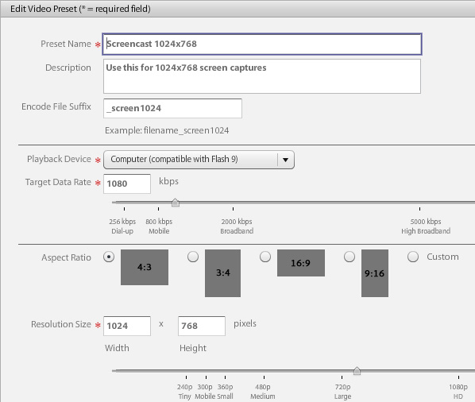

# Información general en vídeo {#video-overview}

Dynamic Media Classic incluye conversión automática de vídeo durante la carga, flujo de vídeo a equipos de escritorio y dispositivos móviles, y conjuntos de vídeos adaptables optimizados para la reproducción en función del dispositivo y el ancho de banda. Una de las cosas más importantes del vídeo es que el flujo de trabajo es sencillo: está diseñado para que cualquier persona pueda utilizarlo, incluso si no está familiarizada con la tecnología de vídeo.

Al final de esta sección del tutorial, sabrá cómo hacer lo siguiente:

- Cargar y codificar (transcodificar) vídeo en diferentes tamaños y formatos
- Elija entre los ajustes preestablecidos de vídeo disponibles para cargar
- Añadir o editar un ajuste preestablecido de codificación de vídeo
- Vista previa de vídeos en un visor de vídeos
- Implementación de vídeo en sitios web y móviles
- Adición de subtítulos y marcadores de capítulo al vídeo
- Personalización y publicación de visores de vídeo para usuarios de escritorio y móviles

>[!NOTE]
>
>Todas las direcciones URL de este capítulo son solo ilustrativas; no son vínculos activos.

## Descripción general del vídeo de Dynamic Media Classic

Primero vamos a tener una mejor idea de las posibilidades de vídeo con Dynamic Media Classic.

### Funciones y capacidades

La plataforma de vídeo de Dynamic Media Classic ofrece todas las partes de la solución de vídeo: la carga, conversión y administración de vídeos; la capacidad de añadir subtítulos y marcadores de capítulo a un vídeo; y la capacidad de utilizar ajustes preestablecidos para facilitar la reproducción.

Esto facilita la publicación de vídeos adaptables de alta calidad para su transmisión por streaming en varias pantallas, incluidos dispositivos de escritorio, iOS, Android™, BlackBerry® y dispositivos móviles Windows. Un conjunto de vídeos adaptable agrupa versiones del mismo vídeo que se codifican a diferentes velocidades de bits y formatos, como 400 kbps, 800 kbps y 1000 kbps. El equipo de escritorio o dispositivo móvil detecta el ancho de banda disponible.

Además, la calidad de vídeo cambia automáticamente si las condiciones de red cambian en el escritorio o en el dispositivo móvil. Además, si un cliente entra en modo de pantalla completa en un equipo de escritorio, el conjunto de vídeos adaptable responde usando una mejor resolución, mejorando así la experiencia de visualización del cliente. El uso de conjuntos de vídeos adaptables proporciona la mejor reproducción posible para los clientes que reproducen vídeo de Dynamic Media Classic en varias pantallas y dispositivos.

### Administración de vídeo

Trabajar con vídeo puede ser más complejo que trabajar con imágenes fijas digitales. Con el vídeo se afrontan numerosos formatos y estándares, así como la incertidumbre de si el público puede reproducir los clips. Dynamic Media Classic facilita el trabajo con vídeo, ya que proporciona muchas herramientas potentes &quot;bajo el capó&quot;, pero elimina la complejidad de trabajar con ellas.

Dynamic Media Classic reconoce y puede trabajar con muchos formatos de origen diferentes disponibles. Sin embargo, leer el vídeo es solo una parte del esfuerzo: también debe convertir el vídeo a un formato compatible con la web. Dynamic Media Classic se encarga de esto permitiéndole convertir vídeo a vídeo H.264.

Convertir el vídeo usted mismo puede complicarse con las muchas herramientas profesionales y entusiastas disponibles. Dynamic Media Classic simplifica el proceso al ofrecer ajustes preestablecidos sencillos que están optimizados para diferentes ajustes de calidad. Sin embargo, si desea algo más personalizado, también puede crear sus propios ajustes preestablecidos.

Si tiene muchos vídeos, apreciará la capacidad de administrar todos sus recursos junto con sus imágenes y otros medios en Dynamic Media Classic. XMP Puede organizar, catalogar y buscar sus recursos, incluidos los de vídeo, con una sólida compatibilidad con los metadatos de los recursos de vídeo, y de la aplicación de metadatos.

### Reproducción de vídeo

Similar al problema de convertir vídeo para que sea fácil de usar y accesible para la web, es el problema de implementar e implementar vídeo en el sitio. Elegir si comprar un reproductor o construir el suyo propio, haciéndolo compatible con varios dispositivos y pantallas, y luego mantener sus reproductores puede ser una ocupación a tiempo completo.

De nuevo, el enfoque de Dynamic Media Classic es permitirle elegir el ajuste preestablecido y el visualizador que se adapte a sus necesidades. Tiene muchas opciones de visualizador diferentes y una biblioteca de numerosos ajustes preestablecidos disponibles.

Puede enviar vídeo fácilmente a la web y a los dispositivos móviles, ya que Dynamic Media Classic admite vídeo de HTML5, lo que significa que puede segmentar usuarios que usen varios navegadores, así como usuarios de plataformas Android™ y iOS. El streaming de vídeo permite una reproducción fluida de contenido de alta definición o más largo, mientras que el vídeo progresivo HTML 5 tiene ajustes preestablecidos optimizados para la pantalla pequeña.

Los ajustes preestablecidos del visor para vídeo se pueden configurar parcialmente según el tipo de visor.

Al igual que todos los visores, la integración se realiza mediante una sola URL de Dynamic Media Classic por visor o vídeo.

>[!NOTE]
>
>Se recomienda utilizar los visores de vídeo Dynamic Media Classic HTML5. Los ajustes preestablecidos utilizados en los visores de vídeo de HTML5 son reproductores de vídeo robustos. Al combinar en un solo reproductor la capacidad de diseñar los componentes de reproducción mediante HTML5 y CSS, tener reproducción integrada y utilizar flujo continuo adaptable y progresivo según la capacidad del explorador, puede ampliar el alcance del contenido multimedia enriquecido a los usuarios de escritorio, tableta y móvil, y garantizar una experiencia de vídeo optimizada.

Una última nota sobre el vídeo de Dynamic Media Classic que puede aplicarse a algunos clientes: es posible que no todas las empresas tengan habilitada la conversión automática, la transmisión o los ajustes preestablecidos de vídeo en su cuenta. Si, por alguna razón, no puede acceder a las direcciones URL de streaming de vídeo, esta puede ser la razón. Puede cargar y publicar vídeos descargados progresivamente y tener acceso a todos los visores de vídeo. Sin embargo, para aprovechar todas las funciones de vídeo de Dynamic Media Classic, póngase en contacto con su administrador de cuentas o de ventas para activar estas funciones.

Más información sobre [Vídeo en Dynamic Media Classic](https://experienceleague.adobe.com/docs/dynamic-media-classic/using/video/quick-start-video.html).

## Vídeo 101

### Conceptos básicos de vídeo y terminología

Antes de comenzar, vamos a hablar de algunos términos con los que debe estar familiarizado para trabajar con vídeo. Estos conceptos no son específicos de Dynamic Media Classic y, si va a administrar vídeos para un sitio web profesional, le recomendamos que obtenga más información sobre este tema. Recomendamos algunos recursos al final de esta sección.

- **Codificación/transcodificación.** La codificación es el proceso de aplicación de compresión de vídeo para convertir datos de vídeo sin comprimir en un formato que facilita el trabajo con. La transcodificación, aunque es similar, hace referencia a la conversión de un método de codificación a otro.

   - Los archivos de vídeo principales creados con software de edición de vídeo suelen ser demasiado grandes y no tienen el formato adecuado para su envío a destinos en línea. Normalmente se codifican para una reproducción rápida en el escritorio y para la edición, pero no para la entrega a través de la web.
   - Para convertir el vídeo digital al formato y las especificaciones adecuados para su reproducción en diferentes pantallas, los archivos de vídeo se transcodifican en un tamaño de archivo más pequeño y eficaz, óptimo para su entrega a la web y a dispositivos móviles.

- **Compresión de vídeo.** Reducir la cantidad de datos utilizados para representar imágenes de vídeo digital y es una combinación de compresión de imágenes espaciales y compensación de movimiento temporal.

   - La mayoría de las técnicas de compresión son deficientes, lo que significa que tiran los datos para lograr un tamaño más pequeño.
   - Por ejemplo, el vídeo DV se comprime relativamente poco y permite editar fácilmente el material de archivo de origen, aunque es demasiado grande para utilizarlo en la web o incluso colocarlo en un DVD.

- **Formatos de archivo.** El formato es un contenedor, similar a un archivo ZIP, que determina cómo se organizan los archivos en el archivo de vídeo, pero normalmente no cómo se codifican.

   - Los formatos de archivo comunes para el vídeo de origen incluyen Windows Media (WMV), QuickTime (MOV), Microsoft® AVI y MPEG, entre otros. Los formatos publicados por Dynamic Media Classic son MP4.
   - Un archivo de vídeo suele contener varias pistas, una pista de vídeo (sin audio) y una o más pistas de audio (sin vídeo), que están interrelacionadas y sincronizadas.
   - El formato del archivo de vídeo determina cómo se organizan estas diferentes pistas de datos y metadatos.

- **Códec.** Un códec de vídeo describe el algoritmo mediante el cual se codifica un vídeo mediante compresión. El audio también se codifica mediante un códec de audio.

   - Los códecs minimizan la cantidad de información necesaria para reproducir vídeo. En lugar de almacenar información sobre cada fotograma individual, sólo se almacena información sobre las diferencias entre uno y otro.
   - Debido a que la mayoría de los vídeos cambian poco de un fotograma a otro, los códecs permiten altas tasas de compresión, lo que da como resultado tamaños de archivo más pequeños.
   - Un reproductor de vídeo descodifica el vídeo según su códec y, a continuación, muestra una serie de imágenes o fotogramas en la pantalla.
   - Los códecs de vídeo comunes incluyen H.264, On2 VP6 y H.263.

- **Resolución.** Altura y anchura del vídeo en píxeles.

   - El tamaño del vídeo de origen viene determinado por la cámara y la salida del software de edición. Una cámara HD crea vídeo de alta resolución de 1920 x 1080; sin embargo, para reproducirlo sin problemas en la web, debe reducirlo (cambiar su tamaño) a una resolución más pequeña, como 1280 x 720, 640 x 480 o más pequeña.
   - La resolución afecta directamente al tamaño de archivo y al ancho de banda necesario para reproducir ese vídeo.

- **Proporción de aspecto de visualización.** relación entre la anchura de un vídeo y la altura de un vídeo. Cuando la proporción de aspecto del vídeo no coincide con la del reproductor, es posible que vea &quot;barras negras&quot; o espacio vacío. Dos relaciones de aspecto comunes que se utilizan para mostrar vídeo son:

   - 4:3 (1.33:1). Se utiliza para casi todo el contenido de emisiones de TV de definición estándar.
   - 16:9 (1.78:1). Se utiliza para casi todo el contenido de TV de alta definición (HDTV) y películas de pantalla ancha.

- **Velocidad de bits/velocidad de datos.** Cantidad de datos codificados para representar un solo segundo de reproducción de vídeo (en kilobits por segundo).

   - Por lo general, cuanto menor sea la velocidad de bits, más deseable será para la web, ya que se puede descargar más rápidamente. Sin embargo, también puede significar que la calidad es baja debido a la pérdida de compresión.
   - Un buen códec debe equilibrar una tasa de bits baja con una buena calidad.

- **Velocidad de fotogramas (fotogramas por segundo o FPS).**: el número de fotogramas o imágenes fijas por segundo de vídeo. Normalmente, la televisión norteamericana (NTSC) se emite en 29,97 FPS; la televisión europea y asiática (PAL) se emite en 25 FPS; y las películas (analógicas y digitales) suelen emitirse en 24 (23,976) FPS.

   - Para hacer las cosas más confusas, también hay marcos progresivos y entrelazados. Cada cuadro progresivo contiene un cuadro de imagen completo, mientras que los cuadros entrelazados contienen cada dos filas de píxeles en un cuadro de imagen. A continuación, los fotogramas se reproducen rápidamente y parecen fusionarse. La película utiliza un método de exploración progresiva, mientras que el vídeo digital suele estar entrelazado.
   - En general, no importa si el material de archivo de origen está entrelazado o no: Dynamic Media Classic conservará el método de exploración en el vídeo convertido.
   - Transmisión/Envío progresivo. La transmisión de vídeo es el envío de medios en un flujo continuo que se puede reproducir a medida que llega, mientras que el vídeo descargado progresivamente se descarga como cualquier otro archivo de un servidor y se almacena en caché localmente en el explorador.

Esperamos que este manual le ayude a comprender las diversas opciones involucradas en el uso de vídeo de Dynamic Media Classic.

## Flujo de trabajo de vídeo

Al trabajar con vídeo en Dynamic Media Classic, sigue un flujo de trabajo básico similar al de las imágenes.

1. Comience por cargar archivos de vídeo en Dynamic Media Classic. Para ello, abra el **Menú Herramientas** en la parte inferior del panel de extensión de Dynamic Media Classic y elija **Cargar a Dynamic Media Classic > Archivos a nombre de carpeta** o **Cargar a Dynamic Media Classic > Carpetas a nombre de carpeta**. &quot;Folder name&quot; es la carpeta que esté explorando actualmente con la extensión. Los archivos de vídeo pueden ser grandes, por lo que le recomendamos que utilice FTP para cargar archivos grandes. Como parte de la carga, elija uno o más ajustes preestablecidos de vídeo para codificar los vídeos. El vídeo se puede transcodificar en vídeo MP4 durante la carga. Consulte el tema Ajustes preestablecidos de vídeo a continuación para obtener más información sobre el uso y la creación de ajustes preestablecidos de codificación. Obtenga información sobre [cargar y codificar vídeos](https://experienceleague.adobe.com/docs/dynamic-media-classic/using/video/uploading-encoding-videos.html).
2. Seleccione o seleccione y modifique un ajuste preestablecido de visualizador de vídeo y previsualice el vídeo. Puede elegir un ajuste preestablecido de visualizador o personalizar el suyo propio. Si va a segmentar usuarios móviles, no tiene que hacer nada aquí porque las plataformas móviles no requieren un visualizador ni un ajuste preestablecido. Obtenga más información sobre [Vista previa de vídeos en un visor de vídeo](https://experienceleague.adobe.com/docs/dynamic-media-classic/using/video/previewing-videos-video-viewer.html) y [Adición o edición de un ajuste preestablecido de visor de vídeo](https://experienceleague.adobe.com/docs/dynamic-media-classic/using/video/previewing-videos-video-viewer.html#adding-or-editing-a-video-viewer-preset).
3. Ejecute un Publish de vídeo, obtenga la dirección URL e integre. La principal diferencia entre este paso para el flujo de trabajo de vídeo y el de imagen es que se ejecuta un Publish de vídeo especial en lugar de (o tal vez y) la publicación estándar del servicio de imágenes. La integración del visor de vídeo en el escritorio funciona exactamente igual que la integración del visor de imágenes, sin embargo, para los dispositivos móviles es aún más sencilla: todo lo que necesita es la URL del propio vídeo.

### Acerca de la transcodificación

La transcodificación se definió anteriormente como el proceso de conversión de un método de codificación a otro. En el caso de Dynamic Media Classic, es el proceso de convertir el vídeo de origen de su formato actual a MP4. Es necesario para que el vídeo aparezca en el navegador de escritorio o en un dispositivo móvil.

Dynamic Media Classic puede encargarse de todas las transcodificaciones, lo que supone una gran ventaja. Puede transcodificar el vídeo usted mismo y cargar los archivos ya convertidos a MP4, pero ese puede ser un proceso complejo que requiere software sofisticado. A menos que sepa lo que está haciendo, normalmente no obtendrá buenos resultados en su primer intento.

Dynamic Media Classic no solo convierte los archivos por usted, sino que también lo facilita al proporcionar ajustes preestablecidos fáciles de usar. Realmente no necesita saber mucho sobre el aspecto técnico de este proceso; todo lo que debe saber es aproximadamente el tamaño final que desea obtener del sistema y una sensación del ancho de banda que tienen los usuarios finales.

Aunque los ajustes preestablecidos creados son útiles y cubren la mayoría de las necesidades, a veces desea algo más personalizado. En ese caso, puede crear su propio ajuste preestablecido de codificación. En Dynamic Media Classic, un ajuste preestablecido de codificación se denomina Ajuste preestablecido de vídeo. Esto se explica más adelante en este capítulo.

### Acerca de Streaming

Otra característica importante que vale la pena destacar es la transmisión de vídeo, una función estándar de la plataforma de vídeo de Dynamic Media Classic. Los medios de streaming se reciben y presentan constantemente a un usuario final mientras se entregan. Esto es importante y deseable por varias razones.

El streaming suele requerir menos ancho de banda que la descarga progresiva porque solo se entrega la parte del vídeo que se ve. El servidor y los visores de flujo de vídeo de Dynamic Media Classic utilizan la detección automática del ancho de banda para ofrecer el mejor flujo posible para la conexión a Internet de un usuario.

Con el streaming, el vídeo comienza a reproducirse antes que con otros métodos. También hace un uso más eficiente de los recursos de red porque sólo las partes del vídeo que se ven se envían al cliente.

El otro método de entrega es la descarga progresiva. En comparación con el streaming de vídeo, la descarga progresiva solo ofrece una ventaja consistente: no necesita un servidor de streaming para transmitir el vídeo. Y aquí es, por supuesto, donde entra Dynamic Media Classic: Dynamic Media Classic tiene un servidor de streaming integrado en la plataforma, por lo que no necesita la molestia o el coste adicional de mantener esta pieza de hardware dedicada.

El vídeo de descarga progresiva se puede servir desde cualquier servidor web normal. Aunque esto puede ser conveniente y potencialmente rentable, tenga en cuenta que las descargas progresivas tienen capacidades limitadas de búsqueda y navegación, y los usuarios pueden acceder y reutilizar su contenido. En algunas situaciones, como la reproducción detrás de estrictos servidores de seguridad de red, la entrega de streaming puede bloquearse; en estos casos, puede ser deseable volver a la entrega progresiva.

La descarga progresiva es una buena opción para los aficionados o sitios web que tienen requisitos de poco tráfico; si no les importa si su contenido se almacena en caché en el equipo de un usuario; si solo necesitan entregar vídeos de menor duración (menos de 10 minutos); o si sus visitantes no pueden recibir vídeo de streaming por alguna razón.

Es necesario transmitir el vídeo si necesita funciones avanzadas y control sobre la entrega de vídeo, o si necesita mostrar vídeo a audiencias más grandes (por ejemplo, varios 100 visualizadores simultáneos), rastrear y notificar el uso o las estadísticas de visualización, o desea ofrecer a sus visualizadores la mejor experiencia de reproducción interactiva.

Por último, si le preocupa proteger los medios en caso de problemas de propiedad intelectual o de gestión de derechos, la transmisión proporciona una entrega de vídeo más segura, ya que los medios no se guardan en la caché del cliente cuando se transmiten.

## Ajustes preestablecidos de vídeo

Al cargar el vídeo, puede elegir uno o más ajustes preestablecidos que contengan la configuración para convertir el vídeo principal a un formato compatible con la web mediante codificación. Los ajustes preestablecidos de vídeo se dividen en dos tipos: ajustes preestablecidos de vídeo adaptable y ajustes preestablecidos de codificación única.

Ver [Ajustes preestablecidos de vídeo disponibles](https://experienceleague.adobe.com/docs/dynamic-media-classic/using/setup/application-setup.html#video-presets-for-encoding-video-files).

Los ajustes preestablecidos de vídeo adaptables están activados de forma predeterminada, lo que significa que están disponibles para la codificación. Si desea utilizar un ajuste preestablecido de codificación única, el administrador debe activarlo para que aparezca en la lista de ajustes preestablecidos de vídeo.

Obtenga información sobre cómo [activar o desactivar ajustes preestablecidos de vídeo](https://experienceleague.adobe.com/docs/dynamic-media-classic/using/video/uploading-encoding-videos.html#activating-or-deactivating-video-encoding-presets).

Puede elegir uno de los muchos ajustes preestablecidos creados que se incluyen con Dynamic Media Classic o puede crear los suyos propios; sin embargo, no se selecciona ningún ajuste preestablecido para la carga de forma predeterminada. En otras palabras, **si no selecciona un ajuste preestablecido de vídeo durante la carga, el vídeo no se convertirá y es posible que no se pueda publicar**. Sin embargo, puede convertir el vídeo a sí mismo sin conexión y cargar y publicar muy bien. Los ajustes preestablecidos de vídeo solo son necesarios si desea que Dynamic Media Classic convierta automáticamente.

Al cargar, seleccione un ajuste preestablecido de vídeo eligiendo **Opciones de vídeo** en el panel Opciones de trabajo. A continuación, elija si desea codificar para equipo, móvil o tableta.

- El equipo es para uso de escritorio. Aquí suele encontrar ajustes preestablecidos más grandes (como HD) que consumen más ancho de banda.
- Los dispositivos móviles y tabletas crean vídeo MP4 para dispositivos como iPhone y smartphones Android™. La única diferencia entre móvil y tableta es que los ajustes preestablecidos de tableta suelen tener un ancho de banda más alto, ya que se basan en el uso de WiFi. Los ajustes preestablecidos móviles están optimizados para un uso de 3G más lento.

### Preguntas que debe hacerse antes de elegir un ajuste preestablecido

Al elegir un ajuste preestablecido, debe conocer la audiencia y el material de archivo de origen. ¿Qué sabes de tu cliente? ¿Cómo están viendo el video, con un monitor de computadora o un dispositivo móvil?

¿Con qué resolución es su vídeo? Si elige un ajuste preestablecido más grande que el original, puede obtener un vídeo borroso o pixelado. Está bien si el vídeo es más grande que el ajuste preestablecido, pero no elija un ajuste preestablecido más grande que el vídeo de origen.

¿Cuál es su relación de aspecto? Si ve barras negras alrededor del vídeo convertido, elige la relación de aspecto incorrecta. Dynamic Media Classic no puede detectar automáticamente esta configuración porque primero tendría que examinar el archivo antes de cargarlo.

### Desglose de opciones de vídeo

Los ajustes preestablecidos de vídeo determinan cómo se codifica el vídeo especificando estos ajustes. Si no conoce estos términos, consulte el tema Conceptos básicos de vídeo y terminología, más arriba.

- **Proporción de aspecto.** Estándar 4:3 o pantalla panorámica 16:9.
- **Tamaño.** Es igual a la resolución de pantalla y se mide en píxeles. Esto está relacionado con la relación de aspecto. Con una relación de 16:9, un vídeo es de 432 x 240 píxeles, mientras que con una relación de 4:3 es de 320 x 240 píxeles.
- **FPS.** La velocidad de fotogramas estándar es de 30 fotogramas por segundo, 25 fotogramas por segundo o 24 fotogramas por segundo (fps), según el estándar de vídeo: NTSC, PAL o Film. Esta configuración no importa, ya que Dynamic Media Classic siempre utiliza la misma velocidad de fotogramas que el vídeo de origen.
- Formato **.** Este es MP4.
- **Ancho de banda.** Esta es la velocidad de conexión deseada del usuario de destino. ¿Tienen una conexión a Internet rápida o lenta? ¿Suelen utilizar equipos de escritorio o dispositivos móviles? Esto también está relacionado con la resolución (tamaño), ya que cuanto mayor sea el vídeo, mayor ancho de banda requerirá.

### Determinación de la velocidad de datos o &quot;velocidad de bits&quot; para el vídeo

El cálculo de la velocidad de bits de vídeo es uno de los factores menos conocidos para ofrecer vídeo en la web, pero potencialmente el más importante porque afecta directamente a la experiencia del usuario. Si establece una tasa de bits demasiado alta, tendrá una alta calidad de vídeo, pero un rendimiento deficiente. Los usuarios con conexiones a Internet más lentas se ven obligados a esperar, ya que el vídeo se pausa constantemente a medida que se reproduce. Sin embargo, si lo establece demasiado bajo, la calidad se resiente. Dentro del ajuste preestablecido de vídeo, Dynamic Media Classic sugiere una serie de datos en función del ancho de banda de destino. Ese es un buen lugar para empezar.

Sin embargo, si quieres averiguarlo tú mismo, necesitarás una calculadora de tasa de bits. Se trata de una herramienta que suelen utilizar los profesionales del vídeo y los aficionados para estimar la cantidad de datos que caben en un flujo o pieza de medio determinado (como un DVD).

## Crear un ajuste preestablecido de vídeo personalizado

A veces, es posible que necesite un ajuste preestablecido de vídeo especial que no coincida con los ajustes de los ajustes preestablecidos de vídeo de codificación integrados. Esto puede ocurrir si tiene un vídeo personalizado de un tamaño específico, como un vídeo creado a partir de un software de animación 3D o uno que se haya recortado de su tamaño original. Tal vez desee experimentar con diferentes configuraciones de ancho de banda para ofrecer vídeo de mayor o menor calidad. Independientemente del caso, cree un ajuste preestablecido de vídeo de codificación única personalizado.

### Flujo de trabajo de ajustes preestablecidos de vídeo

1. Los ajustes preestablecidos de vídeo se encuentran en **Configuración > Configuración de aplicación > Ajustes preestablecidos de vídeo**. Aquí encontrará una lista de todos los ajustes preestablecidos de codificación disponibles para su empresa.

   - Cada cuenta de vídeo de streaming tiene docenas de ajustes preestablecidos listos para usar y, si crea sus propios ajustes preestablecidos personalizados, también los verá aquí.
   - Puede filtrar por tipo mediante el menú desplegable. Los ajustes preestablecidos se dividen en Equipo, Móvil y Tablet.
     

2. La columna Activo permite elegir si desea mostrar todos los ajustes preestablecidos al cargar o solo los que elija. Si se encuentra en EE.UU., puede que desee desmarcar los ajustes preestablecidos de PAL europeo, y si se encuentra en Reino Unido/ EMEA, desmarque los ajustes preestablecidos de NTSC.
3. Haga clic en el botón **Agregar** para crear un ajuste preestablecido personalizado. Se abrirá el panel Agregar ajuste preestablecido de vídeo. El proceso aquí es similar a crear un ajuste preestablecido de imagen.
4. Primero, asígnele un **Nombre de ajuste preestablecido** para que aparezca en la lista de ajustes preestablecidos. En el ejemplo anterior, este ajuste preestablecido es para vídeos de tutorial de captura de pantalla.
5. La **descripción** es opcional, pero proporciona a los usuarios información sobre herramientas que describe el propósito de este ajuste preestablecido.
6. El **sufijo de archivo de codificación** se anexa al final del nombre del vídeo que está creando aquí. Recuerde que tendrá un vídeo principal y este vídeo codificado, que es un derivado del principal, y que dos recursos de Dynamic Media Classic no pueden tener el mismo ID de recurso.
7. **Dispositivo de reproducción** es donde elige el formato de archivo de vídeo que desea (Equipo, Móvil o Tablet). Recuerde que Mobile y Tablet producen el mismo formato MP4. Dynamic Media Classic solo necesita saber en qué categoría colocar el ajuste preestablecido; sin embargo, la diferencia teórica es que los ajustes preestablecidos de Tablet suelen ser para una conexión a Internet más rápida, ya que todos admiten WiFi.
8. **Velocidad de datos de destino** es algo que tendrá que averiguar usted mismo, sin embargo, puede ver un rango sugerido en la imagen siguiente. También puede arrastrar el control deslizante hasta el ancho de banda de destino aproximado. Para obtener una cifra más precisa, utilice una calculadora de velocidad de bits. Hay un poco de prueba y error involucrado.

   

9. Establezca la **proporción de aspecto** del archivo de origen. Esta configuración está directamente vinculada al tamaño, a continuación. Si elige _Personalizado_, tendrá que especificar manualmente la anchura y la altura.
10. Si elige una proporción de aspecto, defina un valor para **Tamaño de resolución** y Dynamic Media Classic rellenará el otro valor automáticamente. Sin embargo, para una proporción de aspecto personalizada, rellene ambos valores. El tamaño debe estar en línea con la velocidad de datos. Si establece una velocidad de datos baja y un tamaño grande, esperaría que la calidad sea mala.
11. Haga clic en **Guardar** para guardar el ajuste preestablecido. A diferencia de cualquier otro ajuste preestablecido, no es necesario publicar en este punto, ya que los ajustes preestablecidos solo se utilizan para cargar archivos. Más adelante, tendrá que publicar los vídeos codificados, pero los ajustes preestablecidos solo son para uso interno de Dynamic Media Classic.
12. Para comprobar que el ajuste preestablecido de vídeo está en la lista de carga, vaya a **Cargar**. Elija **Opciones de trabajo** y expanda **Opciones de vídeo**. El ajuste preestablecido aparece en la categoría del dispositivo de reproducción que ha elegido (PC, móvil o tableta).

Más información sobre [Agregar o editar un ajuste preestablecido de vídeo](https://experienceleague.adobe.com/docs/dynamic-media-classic/using/video/uploading-encoding-videos.html#adding-or-editing-a-video-encoding-preset).

## Agregar subtítulos al vídeo

A veces, puede resultar útil agregar subtítulos al vídeo, por ejemplo, cuando necesita proporcionar el vídeo a espectadores en varios idiomas, pero no desea doblar el audio en otro idioma ni volver a grabar el vídeo en idiomas distintos. Además, la adición de subtítulos ofrece una mayor accesibilidad para las personas con problemas de audición y que utilizan subtítulos. Dynamic Media Classic facilita la adición de subtítulos a los vídeos.

Aprenda a [agregar subtítulos al vídeo](https://experienceleague.adobe.com/docs/dynamic-media-classic/using/video/adding-captions-video.html).

## Añadir marcadores de capítulo al vídeo

Para los vídeos de formularios largos, es probable que los espectadores aprecien la capacidad y la comodidad que ofrece navegar por el vídeo con marcadores de capítulo. Dynamic Media Classic permite agregar fácilmente marcadores de capítulo al vídeo.

Aprenda a [agregar marcadores de capítulo al vídeo](https://experienceleague.adobe.com/docs/dynamic-media-classic/using/video/adding-chapter-markers-video.html).

## Temas de implementación de vídeo

### URL de Publish y copia

El último paso del flujo de trabajo de Dynamic Media Classic es publicar el contenido de vídeo. Sin embargo, el vídeo tiene su propio trabajo de publicación, denominado Publicación del servidor de vídeo, que se encuentra en Avanzadas.

Aprenda a [Publish su vídeo](https://experienceleague.adobe.com/docs/dynamic-media-classic/using/video/deploying-video-websites-mobile-sites.html#publishing-video).

Una vez que ejecute una publicación de vídeo, podrá obtener una URL para acceder a sus vídeos y a cualquier ajuste preestablecido de visualizador de Dynamic Media Classic disponible en un explorador web. Sin embargo, si personaliza o crea su propio ajuste preestablecido de visualizador de vídeo, debe ejecutar una publicación de servidor de imágenes independiente.

- Aprenda a [Vincular una dirección URL a un sitio web o sitio móvil](https://experienceleague.adobe.com/docs/dynamic-media-classic/using/video/deploying-video-websites-mobile-sites.html#linking-a-video-url-to-a-mobile-site-or-a-website).
- Aprenda a [Incrustar el visor de vídeo en una página web](https://experienceleague.adobe.com/docs/dynamic-media-classic/using/video/deploying-video-websites-mobile-sites.html#embedding-the-video-viewer-on-a-web-page).

También puede implementar el vídeo mediante un reproductor de vídeo de terceros o personalizado.

Aprenda a [implementar vídeo con un reproductor de vídeo de terceros](https://experienceleague.adobe.com/docs/dynamic-media-classic/using/video/deploying-video-websites-mobile-sites.html#deploying-video-using-a-third-party-video-player).

Además, si también desea utilizar las miniaturas de vídeo, es decir, la imagen extraída del vídeo, debe ejecutar una publicación del servidor de imágenes. Esto se debe a que la imagen en miniatura del vídeo reside en el servidor de imágenes, mientras que el propio vídeo está en el servidor de vídeo. Las miniaturas de vídeo se pueden utilizar en los resultados de búsqueda de vídeo y en las listas de reproducción de vídeo, y se pueden utilizar como el &quot;fotograma de póster&quot; inicial que aparece en el visor de vídeo antes de que se reproduzca el vídeo.

Más información acerca de [Trabajar con miniaturas de vídeo](https://experienceleague.adobe.com/docs/dynamic-media-classic/using/video/deploying-video-websites-mobile-sites.html#working-with-video-thumbnails).

### Selección y personalización de un ajuste preestablecido de visor

El proceso de selección y personalización de un ajuste preestablecido de visualizador es el mismo que el de las imágenes. Puede crear un ajuste preestablecido o modificar uno existente y guardarlo con un nombre nuevo, realizar ediciones y ejecutar una publicación del servicio de imágenes. Todos los ajustes preestablecidos del visualizador se publican en el servidor de imágenes, no solo ajustes preestablecidos para imágenes, por lo que debe ejecutar una publicación de imagen para ver los ajustes preestablecidos nuevos o modificados.

>[!TIP]
>
>Ejecute una publicación del servicio de imágenes después de la publicación del servidor de vídeo para publicar las imágenes en miniatura asociadas a los vídeos.

## Optimización del motor de búsqueda de vídeo

La optimización de los motores de búsqueda (SEO) es el proceso de mejorar la visibilidad de un sitio web o una página web en los motores de búsqueda. Aunque los motores de búsqueda se destacan en recopilar información sobre contenido basado en texto, no pueden adquirir adecuadamente información sobre vídeo a menos que se les proporcione esta información. Con Dynamic Media Classic Video SEO, puede utilizar metadatos para proporcionar a los motores de búsqueda descripciones de sus vídeos. La función Video SEO permite crear mapas del sitio de vídeos y fuentes RSS de medios (mRSS).

- **Mapa de vídeos**. Informa a Google exactamente dónde y qué contenido de vídeo hay en un sitio. Por lo tanto, es posible realizar búsquedas completas en los vídeos en Google. Por ejemplo, un mapa de vídeos puede especificar el tiempo de ejecución y las categorías de los vídeos.
- **fuente mRSS**. Los editores de contenido los utilizan para enviar archivos multimedia a Yahoo! Búsqueda de vídeo. Google admite el protocolo de fuente de mapa de vídeos y RSS de medios (mRSS) para enviar información a los motores de búsqueda.

Cuando crea mapas del sitio de vídeo y fuentes mRSS, decide qué campos de metadatos de archivos de vídeo desea incluir. De este modo, se describen los vídeos a los motores de búsqueda para que los motores de búsqueda puedan dirigir con mayor precisión el tráfico a los vídeos del sitio web.

Una vez creado el mapa del sitio o la fuente, puede hacer que Dynamic Media Classic lo publique automáticamente, lo publique manualmente o simplemente genere un archivo que pueda editar más adelante. Además, Dynamic Media Classic puede generar y publicar automáticamente este archivo todos los días.

Al final del proceso, envía el archivo o la dirección URL al motor de búsqueda. Esta tarea se realiza fuera de Dynamic Media Classic; sin embargo, se analiza brevemente a continuación.

### Requisitos para los archivos de mapa del sitio/mRSS

Para que Google y otros motores de búsqueda no rechacen sus archivos, deben tener el formato adecuado e incluir ciertos datos. Dynamic Media Classic genera un archivo con el formato correcto; sin embargo, si la información no está disponible para algunos de los vídeos, no se incluye en el archivo.

Los campos obligatorios son Página de aterrizaje (la URL de la página que sirve el vídeo, no la URL del propio vídeo), Título y Descripción. Cada vídeo debe tener una entrada para estos elementos o no se incluirá en el archivo generado. Los campos opcionales son Etiquetas y Categoría.

Hay otros dos campos obligatorios (URL de contenido, la URL del recurso de vídeo en sí y Miniatura, una URL de una imagen en miniatura del vídeo), pero Dynamic Media Classic rellenará automáticamente esos valores.

XMP El flujo de trabajo recomendado es incrustar estos datos en los vídeos antes de cargarlos mediante metadatos de la aplicación, y Dynamic Media Classic los extraerá después de cargarlos. Una aplicación como Adobe Bridge, que se incluye con todas las aplicaciones de Adobe Creative Cloud, se utiliza para rellenar los datos en campos de metadatos estándar.

Si sigue este método, no tendrá que introducir manualmente estos datos mediante Dynamic Media Classic. Sin embargo, también puede utilizar ajustes preestablecidos de metadatos en Dynamic Media Classic como forma rápida de introducir los mismos datos cada vez.

Para obtener más información sobre ese tema, vea [Ver, agregar y exportar metadatos](https://experienceleague.adobe.com/docs/dynamic-media-classic/using/managing-assets/viewing-adding-exporting-metadata.html).

Una vez rellenados los metadatos, puede verlos en la vista de detalles de ese recurso de vídeo. Las palabras clave también pueden estar presentes, pero se encuentran en la pestaña Palabras clave.

- Más información sobre [Agregar palabras clave](https://experienceleague.adobe.com/docs/dynamic-media-classic/using/managing-assets/viewing-adding-exporting-metadata.html#add-or-edit-keywords).
- Más información sobre [Video SEO](https://experienceleague.adobe.com/docs/dynamic-media-classic/using/setup/video-seo-search-engine-optimization.html).
- Más información acerca de la [configuración de Video SEO](https://experienceleague.adobe.com/docs/dynamic-media-classic/using/setup/video-seo-search-engine-optimization.html#choosing-video-seo-settings).

#### Configuración del SEO de vídeo

La configuración de la optimización para motores de búsqueda (SEO) de vídeo comienza con la elección del tipo de formato que desea, el método de generación y los campos de metadatos que deben incluirse en el archivo.

1. Vaya a **Configuración > Configuración de aplicación > Configuración de vídeo > Configuración**.
2. En el menú **Modo de generación**, elija un formato de archivo. El valor predeterminado es Desactivado, por lo que, para activarlo, elija Mapa de vídeos, mRSS o Ambos.
3. Elija si desea generar de forma automática o manual. Para simplificar, le recomendamos que lo establezca en **Modo automático**. Si elige Automático, establezca también la opción **Marcar para Publish**; de lo contrario, los archivos no se activarán. El mapa del sitio y los archivos RSS son tipos de documento XML y deben publicarse como cualquier otro recurso. Utilice uno de los modos manuales si no tiene toda la información lista ahora o solo desea realizar una generación única.
4. Rellene las etiquetas de metadatos que se utilizan en los archivos. Este paso no es opcional. Como mínimo, debe incluir los tres campos marcados con un asterisco (\*): **Página de aterrizaje** , **Título** y **Descripción**. Para utilizar los metadatos para estas tareas, arrastre y suelte los campos del panel Metadatos de la derecha en un campo correspondiente del formulario. Dynamic Media Classic rellenará automáticamente el campo de marcador de posición con los datos reales de cada vídeo. No es necesario utilizar campos de metadatos. En su lugar, puede escribir texto estático aquí, pero el mismo texto aparecerá para cada vídeo.
5. Una vez que hayas ingresado información en los tres campos obligatorios, Dynamic Media Classic habilitará los botones **Guardar** y **Guardar y Generar**. Haga clic en uno para guardar la configuración. Use **Guardar** si está en modo automático y desea que Dynamic Media Classic genere los archivos más adelante. Use **Guardar y generar** para crear el archivo inmediatamente.

### Prueba y publicación de un mapa de vídeos, una fuente mRSS o ambos archivos

Los archivos generados aparecerán en el directorio raíz (base) de su cuenta.

Estos archivos deben publicarse, ya que la herramienta Video SEO no puede ejecutar una publicación por sí sola. Siempre que estén marcados para la publicación, se envían a los servidores de publicación la próxima vez que se ejecute una publicación.

Después de la publicación, los archivos estarán disponibles con este formato de URL.

Ejemplo:

### Envío a los motores de búsqueda

El último paso del proceso es enviar los archivos o las direcciones URL a los motores de búsqueda. Dynamic Media Classic no puede hacer este paso por usted; sin embargo, suponiendo que envíe la dirección URL y no el propio archivo XML, la fuente debería actualizarse la próxima vez que se genere el archivo y se produzca una publicación.

El método de envío al motor de búsqueda variará, pero para Google utiliza las herramientas de Webmaster de Google. Una vez allí, ve a **Configuración del sitio > Mapas del sitio** y haz clic en el botón **Enviar un mapa del sitio**. Aquí puede colocar la URL de Dynamic Media Classic en sus archivos SEO.

### Informe SEO de vídeo

Dynamic Media Classic proporciona un informe para mostrar cuántos vídeos se incluyeron correctamente en los archivos y, lo que es más importante, cuáles no se incluyeron debido a errores. Para acceder al informe, ve a **Configuración > Configuración de aplicación > Video SEO > Informe**.

## Implementación móvil para vídeo MP4

Dynamic Media Classic no incluye ajustes preestablecidos de visualizador para dispositivos móviles porque los visualizadores no son necesarios para reproducir vídeo en dispositivos móviles compatibles. Siempre que codifique al formato H.264 MP4 (ya sea convirtiendo en el momento de la carga o precodificando en el escritorio), las tabletas y los smartphones compatibles podrán reproducir los vídeos sin necesidad de un visor. Esto es compatible con dispositivos Android y iOS (iPhone y iPad).

El motivo por el que no se requiere ningún visor es porque ambas plataformas son compatibles con H.264 nativo. Puede incrustar el vídeo en una página web de HTML5 o incrustarlo en la propia aplicación, y los sistemas operativos Android y iOS proporcionarán un controlador para reproducir el vídeo.

Por este motivo, Dynamic Media Classic no le proporciona una dirección URL a un visor para dispositivos móviles, sino que le proporciona una dirección URL directamente al vídeo. En la ventana Vista previa de un vídeo MP4, hay vínculos para Escritorio y Móvil. La URL móvil apunta al vídeo publicado.

Algo importante que hay que tener en cuenta acerca del vídeo publicado es que la dirección URL enumera la ruta completa del vídeo, no solo el ID del recurso. Cuando se trata de imágenes, se llama a la imagen por su ID de recurso, independientemente de la estructura de carpetas. Sin embargo, para el vídeo, también debe especificar la estructura de carpetas. En las direcciones URL anteriores, el vídeo se almacena en la ruta:

Esto también se puede expresar como nombre de la empresa/ruta de carpeta/nombre del vídeo.

### Método #1: Reproducción del explorador: código HTML 5

Para incrustar el vídeo MP4 en una página web, utilice la etiqueta de vídeo HTML5.

Este método también funcionará para el escritorio web, pero es posible que tenga problemas con la compatibilidad con el explorador; no todos los exploradores web de escritorio admiten de forma nativa el vídeo H.264, incluido Firefox.

### Método #2: Reproducción de la aplicación en iOS: marco del reproductor de medios

También puede incrustar el vídeo MP4 de Dynamic Media Classic en el código de la aplicación móvil. Este es un ejemplo genérico para iOS que utiliza la estructura del Reproductor de medios que solo se proporciona con fines ilustrativos:

## Recursos adicionales

Vea [Dynamic Media Skill Builder: vídeo en Dynamic Media Classic](https://seminars.adobeconnect.com/p2ueiaswkuze) seminario web bajo demanda para aprender a utilizar las funciones de vídeo en Dynamic Media Classic.
