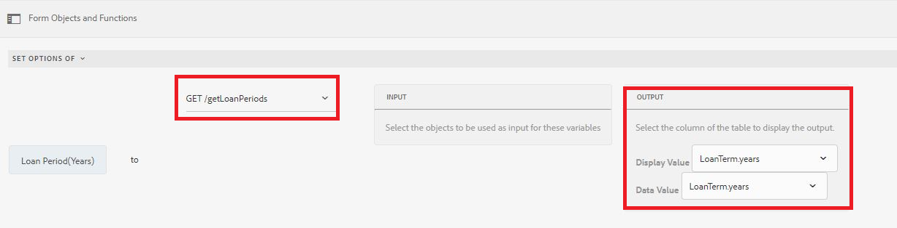

# Adición dinámica de elementos al componente de grupo de opciones

AEM Forms 6.5 ha introducido la capacidad de añadir elementos de forma dinámica a un componente de grupo de opciones de Forms adaptable, como CheckBox, Botón de opción y Lista de imágenes.


Puede añadir elementos mediante el editor visual y el editor de código según el caso de uso.

**Uso del editor visual:** Puede rellenar los elementos del grupo de opciones a partir de los resultados de una llamada de función o una llamada de servicio. Por ejemplo, puede establecer los elementos del grupo de opciones consumiendo la respuesta de una llamada a la API de REST.

En la captura de pantalla siguiente, estamos configurando las opciones de Loan Period(years) a los resultados de una llamada de servicio llamada getLoanPeriods.



**Uso del editor de código**: Cuando desee establecer los elementos en el grupo de opciones de forma dinámica en función de los valores introducidos en el formulario. Por ejemplo, el siguiente fragmento de código establece los elementos de la casilla de verificación en los valores introducidos en los campos Nombre del solicitante y Cónyuge del formulario adaptable.

En el fragmento de código, se establecen los elementos de WorkingMembers, que es un componente de casilla de verificación. La matriz de los elementos se crea dinámicamente recuperando los valores de los campos de texto nombre del solicitante y cónyuge de los formularios adaptables

```javascript
 
 if(MaritalStatus.value=="Married")
  {
WorkingMembers.items =["spouse="+spouse.value,"applicant="+applicantName.value];
  }
else
  {
    WorkingMembers.items =["applicant="+applicantName.value];
  }
```

Los datos enviados son los siguientes

```xml
<afUnboundData>

<data>

<applicantName>John Jacobs</applicantName>

<MaritalStatus>Married</MaritalStatus>

<spouse>Gloria Rios</spouse>

<WorkingMembers>spouse,applicant</WorkingMembers>

</data>

</afUnboundData>
```

**Adición de elementos mediante el editor de reglas**

>[!VIDEO](https://video.tv.adobe.com/v/26847?quality=12&learn=on)

**Añadir elementos mediante el editor de código**

>[!VIDEO](https://video.tv.adobe.com/v/26848?quality=12&learn=on)

Para probar esto en el sistema:

**Uso del editor de código para añadir elementos**

* [Descargar los recursos](assets/usingthecodeeditor.zip)
* [Abrir Forms Y Documentos](http://localhost:4502/aem/forms.html/content/dam/formsanddocuments)
* Haga clic en &quot;Crear&quot; | Cargar archivo&quot; y cargue el archivo que descargó en el paso anterior
* [Previsualización de los formularios](http://localhost:4502/content/dam/formsanddocuments/simpleform/jcr:content?wcmmode=disabled)
* Introduzca el nombre del candidato y seleccione el estado civil a casado
* Escriba el nombre del cónyuge
* Haga clic en Siguiente
* Debe ver la casilla de verificación rellenada con el nombre del solicitante y con el nombre del cónyuge si el estado civil es casado

**Usar el editor visual para agregar elementos**

* [Descargar los recursos](assets/usingthevisualeditor.zip)
* Instale Tomcat si todavía no lo tiene. [Las instrucciones para instalar tomcat están disponibles aquí](https://experienceleague.adobe.com/docs/experience-manager-learn/forms/ic-print-channel-tutorial/introduction.html)
* [Implemente el archivo SampleRest.war contenido en este archivo zip en su Tomcat](assets/sample-rest.zip)
* [Abrir Forms Y Documentos](http://localhost:4502/aem/forms.html/content/dam/formsanddocuments)
* Haga clic en &quot;Crear&quot; | Cargar archivo&quot; y cargue el archivo que descargó en el paso anterior
* [Previsualización de los formularios](http://localhost:4502/content/dam/formsanddocuments/amortizationschedule/jcr:content?wcmmode=disabled)
* Introduzca el importe del préstamo y desplácese fuera del campo. Esto almacenará en déclencheur la regla que muestra el campo periodo del préstamo.
* Seleccione el período de préstamo adecuado (los elementos del período de préstamo se rellenan desde la llamada de resto)
* Seleccione la tasa de interés y haga clic en &quot;Obtener horario de amortización&quot;
* La tabla de amortización debe rellenarse. La programación de amortización se obtiene mediante una llamada de REST.

>[!NOTE]
> AEM Se da por hecho que tomcat se está ejecutando en el puerto 8080 y en el puerto 4502, en el que se está ejecutando en el puerto 4080 y en el puerto 4502, en el que se está ejecutando en el puerto 4080100010000000000000000000000000000000000000000000000000000000000000000000000000000000000000
