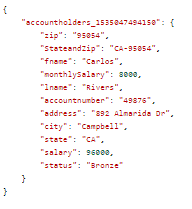

# Creación de elementos del modelo de datos de formulario calculado en AEM Forms{#creating-computed-form-data-model-elements-in-aem-forms}

Los elementos calculados del modelo de datos de formulario permiten almacenar el resultado de la manipulación en uno o varios elementos del modelo de datos de formulario. Por ejemplo, es posible que desee calcular y almacenar el salario mensual realizando una operación matemática en el campo salario. Para ello, dividirá el salario por 12 y almacenará el resultado en un elemento del modelo de datos de formulario calculado llamado monthSalary.

Otro ejemplo para crear un modelo de datos de formulario calculado es concatenar dos o más elementos del modelo de datos de formulario. Por ejemplo, puede concatenar elementos del modelo de datos de formulario de estado y zip con un guión entre los dos elementos.

La siguiente captura de pantalla muestra los elementos calculados StateAndZip y monthSalary

## Creación de un elemento calculado de salario mensual

>[!VIDEO](https://video.tv.adobe.com/v/23855?quality=12&learn=on)

### Creando elemento calculado StateAndZip

>[!VIDEO](https://video.tv.adobe.com/v/23856?quality=12&learn=on)
