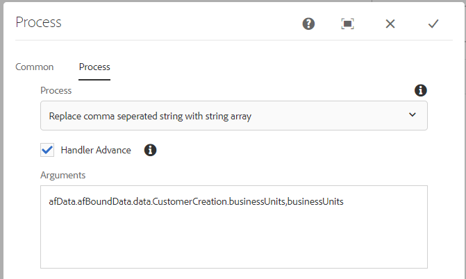

# Convertir una cadena separada por comas en una matriz de cadenas {#setting-value-of-json-data-element-in-aem-forms-workflow}

Cuando el formulario se basa en un modelo de datos de formulario que tiene una matriz de cadenas como parámetro de entrada, debe manipular los datos del formulario adaptable enviados para insertar una matriz de cadenas. Por ejemplo, si ha enlazado un campo de casilla de verificación a un elemento del modelo de datos de formulario de tipo matriz de cadenas, los datos del campo de casilla de verificación están en un formato de cadena separado por comas. El código de ejemplo que se muestra a continuación muestra cómo reemplazar la cadena separada por comas con una matriz de cadenas.

## Creación de una etapa de proceso

Se utiliza un paso de proceso en un flujo de trabajo de AEM cuando queremos que el flujo de trabajo ejecute una lógica determinada. El paso del proceso se puede asociar a un script ECMA o a un servicio OSGi. Nuestro paso de proceso personalizado ejecuta el servicio OSGi.

Los datos enviados tienen el siguiente formato. El valor del elemento businessUnits es una cadena separada por comas, que debe convertirse en una matriz de cadenas.


Los datos de entrada para el resto del extremo asociado con el modelo de datos de formulario esperan una matriz de cadenas como se muestra en esta captura de pantalla. El código personalizado del paso de proceso convierte los datos enviados en al formato correcto.


Pasamos la ruta del objeto JSON y el nombre del elemento al paso del proceso. El código del paso de proceso reemplaza los valores separados por comas del elemento en una matriz de cadenas.


>[!NOTE]
>
>Asegúrese de que la ruta del archivo de datos en las opciones de envío del formulario adaptable esté establecida en &quot;Data.xml&quot;. Esto se debe a que el código del paso del proceso busca un archivo llamado Data.xml en la carpeta de carga útil.

## Procesar código de paso

```java
import java.io.BufferedReader;
import java.io.ByteArrayInputStream;
import java.io.InputStream;
import java.io.InputStreamReader;

import javax.jcr.Binary;
import javax.jcr.Node;
import javax.jcr.Session;

import org.osgi.framework.Constants;
import org.osgi.service.component.annotations.Component;
import org.slf4j.Logger;
import org.slf4j.LoggerFactory;

import com.adobe.granite.workflow.WorkflowException;
import com.adobe.granite.workflow.WorkflowSession;
import com.adobe.granite.workflow.exec.WorkItem;
import com.adobe.granite.workflow.exec.WorkflowProcess;
import com.adobe.granite.workflow.metadata.MetaDataMap;
import com.google.gson.JsonArray;
import com.google.gson.JsonObject;
import com.google.gson.JsonParser;

@Component(property = {
    Constants.SERVICE_DESCRIPTION + "=Create String Array",
    Constants.SERVICE_VENDOR + "=Adobe Systems",
    "process.label" + "=Replace comma seperated string with string array"
})

public class CreateStringArray implements WorkflowProcess {
    private static final Logger log = LoggerFactory.getLogger(CreateStringArray.class);
    @Override
    public void execute(WorkItem workItem, WorkflowSession workflowSession, MetaDataMap arg2) throws WorkflowException {
        log.debug("The string I got was ..." + arg2.get("PROCESS_ARGS", "string").toString());
        String[] arguments = arg2.get("PROCESS_ARGS", "string").toString().split(",");
        String objectName = arguments[0];
        String propertyName = arguments[1];

        String objects[] = objectName.split("\\.");
        System.out.println("The params is " + propertyName);
        log.debug("The params string is " + objectName);
        String payloadPath = workItem.getWorkflowData().getPayload().toString();
        log.debug("The payload  in set Elmement Value in Json is  " + workItem.getWorkflowData().getPayload().toString());
        String dataFilePath = payloadPath + "/Data.xml/jcr:content";
        Session session = workflowSession.adaptTo(Session.class);
        Node submittedDataNode = null;
        try {
            submittedDataNode = session.getNode(dataFilePath);

            InputStream submittedDataStream = submittedDataNode.getProperty("jcr:data").getBinary().getStream();
            BufferedReader streamReader = new BufferedReader(new InputStreamReader(submittedDataStream, "UTF-8"));
            StringBuilder stringBuilder = new StringBuilder();

            String inputStr;
            while ((inputStr = streamReader.readLine()) != null)
                stringBuilder.append(inputStr);
            JsonParser jsonParser = new JsonParser();
            JsonObject jsonObject = jsonParser.parse(stringBuilder.toString()).getAsJsonObject();
            System.out.println("The json object that I got was " + jsonObject);
            JsonObject targetObject = null;

            for (int i = 0; i < objects.length - 1; i++) {
                System.out.println("The object name is " + objects[i]);
                if (i == 0) {
                    targetObject = jsonObject.get(objects[i]).getAsJsonObject();
                } else {
                    targetObject = targetObject.get(objects[i]).getAsJsonObject();

                }

            }

            System.out.println("The final object is " + targetObject.toString());
            String businessUnits = targetObject.get(propertyName).getAsString();
            System.out.println("The values of " + propertyName + " are " + businessUnits);

            JsonArray jsonArray = new JsonArray();

            String[] businessUnitsArray = businessUnits.split(",");
            for (String name: businessUnitsArray) {
                jsonArray.add(name);
            }

            targetObject.add(propertyName, jsonArray);
            System.out.println(" After updating the property " + targetObject.toString());
            InputStream is = new ByteArrayInputStream(jsonObject.toString().getBytes());
            System.out.println("The changed json data  is " + jsonObject.toString());
            Binary binary = session.getValueFactory().createBinary(is);
            submittedDataNode.setProperty("jcr:data", binary);
            session.save();

        } catch (Exception e) {
            System.out.println(e.getMessage());
        }

    }
}
```

El paquete de muestra se puede [descargar desde aquí](assets/CreateStringArray.CreateStringArray.core-1.0-SNAPSHOT.jar)
