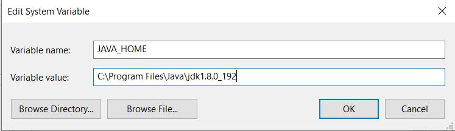
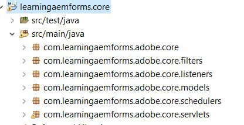

# Cree su primer paquete OSGi

Un paquete OSGi es un archivo Java™ que contiene código Java, recursos y un manifiesto que describe el paquete y sus dependencias. El paquete es la unidad de implementación para una aplicación. Este artículo está dirigido a los desarrolladores que deseen crear un servicio OSGi o un servlet con AEM Forms 6.4 o 6.5. Para crear su primer paquete OSGi, siga los siguientes pasos:


## Instalar JDK

Instale la versión compatible de JDK. He utilizado JDK1.8. Asegúrese de haber agregado **JAVA_HOME** en las variables de entorno y de que está apuntando a la carpeta raíz de la instalación de JDK.
Añadir %JAVA_HOME%/bin en la ruta



>[!NOTE]
> No utilice JDK 15. No es compatible con AEM.

### Probar la versión de JDK

Abra una nueva ventana del símbolo del sistema y escriba: `java -version`. Debe recuperar la versión de JDK identificada por la variable `JAVA_HOME`


## Instalar Maven

Maven es una herramienta de automatización de la compilación que se utiliza principalmente para proyectos de Java. Siga los siguientes pasos para instalar en su sistema local.

* Cree una carpeta llamada `maven` en la unidad C
* Descargue el [archivo zip binario](http://maven.apache.org/download.cgi)
* Extraer el contenido del archivo zip en `c:\maven`
* Cree una variable de entorno llamada `M2_HOME` con un valor de `C:\maven\apache-maven-3.6.0`. En mi caso, la versión **mvn** es 3.6.0. En el momento de escribir este artículo, la última versión de la versión de formato es 3.6.3
* Añada el `%M2_HOME%\bin` en la ruta
* Guardar los cambios
* Abra un nuevo símbolo del sistema y escriba `mvn -version`. Debería ver la versión **mvn** enumerada como se muestra en la captura de pantalla siguiente


## Settings.xml

Un archivo Maven `settings.xml` define los valores que configuran la ejecución de Maven de varias maneras. Normalmente, se utiliza para definir una ubicación de repositorio local, servidores de repositorio remotos alternativos e información de autenticación para repositorios privados.

Vaya a `C:\Users\<username>\.m2 folder`
Extraiga el contenido del archivo [settings.zip](assets/settings.zip) y colóquelo en la carpeta `.m2`.

## Instalar Eclipse

Instale la versión más reciente de [eclipse](https://www.eclipse.org/downloads/)

## Crear el primer proyecto

Archetype es un juego de herramientas de plantilla de proyecto Maven. Un arquetipo se define como un patrón o modelo original desde el cual se hacen todas las demás cosas del mismo tipo. El nombre se ajusta a como estamos tratando de proporcionar un sistema que proporciona un medio consistente de generar proyectos Maven. Archetype ayudará a los autores a crear plantillas de proyecto de Maven para los usuarios, y proporciona a los usuarios los medios para generar versiones parametrizadas de esas plantillas de proyecto.
Para crear su primer proyecto original, siga los siguientes pasos:

* Cree una nueva carpeta llamada `aemformsbundles` en la unidad C
* Abra un símbolo del sistema y vaya a `c:\aemformsbundles`
* Ejecute el siguiente comando en el símbolo del sistema
* `mvn archetype:generate  -DarchetypeGroupId=com.adobe.granite.archetypes  -DarchetypeArtifactId=aem-project-archetype -DarchetypeVersion=19`

El proyecto principal se generará interactivamente y se le pedirá que proporcione valores a una serie de propiedades como

| Nombre de propiedad | Importancia | Value |
------------------------|---------------------------------------|---------------------
| groupId | groupId identifica de forma exclusiva el proyecto en todos los proyectos | com.learningaemforms.adobe |
| appsFolderName | Nombre de la carpeta que contendrá la estructura del proyecto | aprender aemforms |
| artiactId | artifactsId es el nombre del archivo .jar sin versión. Si lo ha creado, puede elegir el nombre que desee con letras minúsculas y sin símbolos extraños. | aprender aemforms |
| version | Si lo distribuye, puede elegir cualquier versión típica con números y puntos (1.0, 1.1, 1.0.1, ...). | 1.0 |

Acepte los valores predeterminados de las demás propiedades pulsando la tecla Intro.
Si todo va bien, debería ver un mensaje de éxito de compilación en la ventana de comandos

## Crear proyecto eclipse a partir de su proyecto principal

Cambie el directorio de trabajo a `learningaemforms`.
Ejecutando `mvn eclipse:eclipse` desde la línea de comandos
El comando anterior lee el archivo pom y crea proyectos Eclipse con metadatos correctos para que Eclipse pueda comprender los tipos de proyectos, las relaciones, la ruta de clases, etc.

## Importar el proyecto en eclipse

Iniciar **Eclipse**

Vaya a **Archivo -> Importar** y seleccione **Proyectos móviles existentes** como se muestra aquí


Haga clic en Siguiente

Seleccione `c:\aemformsbundles\learningaemform`s haciendo clic en el botón **Examinar**


>[!NOTE]
>Puede seleccionar importar los módulos adecuados según sus necesidades. Seleccione e importe el módulo principal únicamente si va a crear código Java en el proyecto.

Haga clic en **Finalizar** para inicio del proceso de importación

El proyecto se importa en Eclipse y verá una serie de `learningaemforms.xxxx` carpetas

Expanda `src/main/java` en la carpeta `learningaemforms.core`. Ésta es la carpeta en la que escribirá la mayor parte del código.



## Cree su proyecto

Una vez que haya escrito el servicio OSGi o el servlet, deberá crear el proyecto para generar el paquete OSGi que se puede implementar mediante la consola web Felix. Consulte [SDK de cliente de AEMFD](https://repo.adobe.com/nexus/content/repositories/public/com/adobe/aemfd/aemfd-client-sdk/) para incluir el SDK de cliente apropiado en el proyecto de Maven. Deberá incluir el SDK de cliente de FD AEM en la sección de dependencias de `pom.xml` del proyecto principal, como se muestra a continuación.

```xml
<dependency>
    <groupId>com.adobe.aemfd</groupId>
    <artifactId>aemfd-client-sdk</artifactId>
    <version>6.0.122</version>
</dependency>
```

Para crear el proyecto, siga los pasos siguientes:

* Abrir **ventana del símbolo del sistema**
* Ir a `c:\aemformsbundles\learningaemforms\core`
* Ejecutar el comando `mvn clean install`
Si todo va bien, debería ver el paquete en la siguiente ubicación `C:\AEMFormsBundles\learningaemforms\core\target`. Este paquete ya está listo para ser implementado en AEM usando la consola web Felix.
