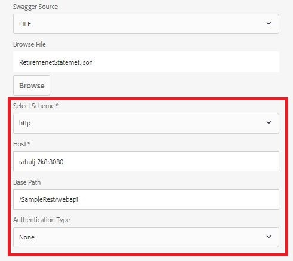

# Capacidad para modificar la configuración de la fuente de datos{#ability-to-modify-data-source-configuration-settings}

Hasta la versión 6.4 de AEM Forms, una vez configurada una fuente de datos, no se podía cambiar el esquema, Host, Ruta base para el servicio RESTful. Esto resultaba problemático si deseaba probar las fuentes de datos con diferentes entornos.

Con la versión de AEM Forms 6.5, ahora puede cambiar fácilmente las propiedades mencionadas. Con esta nueva función, ahora puede crear modelos de datos de formulario con entornos de desarrollo y, una vez que esté satisfecho con los resultados, puede cambiar las propiedades para que apunten a un entorno diferente.

Las capturas de pantalla siguientes muestran la configuración de la fuente de datos en AEM Forms 6.4 y Forms 6.5

**Configuración de fuentes de datos en AEM 6.4**

de fuentes de datos **editables de la configuración de fuentes de datos en la configuración de AEM 6.5 y posterior**

