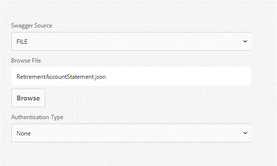

# Posibilidad de modificar la configuración de la fuente de datos{#ability-to-modify-data-source-configuration-settings}

Hasta la versión 6.4 de AEM Forms, una vez configurado el origen de datos, no se podía cambiar el esquema, el host y la ruta base para el servicio RESTful. Esto resultaba problemático si quería probar las fuentes de datos con entornos diferentes.

Con el lanzamiento de AEM Forms 6.5, ahora puede cambiar fácilmente las propiedades mencionadas anteriormente. Con esta nueva funcionalidad, ahora puede crear modelos de datos de formulario para entornos de desarrollo y una vez que esté satisfecho con los resultados, puede cambiar las propiedades para que apunten a un entorno diferente.

Las capturas de pantalla siguientes muestran los ajustes de configuración de la fuente de datos en AEM Forms 6.4 y Forms 6.5

**Configuración de fuentes de datos en AEM 6.4**

**fuentes de datosConfiguración de fuentes de datos editables en la configuración de AEM 6.5 y versiones posteriores**

