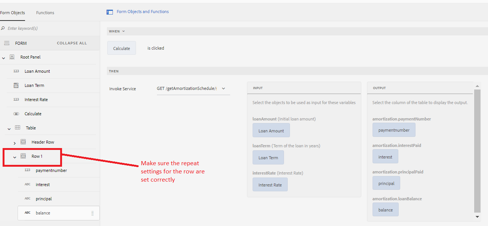

# Rellenar una tabla de formulario adaptable con los resultados de la invocación del servicio del modelo de datos de formulario

[El formulario en directo se aloja aquí](https://forms.enablementadobe.com/content/dam/formsanddocuments/amortization/jcr:content?wcmmode=disabled)
En este artículo echamos un vistazo a cómo rellenar tablas de formularios adaptables recuperando datos de la invocación del servicio del modelo de datos de formulario. Vamos a crear un calendario de amortización en una tabla que enumere cada pago normal de una hipoteca a lo largo del tiempo. El modelo de datos de formulario devuelve los resultados de la amortización. El servicio del modelo de datos de formulario se invoca en el evento &quot;click&quot; del botón &quot;calculate&quot; como se muestra en la captura de pantalla. Los parámetros de entrada y salida de la invocación del servicio se asignan correctamente como se muestra en la captura de pantalla. El resultado se asigna a las columnas de Row1

Row1 está configurado para crecer según los datos devueltos por la llamada de servicio. Observe la configuración de repetición especificada aquí. Un valor de -1 indica un número ilimitado de filas en la tabla

## Implementar esto en el servidor

[Instale Tomcat como se especifica aquí](/help/forms/ic-print-channel-tutorial/set-up-tomcat.md)
[Implemente el archivo SampleRest.war contenido en este archivo zip en su Tomcat](assets/sample-rest.zip)
[Instalación de los recursos](assets/amortizationschedule.zip) AEM uso del administrador de paquetes
[Abra el formulario Programa de amortización](http://localhost:4502/content/dam/formsanddocuments/amortization/jcr:content?wcmmode=disabled)
Introduzca el valor apropiado y haga clic en calcular el horario de amortización que debe rellenarse en el formulario
