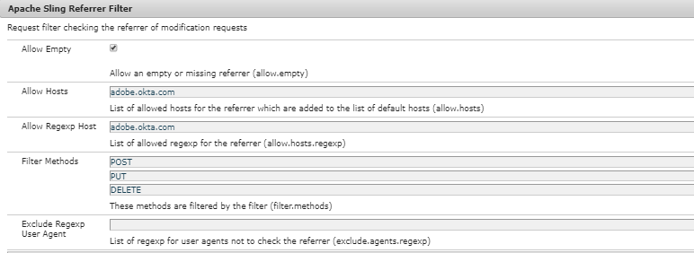

# Autenticar con AEM Author mediante OKTA

El primer paso es configurar la aplicación en el portal OKTA. Una vez que el administrador de OKTA haya aprobado la aplicación, tendrá acceso al certificado de IdP y a la URL de inicio de sesión único. A continuación se muestran los ajustes que se utilizan normalmente para registrar una nueva aplicación.

* **Nombre de la aplicación:** es su nombre de aplicación. Asegúrese de asignar un nombre único a la aplicación.
* **Destinatario de SAML:** después de la autenticación de OKTA, esta es la URL que se visitaría en su instancia de AEM con la respuesta SAML. El controlador de autenticación SAML suele interceptar todas las URL con / saml_login, pero es preferible anexarlas después de la raíz de la aplicación.
* **Audiencia** de SAML: Esta es la URL de dominio de la aplicación. No utilice protocol(http o https) en la dirección URL del dominio.
* **ID del nombre de SAML:** seleccione Correo electrónico en la lista desplegable.
* **Entorno**: Elija el entorno apropiado.
* **Atributos**: Estos son los atributos que obtiene sobre el usuario en la respuesta SAML. Especificarlos según sus necesidades.

## Añadir el certificado OKTA (IdP) al almacén de confianza de AEM

Dado que las aserciones SAML están cifradas, necesitamos añadir el certificado IdP (OKTA) al almacén de confianza de AEM, para permitir una comunicación segura entre OKTA y AEM.
[Inicializar el almacén de confianza](http://localhost:4502/libs/granite/security/content/truststore.html), si no se ha inicializado ya.
Recuerde la contraseña del almacén de confianza. Necesitaremos utilizar esta contraseña más adelante en este proceso.

* Vaya a [Global Trust Store](http://localhost:4502/libs/granite/security/content/truststore.html).
* Haga clic en &quot;Añadir certificado del archivo CER&quot;. Agregue el certificado IdP proporcionado por OKTA y haga clic en enviar.

   >[!NOTE]
   >
   >No asigne el certificado a ningún usuario

Al añadir el certificado al almacén de confianza, debe obtener un alias de certificado como se muestra en la captura de pantalla siguiente. El nombre del alias puede ser diferente en su caso.

**Anote el alias del certificado. Necesitará esto en los pasos posteriores.**

### Configuración del controlador de autenticación SAML

Vaya a [configMgr](http://localhost:4502/system/console/configMgr).
Busque y abra &quot;Gestor de autenticación de Adobe Granite SAML 2.0&quot;.
Proporcione las siguientes propiedades como se especifica a continuación
Las siguientes son las propiedades clave que deben especificarse:

* **ruta** : Esta es la ruta en la que se activará el controlador de autenticación
* **Url** de IdP: esta es su URL de IdP que proporciona OKTA
* **Alias** de certificado IDP:Este es el alias que obtuvo cuando agregó el certificado IdP al almacén de confianza de AEM
* **Id** de entidad del proveedor de servicios:Es el nombre de su servidor AEM
* **Contraseña del almacén** de claves: Esta es la contraseña del almacén de confianza que utilizó
* **Redireccionamiento** predeterminado: Esta es la dirección URL a la que se redirige en caso de autenticación correcta
* **Atributo** UserID:uid
* **Usar codificación**:false
* **Creación automática de usuarios** CRX:true
* **Agregar a grupos**:true
* **Grupos** predeterminados: Usuarios de cookies (es el grupo al que se agregan los usuarios). Puede proporcionar cualquier grupo existente dentro de AEM)
* **NamedIDPolicy**: Especifica restricciones en el identificador de nombre que se utilizará para representar el asunto solicitado. Copie y pegue la siguiente cadena resaltada **urn:oasis:names:tc:SAML:2.0:nameidformat:emailAddress**
* **Atributos sincronizados** : son los atributos que se almacenan a partir de la aserción SAML en el perfil AEM

### Configurar el filtro de referente de Apache Sling

Vaya a [configMgr](http://localhost:4502/system/console/configMgr).
Busque y abra &quot;Filtro de referente de Apache Sling&quot;. Defina las siguientes propiedades como se especifica a continuación:

* **Permitir vacío**: true
* **Permitir hosts**: Nombre de host de IdP (será diferente en su caso)
* **Permitir host** Regexp: Nombre de host de IdP (será diferente en su caso) La captura de pantalla de las propiedades del referente de filtro de Sling

#### Configuración del registro de depuración para la integración de OKTA

Al configurar la integración de OKTA en AEM, puede resultar útil revisar los registros de depuración para el gestor de autenticación SAML de AEM. Para establecer el nivel de registro en DEBUG, cree una nueva configuración de Sling Logger a través de la consola web OSGi de AEM.

Recuerde eliminar o deshabilitar este registrador en Fase y Producción para reducir el ruido de registro.

Al configurar la integración de OKTA en AEM, puede resultar útil revisar los registros de depuración para el gestor de autenticación SAML de AEM. Para establecer el nivel de registro en DEBUG, cree una nueva configuración de Sling Logger a través de la consola web OSGi de AEM.
**Recuerde eliminar o deshabilitar este registrador en Fase y Producción para reducir el ruido de registro.**
* Vaya a [configMgr](http://localhost:4502/system/console/configMgr)

* Busque y abra &quot;Configuración del registrador de Apache Sling&quot;
* Cree un registrador con la siguiente configuración:
   * **Nivel** de registro: Depuración
   * **Archivo** de registro: logs/saml.log
   * **Registrador**: com.adobe.granite.auth.saml
* Haga clic en Guardar para guardar la configuración

#### Probar la configuración de OKTA

Cierre la sesión de la instancia de AEM. Intente acceder al vínculo . Debería ver OKTA SSO en acción.
