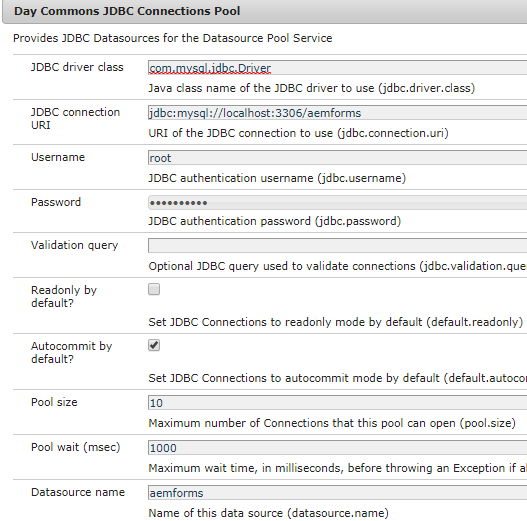

# Almacenamiento de envíos de formularios adaptables en la base de datos

Existen varias formas de almacenar los datos de formulario enviados en la base de datos que elija. Se puede utilizar una fuente de datos JDBC para almacenar directamente los datos en la base de datos. Se puede escribir un paquete OSGI personalizado para almacenar los datos en la base de datos. Este artículo utiliza pasos de proceso personalizados en AEM flujo de trabajo para almacenar los datos.
El caso de uso es activar un flujo de trabajo AEM en un envío de formulario adaptable y un paso en el flujo de trabajo almacena los datos enviados en la base de datos.

**Siga los pasos que se mencionan a continuación para que funcione en su sistema**

* [Descargue el archivo Zip y extraiga su contenido en el disco duro](assets/storeafdataindb.zip)

   * Importe StoreAFInDBWorkflow.zip en AEM mediante el administrador de paquetes. El paquete tiene un flujo de trabajo de muestra que almacena los datos AF en la base de datos. Abra el modelo de flujo de trabajo. El flujo de trabajo solo tiene un paso. Este paso llama al código escrito en el paquete para almacenar los datos AF en la base de datos. Estoy pasando un solo argumento al proceso. Es el nombre del formulario adaptable cuyos datos se están guardando.
   * Implemente el archivo insertdata.core-0.0.1-SNAPSHOT.jar con la consola web Felix. Este paquete tiene el código para escribir los datos de formulario enviados en la base de datos

* Vaya a [ConfigMgr](http://localhost:4502/system/console/configMgr)

   * Busque &quot;Grupo de conexiones JDBC&quot;. Crear un nuevo pool de conexiones JDBC Day Commons. Especifique la configuración específica de la base de datos.

   * 
   * Buscar &quot;**Insertar datos de formulario en la base de datos**&quot;
   * Especifique las propiedades específicas de la base de datos.
      * DataSourceName: nombre del origen de datos que configuró anteriormente.
      * NombreTabla: Nombre de la tabla en la que desea almacenar los datos AF
      * FormName: nombre de columna para contener el nombre del formulario
      * ColumnName: nombre de columna para contener los datos AF

   

* Crear un formulario adaptable.

* Asocie el formulario adaptable con AEM flujo de trabajo (StoreAFValuesinDB) como se muestra en la captura de pantalla siguiente.

* Asegúrese de especificar &quot;data.xml&quot; en la ruta del archivo de datos, como se muestra en la captura de pantalla siguiente

   

* Previsualización del formulario y envío

* Si todo ha salido bien, debería ver que los datos del formulario se almacenan en la tabla y la columna especificadas por usted

