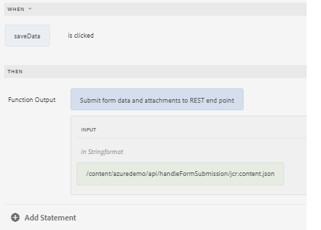

# Usar la API de GuideBridge para almacenar en POST datos de formulario

Guardar y reanudar un formulario implica permitir a los usuarios guardar el progreso de rellenarlo y reanudarlo más tarde.
Para aplicar este caso de uso, es necesario acceder a los datos del formulario y enviarlos mediante la API de GuideBridge al extremo REST para su almacenamiento y recuperación.

Los datos del formulario se guardan al hacer clic en un botón mediante el editor de reglas


La siguiente función de JavaScript se escribió para enviar los datos al extremo especificado

```javascript
/**
* Submits data and attachments 
* @name submitFormDataAndAttachments Submit form data and attachments to REST end point
* @param {string} endpoint in Stringformat
* @return {string} 
 */
 
 function submitFormDataAndAttachments(endpoint) {
    guideBridge.getFormDataObject({
        success: function(resultObj) {
            const afFormData = resultObj.data.data;
            const formData = new FormData();
            formData.append("dataXml", afFormData);
            resultObj.data.attachments.forEach(attachment => {
                console.log(attachment.name);
                formData.append(attachment.name, attachment.data);
            });
            fetch(endpoint, {
                method: 'POST',
                body: formData
            })
            .then(response => {
                if (response.ok) {
                    console.log("successfully saved");
                    const fld = guideBridge.resolveNode("$form.confirmation");
                    return "Form data was saved successfully";
                } else {
                    throw new Error('Failed to save form data');
                }
            })
            .catch(error => {
                console.error('Error:', error);
            });
        }
    });
}
```


## Código del lado del servidor

El siguiente código Java del lado del servidor se escribió para administrar los datos del formulario. AEM A continuación se muestra el servlet Java que se ejecuta en el servidor y al que se llama a través de la llamada XHR en el JavaScript anterior.

```java
package com.azuredemo.core.servlets;
import com.adobe.aemfd.docmanager.Document;
import org.apache.sling.api.SlingHttpServletRequest;
import org.apache.sling.api.SlingHttpServletResponse;
import org.apache.sling.api.request.RequestParameter;
import org.apache.sling.api.servlets.SlingAllMethodsServlet;
import org.apache.sling.servlets.annotations.SlingServletResourceTypes;
import org.osgi.service.component.annotations.Component;
import org.slf4j.Logger;
import org.slf4j.LoggerFactory;
import javax.servlet.Servlet;
import javax.servlet.http.HttpServletResponse;
import java.io.File;
import java.io.IOException;
import java.io.Serializable;
import java.util.List;
@Component(
   service = {
      Servlet.class
   }
)
@SlingServletResourceTypes(
   resourceTypes = "azure/handleFormSubmission",
   methods = "POST",
   extensions = "json"
)
public class StoreFormSubmission extends SlingAllMethodsServlet implements Serializable {
   private static final long serialVersionUID = 1 L;
   private final transient Logger log = LoggerFactory.getLogger(this.getClass());
   protected void doPost(SlingHttpServletRequest request, SlingHttpServletResponse response) throws IOException {
      List < RequestParameter > listOfRequestParameters = request.getRequestParameterList();
      log.debug("The size of list is " + listOfRequestParameters.size());
      for (int i = 0; i < listOfRequestParameters.size(); i++) {
         RequestParameter requestParameter = listOfRequestParameters.get(i);
         log.debug("is this request parameter a form field?" + requestParameter.isFormField());
         if (!requestParameter.isFormField()) {
            Document attachmentDOC = new Document(requestParameter.getInputStream());
            attachmentDOC.copyToFile(new File(requestParameter.getName()));
         } else {
            log.debug("Not a form field " + requestParameter.getName());
            log.debug(requestParameter.getString());
         }
      }
      response.setStatus(HttpServletResponse.SC_OK);
   }
}
```
