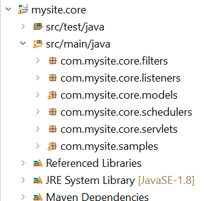

# Cree su primer paquete OSGi

Un paquete OSGi es un archivo Java™ que contiene código Java, recursos y un manifiesto que describe el paquete y sus dependencias. El paquete es la unidad de implementación para una aplicación. Este artículo está dirigido a los desarrolladores que deseen crear un servicio OSGi o un servlet utilizando AEM Forms 6.4 o 6.5. Para crear su primer paquete OSGi, siga los siguientes pasos:


## Instalación de JDK

Instale la versión compatible de JDK. He utilizado JDK1.8. Asegúrese de que ha añadido **JAVA_HOME** en las variables de entorno y señala a la carpeta raíz de la instalación de JDK.
Agregue el %JAVA_HOME%/bin a la ruta


>[!NOTE]
> No utilice JDK 15. No es compatible con AEM.

### Probar la versión de JDK

Abra una nueva ventana del símbolo del sistema y escriba: `java -version`. Debería recuperar la versión de JDK identificada por el `JAVA_HOME` variable


## Instalar Maven

Maven es una herramienta de automatización de compilaciones que se utiliza principalmente para proyectos Java. Siga los siguientes pasos para instalar maven en su sistema local.

* Cree una carpeta llamada `maven` en su unidad C
* Descargue el [archivo zip binario](https://maven.apache.org/download.cgi)
* Extraiga el contenido del archivo zip en `c:\maven`
* Cree una variable de entorno llamada `M2_HOME` con un valor de `C:\maven\apache-maven-3.6.0`. En mi caso, la variable **mvn** La versión es 3.6.0. En el momento de escribir este artículo, la última versión de maven es 3.6.3
* Agregue la variable `%M2_HOME%\bin` a su ruta
* Guarde los cambios
* Abra un nuevo símbolo del sistema y escriba `mvn -version`. Debería ver el **mvn** versión mostrada como se muestra en la captura de pantalla siguiente


## Instalar Eclipse

Instale la última versión de [eclipse](https://www.eclipse.org/downloads/)

## Crear el primer proyecto

Arquetipo es un conjunto de herramientas de creación de plantillas de proyecto Maven. Un arquetipo se define como un patrón o modelo original desde el cual se realizan todas las demás cosas del mismo tipo. El nombre se ajusta a como intentamos proporcionar un sistema que proporcione un medio coherente de generar proyectos Maven. El tipo de archivo ayudará a los autores a crear plantillas de proyecto de Maven para los usuarios y les proporcionará los medios para generar versiones parametrizadas de esas plantillas de proyecto.
Para crear su primer proyecto de maven, siga los siguientes pasos:

* Cree una nueva carpeta llamada `aemformsbundles` en su unidad C
* Abra un símbolo del sistema y vaya a `c:\aemformsbundles`
* Ejecute el siguiente comando en el símbolo del sistema

```java
mvn -B org.apache.maven.plugins:maven-archetype-plugin:3.2.1:generate -D archetypeGroupId=com.adobe.aem -D archetypeArtifactId=aem-project-archetype -D archetypeVersion=36 -D appTitle="My Site" -D appId="mysite" -D groupId="com.mysite" -D aemVersion=6.5.13
```

Al completarse correctamente, debería ver un mensaje de éxito de compilación en la ventana de comandos

## Crear un proyecto eclipse a partir de su proyecto de maven

* Cambie el directorio de trabajo a `mysite`
* Ejecutar `mvn eclipse:eclipse` desde la línea de comandos. El comando lee el archivo pom y crea proyectos de Eclipse con metadatos correctos para que Eclipse comprenda los tipos de proyectos, las relaciones, la ruta de clase, etc.

## Importar el proyecto en eclipse

Launch **Eclipse**

Vaya a **Archivo -> Importar** y seleccione **Proyectos Maven existentes** como se muestra aquí


Haga clic en Siguiente

Seleccione el c:\aemformsbundles\mysite by clicking the **Examinar** botón


>[!NOTE]
>Puede seleccionar importar los módulos adecuados según sus necesidades. Seleccione e importe solo el módulo principal si solo va a crear código Java en el proyecto.

Haga clic en **Finalizar** para iniciar el proceso de importación

El proyecto se importa en Eclipse y verá una serie de `mysite.xxxx` carpetas

Expanda el `src/main/java` en el `mysite.core` carpeta. Esta es la carpeta en la que escribirá la mayor parte del código.



## Incluir SDK de cliente de AEMFD

Deberá incluir el sdk del cliente AEMFD en su proyecto para aprovechar los distintos servicios que se incluyen con AEM Forms. Consulte [SDK de cliente de AEMFD](https://mvnrepository.com/artifact/com.adobe.aemfd/aemfd-client-sdk) para incluir el SDK de cliente apropiado en su proyecto de Maven. Tendrá que incluir el SDK de cliente de FD de AEM en la sección de dependencias de `pom.xml` del proyecto principal como se muestra a continuación.

```xml
<dependency>
    <groupId>com.adobe.aemfd</groupId>
    <artifactId>aemfd-client-sdk</artifactId>
    <version>6.0.122</version>
</dependency>
```

Para crear el proyecto, siga los siguientes pasos:

* Apertura **ventana del símbolo del sistema**
* Vaya a `c:\aemformsbundles\mysite\core`
* Ejecutar el comando `mvn clean install -PautoInstallBundle`
El comando anterior crea e instala el paquete en el servidor de AEM que se ejecuta en `http://localhost:4502`. El paquete también estará disponible en el sistema de archivos en
   `C:\AEMFormsBundles\mysite\core\target` y se pueden implementar utilizando [Consola web Felix](http://localhost:4502/system/console/bundles)
