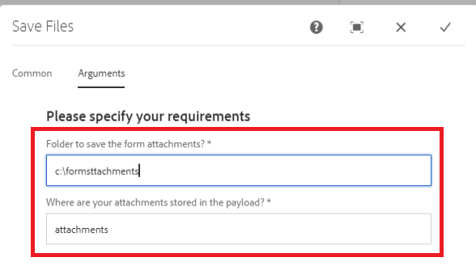

# Componente de flujo de trabajo personalizado

Este tutorial está diseñado para los clientes de AEM Forms que necesiten crear un componente de flujo de trabajo personalizado. El componente de flujo de trabajo se configura para ejecutar el código escrito en el paso anterior. El componente de flujo de trabajo tiene la capacidad de especificar argumentos de proceso para el código. En este artículo exploraremos el componente de flujo de trabajo asociado al código.

[Descargar el componente de flujo de trabajo personalizado](assets/saveFiles.zip)
Importe el componente de flujo de trabajo [mediante el administrador de paquetes](http://localhost:4502/crx/packmgr/index.jsp)

El componente de flujo de trabajo personalizado se encuentra en /apps/AEMFormsDemoListings/workflow/component/SaveFiles

Seleccione el nodo SaveFiles y examine sus propiedades

**componentGroup**: el valor de esta propiedad determina la categoría del componente de flujo de trabajo.

**jcr:Title**: este es el título del componente de flujo de trabajo.

**sling:resourceSuperType** El valor de esta propiedad determinará la herencia de este componente. En este caso, se hereda del componente de proceso

## cq:dialog

Los cuadros de diálogo se utilizan para permitir que el autor interactúe con el componente. El cuadro de diálogo cq:dialog se encuentra en el nodo SaveFiles

Los nodos bajo el nodo de elementos representan las pestañas del componente a través de las cuales los autores interactuarán con el componente. Las pestañas comunes y de proceso están ocultas. Las pestañas Común y Argumentos están visibles.

Los argumentos de proceso del proceso se encuentran en el nodo processargs

El autor especifica los argumentos como se muestra en la captura de pantalla siguiente

Los valores se almacenan como propiedades del nodo de metadatos. Por ejemplo, el valor **c:\formsattachments** se almacenará en la propiedad saveToLocation del nodo de metadatos

## cq:editConfig

cq:EditConfig es simplemente un nodo con el tipo principal cq:EditConfig y el nombre cq:editConfig bajo la raíz del componente
El comportamiento de edición de un componente se configura añadiendo un nodo cq:editConfig de tipo cq:EditConfig debajo del nodo de componente (de tipo cq:Component)

cq:formParameters (tipo de nodo nt:unstructured): define parámetros adicionales que se añaden al formulario de diálogo.

Observe las propiedades del nodo cq:formParameters

El valor de la propiedad PROCESS indica el código Java que se asociará con el componente de flujo de trabajo.
