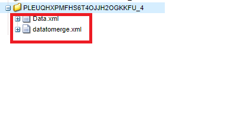

# Extraer nodo del xml de datos enviado

Este paso de proceso personalizado es crear un nuevo documento xml extrayendo el nodo de otro documento xml. Debe utilizar esto cuando desee combinar los datos enviados con una plantilla xdp para generar pdf. Por ejemplo, al enviar un formulario adaptable, los datos que debe combinar con la plantilla xdp se encuentran dentro del elemento de datos. En este caso, necesitará crear otro documento xml extrayendo el elemento de datos adecuado.

La siguiente captura de pantalla muestra los argumentos que debe pasar al paso de proceso personalizado

Los siguientes son los parámetros
* Data.xml: el archivo xml del que desea extraer el nodo
* datatomerge.xml - El nuevo xml creado con el nodo extraído
* /afData/afUnboundData/data: el nodo que se va a extraer

La siguiente captura de pantalla muestra el archivo datamerge.xml que se está creando en la carpeta de carga útil

[El paquete personalizado se puede descargar desde aquí](/help/forms/assets/common-osgi-bundles/SetValueApp.core-1.0-SNAPSHOT.jar)
