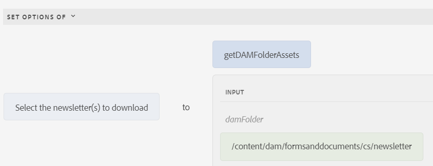

# Adición dinámica de elementos al componente de grupo de opciones

AEM Forms 6.5 ha introducido la capacidad de añadir elementos de forma dinámica a un componente de grupo de opciones de Forms adaptable, como CheckBox, Botón de opción y Lista de imágenes. En este artículo analizaremos el caso de uso de rellenar un componente de grupo de selección con el contenido de la carpeta DAM. En la captura de pantalla, los 3 archivos se encuentran en la carpeta denominada newsletter. Cada vez que se añade una nueva newsletter a la carpeta, el componente del grupo de opciones se actualiza para enumerar su contenido automáticamente. El usuario puede seleccionar uno o más boletines para descargar.


## Crear servlet para devolver el contenido de la carpeta DAM

El siguiente código se escribió para devolver el contenido de la carpeta DAM en formato JSON.

```java
package com.newsletters.core.servlets;
import static com.day.cq.commons.jcr.JcrConstants.JCR_CONTENT;
import java.io.IOException;
import java.io.PrintWriter;
import java.util.ArrayList;
import java.util.List;
import javax.servlet.Servlet;
import org.apache.sling.api.SlingHttpServletRequest;
import org.apache.sling.api.SlingHttpServletResponse;
import org.apache.sling.api.resource.Resource;
import org.apache.sling.api.servlets.SlingSafeMethodsServlet;
import org.osgi.service.component.annotations.Component;
import org.slf4j.Logger;
import org.slf4j.LoggerFactory;
import com.google.gson.Gson;
import com.google.gson.JsonObject;

@Component(service = {
  Servlet.class
}, property = {
  "sling.servlet.methods=get",
  "sling.servlet.paths=/bin/listfoldercontents"
})
public class ListFolderContent extends SlingSafeMethodsServlet {
  private static final long serialVersionUID = 1 L;
  private static final Logger log = LoggerFactory.getLogger(ListFolderContent.class);
  protected void doGet(SlingHttpServletRequest request, SlingHttpServletResponse response) {
    Resource resource = request.getResourceResolver().getResource(request.getParameter("damFolder"));
    List < JsonObject > results = new ArrayList < > ();
    resource.getChildren().forEach(child -> {
      if (!JCR_CONTENT.equals(child.getName())) {
        JsonObject asset = new JsonObject();
        log.debug("##The child name is " + child.getName());
        asset.addProperty("assetname", child.getName());
        asset.addProperty("assetpath", child.getPath());
        results.add(asset);

      }
    });
    PrintWriter out = null;
    try {
      out = response.getWriter();
    } catch (IOException e) {

      log.debug(e.getMessage());
    }
    response.setContentType("application/json");
    response.setCharacterEncoding("UTF-8");
    Gson gson = new Gson();
    out.print(gson.toJson(results));
    out.flush();
  }

}
```

## Crear una biblioteca de cliente con la función de JavaScript

El servlet se invoca desde una función de JavaScript. La función devuelve un objeto de matriz que se utilizará para rellenar el componente de grupo de opciones

```javascript
/**
 * Populate drop down/choice group  with assets from specified folder
 * @return {string[]} 
 */
function getDAMFolderAssets(damFolder) {
   // strUrl is whatever URL you need to call
   var strUrl = '/bin/listfoldercontents?damFolder=' + damFolder;
   var documents = [];
   $.ajax({
      url: strUrl,
      success: function(jsonData) {
         for (i = 0; i < jsonData.length; i++) {
            documents.push(jsonData[i].assetpath + "=" + jsonData[i].assetname);
         }
      },
      async: false
   });
   return documents;
}
```

## Crear formulario adaptable

Cree un formulario adaptable y asócielo a la biblioteca de cliente **listfolderassets**. Agregue un componente Casilla de verificación al formulario. Utilice el editor de reglas para rellenar las opciones de la casilla de verificación como se muestra en la captura de pantalla


Estamos invocando la función de JavaScript llamada **getDAMFolderAssets** y pasando la ruta de los recursos de la carpeta DAM a la lista del formulario.

## Pasos siguientes

[Montar los recursos seleccionados](./assemble-selected-newsletters.md)
