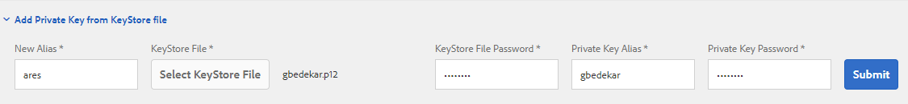

# Certificación de Documentos en AEM Forms

Un Documento certificado ofrece a los destinatarios de formularios y documentos PDF garantías adicionales de su autenticidad e integridad.

Para certificar un documento, puede utilizar Acrobat DC en el escritorio o AEM Forms Documento Services como parte de un proceso automatizado en un servidor.

Este artículo le proporciona un paquete OSGI de muestra para certificar documentos PDF con AEM Forms Documento Services.El código utilizado en el ejemplo está [disponible aquí](https://helpx.adobe.com/experience-manager/6-4/forms/using/aem-document-services-programmatically.html)

Para certificar documentos mediante AEM Forms, deben seguirse los pasos siguientes

## Añadir certificado a almacén de confianza {#adding-certificate-to-trust-store}

Siga los pasos que se mencionan a continuación para agregar el certificado al almacén de claves en AEM

* [Inicializar almacén de confianza global](http://localhost:4502/libs/granite/security/content/truststore.html)
* [Buscar usuario de fd-service](http://localhost:4502/security/users.html)
* **Tendrá que desplazarse por la página de resultados para cargar todos los usuarios y encontrar al usuario de fd-service**
* Doble haga clic en el usuario de fd-service para abrir la ventana de configuración del usuario
* Haga clic en &quot;Añadir clave privada del archivo de almacén de claves&quot;.Especifique el alias y la contraseña específicos del certificado
   
* Guardar los cambios

## Creación del servicio OSGI

Puede escribir su propio paquete OSGi y utilizar el SDK del cliente de AEM Forms para implementar un servicio de certificación de documentos PDF. Los siguientes vínculos serían útiles para escribir su propio paquete OSGi

* [Creación de su primer paquete OSGi](https://helpx.adobe.com/experience-manager/using/maven_arch13.html)
* [Uso de la API de servicio de Documento](https://helpx.adobe.com/experience-manager/6-4/forms/using/aem-document-services-programmatically.html)

O bien, puede utilizar el paquete de muestra incluido como parte de este tutorial.

>[!NOTE]
>
>El paquete de muestra utiliza el alias &quot;ares&quot; para certificar los documentos. Así que asegúrese de que su alias se llame &quot;ares&quot; al utilizar este paquete

## Prueba de la muestra en el sistema local

* Descargar e instalar el paquete de servicios de Documento [personalizados](/help/forms/assets/common-osgi-bundles/AEMFormsDocumentServices.core-1.0-SNAPSHOT.jar)
* Descargar e instalar [Desarrollo con Service User Bundle](/help/forms/assets/common-osgi-bundles/DevelopingWithServiceUser.jar)
* [Asegúrese de haber agregado la siguiente entrada en el Servicio de asignaciones de usuarios del servicio Apache Sling](http://localhost:4502/system/console/configMgr)

   **DevelopingWithServiceUser.core:getformsresourceolver=fd-service** como se muestra en la captura de pantalla siguiente
   
* [Importar formulario adaptable de ejemplo](assets/certify-pdf-af.zip)
* [Importar e instalar el envío personalizado](assets/custom-submit-certify.zip)
* [Abrir el formulario adaptable](http://localhost:4502/content/dam/formsanddocuments/certifypdf/jcr:content?wcmmode=disabled)
* Cargar documento PDF que necesita certificación
   **opcional** : especifique el campo de firma que desea utilizar para certificar el documento
* Haga clic en enviar.
* Se le debe devolver un PDF certificado.

