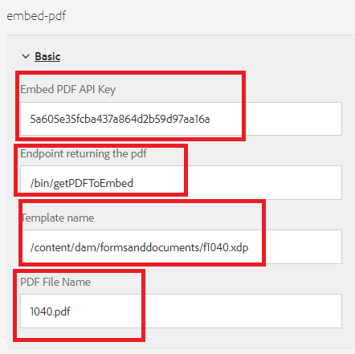

# Mostrar DoR en línea

Un caso de uso común es mostrar un documento pdf con los datos introducidos por la persona que rellena el formulario.

Para lograr este caso de uso, hemos utilizado la variable [API de incrustación de Adobe PDF](https://www.adobe.io/apis/documentcloud/dcsdk/pdf-embed.html).

Se realizaron los siguientes pasos para completar la integración

## Cree un componente personalizado para mostrar el PDF en línea

Se ha creado un componente personalizado (incrustar-pdf) para incrustar el pdf devuelto por la llamada del POST.

## Biblioteca de cliente

El siguiente código se ejecuta cuando el `viewPDF` se hace clic en el botón de casilla de verificación. Pasamos los datos del formulario adaptable, el nombre de la plantilla al extremo para generar el pdf. A continuación, el pdf generado se muestra al usuario que rellena el formulario utilizando la biblioteca JavaScript de pdf incrustado.

```javascript
$(document).ready(function() {

    $(".viewPDF").click(function() {
        console.log("view pdfclicked");
        window.guideBridge.getDataXML({
            success: function(result) {
                var obj = new FormData();
                obj.append("data", result.data);
                obj.append("template", document.querySelector("[data-template]").getAttribute("data-template"));
                const fetchPromise = fetch(document.querySelector("[data-endpoint]").getAttribute("data-endpoint"), {
                        method: "POST",
                        body: obj,
                        contentType: false,
                        processData: false,

                    })
                    .then(response => {

                        var adobeDCView = new AdobeDC.View({
                            clientId: document.querySelector("[data-apikey]").getAttribute("data-apikey"),
                            divId: "adobe-dc-view"
                        });
                        console.log("In preview file");
                        adobeDCView.previewFile(

                            {
                                content: {
                                    promise: response.arrayBuffer()
                                },
                                metaData: {
                                    fileName: document.querySelector("[data-filename]").getAttribute("data-filename")
                                }
                            }
                        );


                        console.log("done")
                    })


            }
        });
    });


});
```

## Generar datos de ejemplo para el XDP

* Abra el XDP en AEM Forms designer.
* Haga clic en Archivo | Propiedades del formulario | Vista previa
* Haga clic en Generar datos de vista previa
* Haga clic en Generar
* Proporcionar un nombre de archivo significativo como &quot;form-data.xml&quot;

## Generar XSD a partir de los datos xml

Puede utilizar cualquiera de las herramientas gratuitas en línea para [generar XSD](https://www.freeformatter.com/xsd-generator.html) a partir de los datos xml generados en el paso anterior.

## Cargar la plantilla

Asegúrese de cargar la plantilla xdp en [AEM Forms](http://localhost:4502/aem/forms.html/content/dam/formsanddocuments) uso del botón crear


## Crear formulario adaptable

Cree un formulario adaptable basado en el XSD del paso anterior.
Agregue una nueva pestaña a la adaptativa. Agregue un componente de casilla de verificación y un componente de pdf incrustado a esta ficha Asegúrese de asignar un nombre a la vista de casilla de verificación PDF.
Configure el componente embed-pdf como se muestra en la captura de pantalla siguiente


**Incrustar clave de API del PDF** - Esta es la clave que puede utilizar para incrustar el pdf. Esta clave solo funciona con localhost. Puede crear [su propia clave](https://www.adobe.io/apis/documentcloud/dcsdk/pdf-embed.html) y asociarlo a otro dominio.

**Extremo que devuelve el pdf** - Este es el servlet personalizado que combina los datos con la plantilla xdp y devuelve el pdf.

**Nombre de la plantilla** - Este es el camino a la xdp. Normalmente, se almacena en la carpeta formsanddocuments .

**Nombre de archivo del PDF** - Esta es la cadena que aparecerá en el componente pdf incrustado.

## Crear servlet personalizado

Se creó un servlet personalizado para combinar los datos con la plantilla XDP y devolver el pdf. El código para lograr esto se enumera a continuación. El servlet personalizado forma parte del [paquete incrustado pdf](assets/embedpdf.core-1.0-SNAPSHOT.jar)

```java
import java.io.ByteArrayInputStream;
import java.io.IOException;
import java.io.InputStream;
import java.io.OutputStream;
import java.io.StringReader;
import java.io.StringWriter;
import javax.servlet.Servlet;
import javax.xml.parsers.DocumentBuilder;
import javax.xml.parsers.DocumentBuilderFactory;
import javax.xml.transform.Transformer;
import javax.xml.transform.TransformerFactory;
import javax.xml.transform.dom.DOMSource;
import javax.xml.transform.stream.StreamResult;
import javax.xml.xpath.XPath;
import javax.xml.xpath.XPathConstants;
import javax.xml.xpath.XPathFactory;

import org.apache.sling.api.SlingHttpServletRequest;
import org.apache.sling.api.SlingHttpServletResponse;
import org.apache.sling.api.servlets.SlingAllMethodsServlet;
import org.osgi.service.component.annotations.Component;
import org.osgi.service.component.annotations.Reference;
import org.slf4j.Logger;
import org.slf4j.LoggerFactory;
import org.w3c.dom.Node;
import org.w3c.dom.NodeList;
import org.xml.sax.InputSource;
import com.adobe.aemfd.docmanager.Document;
import com.adobe.fd.output.api.OutputService;

package com.embedpdf.core.servlets;
@Component(service = {
   Servlet.class
}, property = {
   "sling.servlet.methods=post",
   "sling.servlet.paths=/bin/getPDFToEmbed"
})
public class StreamPDFToEmbed extends SlingAllMethodsServlet {
   @Reference
   OutputService outputService;
   private static final long serialVersionUID = 1 L;
   private static final Logger log = LoggerFactory.getLogger(StreamPDFToEmbed.class);

   protected void doPost(SlingHttpServletRequest request, SlingHttpServletResponse response) throws IOException {
      String xdpName = request.getParameter("template");
      String formData = request.getParameter("data");
      log.debug("in doPOST of Stream PDF Form Data is >>> " + formData + " template is >>> " + xdpName);

      try {

         XPathFactory xfact = XPathFactory.newInstance();
         XPath xpath = xfact.newXPath();
         DocumentBuilderFactory factory = DocumentBuilderFactory.newInstance();
         DocumentBuilder builder = factory.newDocumentBuilder();

         org.w3c.dom.Document xmlDataDoc = builder.parse(new InputSource(new StringReader(formData)));

         // get the data to merge with template

         Node afBoundData = (Node) xpath.evaluate("afData/afBoundData", xmlDataDoc, XPathConstants.NODE);
         NodeList afBoundDataChildren = afBoundData.getChildNodes();
         String afDataNodeName = afBoundDataChildren.item(0).getNodeName();
         Node nodeWithDataToMerge = (Node) xpath.evaluate("afData/afBoundData/" + afDataNodeName, xmlDataDoc, XPathConstants.NODE);
         StringWriter writer = new StringWriter();
         Transformer transformer = TransformerFactory.newInstance().newTransformer();
         transformer.transform(new DOMSource(nodeWithDataToMerge), new StreamResult(writer));
         String xml = writer.toString();
         InputStream targetStream = new ByteArrayInputStream(xml.getBytes());
         Document xmlDataDocument = new Document(targetStream);
         // get the template
         Document xdpTemplate = new Document(xdpName);
         log.debug("got the  xdp Template " + xdpTemplate.length());

         // use output service the merge data with template
         com.adobe.fd.output.api.PDFOutputOptions pdfOptions = new com.adobe.fd.output.api.PDFOutputOptions();
         pdfOptions.setAcrobatVersion(com.adobe.fd.output.api.AcrobatVersion.Acrobat_11);
         com.adobe.aemfd.docmanager.Document documentToReturn = outputService.generatePDFOutput(xdpTemplate, xmlDataDocument, pdfOptions);

         // stream pdf to the client

         InputStream fileInputStream = documentToReturn.getInputStream();
         response.setContentType("application/pdf");
         response.addHeader("Content-Disposition", "attachment; filename=AemFormsRocks.pdf");
         response.setContentLength((int) fileInputStream.available());
         OutputStream responseOutputStream = response.getOutputStream();
         int bytes;
         while ((bytes = fileInputStream.read()) != -1) {
            responseOutputStream.write(bytes);
         }
         responseOutputStream.flush();
         responseOutputStream.close();

      } catch (Exception e) {

         System.out.println("Error " + e.getMessage());
      }

   }

}
```


## Implementar el ejemplo en el servidor

Para probar esto en el servidor local, siga los siguientes pasos:

1. [Descargar e instalar el paquete incrustado de pdf](assets/embedpdf.core-1.0-SNAPSHOT.jar).
Esto tiene el servlet para combinar los datos con la plantilla XDP y transmitir el pdf hacia atrás.
1. Añada la ruta /bin/getPDFToEmbed en la sección de rutas excluidas del filtro CSRF de Granite de Adobe utilizando la variable [AEM ConfigMgr](http://localhost:4502/system/console/configMgr). En el entorno de producción, se recomienda utilizar la variable [Marco de protección CSRF](https://experienceleague.adobe.com/docs/experience-manager-65/developing/introduction/csrf-protection.html?lang=en)
1. [Importar la biblioteca del cliente y el componente personalizado](assets/embed-pdf.zip)
1. [Importar el formulario adaptable y la plantilla](assets/embed-pdf-form-and-xdp.zip)
1. [Vista previa del formulario adaptable](http://localhost:4502/content/dam/formsanddocuments/from1040/jcr:content?wcmmode=disabled)
1. Rellene algunos campos del formulario
1. Tabule hasta la ficha Ver PDF . Seleccione la casilla de verificación ver pdf . Debería ver un pdf en el formulario rellenado con los datos del formulario adaptable
