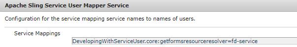

# Generar un conjunto de documentos de PDF a partir de un archivo de datos xml

OutputService proporciona una serie de métodos para crear documentos utilizando un diseño de formulario y datos para combinarlos con el diseño de formulario. En el siguiente artículo se explica el caso de uso para generar varios pdf a partir de un xml grande que contiene varios registros individuales.
A continuación se muestra la captura de pantalla del archivo xml que contiene varios registros.


El xml de datos tiene 2 registros. Cada registro está representado por el elemento form1. Este xml se pasó al método OutputService [generatePDFOutputBatch](https://helpx.adobe.com/aem-forms/6/javadocs/com/adobe/fd/output/api/OutputService.html); obtenemos una lista de documentos pdf (uno por registro)
La firma del método generatePDFOutputBatch emplea los parámetros siguientes

* templates: mapa que contiene la plantilla, identificado por una clave
* data: mapa que contiene documentos de datos xml, identificado por clave
* pdfOutputOptions: opciones para configurar la generación de pdf
* batchOptions: opciones para configurar el lote


## Detalles del caso de uso{#use-case-details}

En este caso de uso, proporcionaremos una interfaz web sencilla para cargar la plantilla y el archivo data(xml). Una vez completada la carga de los archivos y enviada la petición POST al servlet de AEM. Este servlet extrae los documentos y llama al método generatePDFOutputBatch de OutputService. Los archivos PDF generados se comprimen en un archivo zip y se ponen a disposición del usuario final para que los descargue del explorador web.

## Código servlet{#servlet-code}

A continuación se muestra el fragmento de código del servlet. El código extrae la plantilla (xdp) y el archivo de datos (xml) de la solicitud. El archivo de plantilla se guarda en el sistema de archivos. Se crean dos mapas: templateMap y dataFileMap que contienen la plantilla y los archivos xml(data) respectivamente. A continuación, se llama al método generateMultipleRecords del servicio DocumentServices.

```java
for (final java.util.Map.Entry < String, org.apache.sling.api.request.RequestParameter[] > pairs: params
.entrySet()) {
final String key = pairs.getKey();
final org.apache.sling.api.request.RequestParameter[] pArr = pairs.getValue();
final org.apache.sling.api.request.RequestParameter param = pArr[0];
try {
if (!param.isFormField()) {

if (param.getFileName().endsWith("xdp")) {
    final InputStream xdpStream = param.getInputStream();
    com.adobe.aemfd.docmanager.Document xdpDocument = new com.adobe.aemfd.docmanager.Document(xdpStream);

    xdpDocument.copyToFile(new File(saveLocation + File.separator + "fromui.xdp"));
    templateMap.put("key1", "file://///" + saveLocation + File.separator + "fromui.xdp");
    System.out.println("####  " + param.getFileName());

}
if (param.getFileName().endsWith("xml")) {
    final InputStream xmlStream = param.getInputStream();
    com.adobe.aemfd.docmanager.Document xmlDocument = new com.adobe.aemfd.docmanager.Document(xmlStream);
    dataFileMap.put("key1", xmlDocument);
}
}

Document zippedDocument = documentServices.generateMultiplePdfs(templateMap, dataFileMap,saveLocation);
.....
.....
....
```

### Código de implementación de interfaz{#Interface-Implementation-Code}

El siguiente código genera varios PDF utilizando generatePDFOutputBatch de OutputService y devuelve un archivo zip que contiene los archivos PDF al servlet de llamada

```java
public Document generateMultiplePdfs(HashMap < String, String > templateMap, HashMap < String, Document > dataFileMap, String saveLocation) {
    log.debug("will save generated documents to " + saveLocation);
    com.adobe.fd.output.api.PDFOutputOptions pdfOptions = new com.adobe.fd.output.api.PDFOutputOptions();
    pdfOptions.setAcrobatVersion(com.adobe.fd.output.api.AcrobatVersion.Acrobat_11);
    com.adobe.fd.output.api.BatchOptions batchOptions = new com.adobe.fd.output.api.BatchOptions();
    batchOptions.setGenerateManyFiles(true);
    com.adobe.fd.output.api.BatchResult batchResult = null;
    try {
        batchResult = outputService.generatePDFOutputBatch(templateMap, dataFileMap, pdfOptions, batchOptions);
        FileOutputStream fos = new FileOutputStream(saveLocation + File.separator + "zippedfile.zip");
        ZipOutputStream zipOut = new ZipOutputStream(fos);
        FileInputStream fis = null;

        for (int i = 0; i < batchResult.getGeneratedDocs().size(); i++) {
              com.adobe.aemfd.docmanager.Document dataMergedDoc = batchResult.getGeneratedDocs().get(i);
            log.debug("Got document " + i);
            dataMergedDoc.copyToFile(new File(saveLocation + File.separator + i + ".pdf"));
            log.debug("saved file " + i);
            File fileToZip = new File(saveLocation + File.separator + i + ".pdf");
            fis = new FileInputStream(fileToZip);
            ZipEntry zipEntry = new ZipEntry(fileToZip.getName());
            zipOut.putNextEntry(zipEntry);
            byte[] bytes = new byte[1024];
            int length;
            while ((length = fis.read(bytes)) >= 0) {
                zipOut.write(bytes, 0, length);
            }
            fis.close();
        }
        zipOut.close();
        fos.close();
        Document zippedDocument = new Document(new File(saveLocation + File.separator + "zippedfile.zip"));
        log.debug("Got zipped file from file system");
        return zippedDocument;


    } catch (OutputServiceException | IOException e) {

        e.printStackTrace();
    }
    return null;


}
```

### Implementación en el servidor{#Deploy-on-your-server}

Para probar esta capacidad en su servidor, siga las siguientes instrucciones:

* [Descargue los recursos de ejemplo](assets/mult-records-template-and-xml-file.zip). Este archivo zip contiene la plantilla y el archivo de datos xml.
* [Dirija su explorador a la consola web Felix](http://localhost:4502/system/console/bundles)
* [Implementar el paquete DevelopersWithServiceUser](/help/forms/assets/common-osgi-bundles/DevelopingWithServiceUser.jar).
* Agregue la siguiente entrada en el servicio del asignador de usuarios del servicio Apache Sling mediante configMgr.

```java
DevelopingWithServiceUser.core:getformsresourceresolver=fd-service
```




* [Implementar paquete AEMFormsDocumentServices personalizado](/help/forms/assets/common-osgi-bundles/AEMFormsDocumentServices.core-1.0-SNAPSHOT.jar).Paquete personalizado que genera los archivos PDF mediante la API OutputService
* [Dirija su explorador al administrador de paquetes](http://localhost:4502/crx/packmgr/index.jsp)
* [Importe e instale el paquete](assets/generate-multiple-pdf-from-xml.zip). Este paquete contiene la página html que le permite soltar la plantilla y los archivos de datos.
* [Dirija su explorador a MultiRecords.html](¿http://localhost:4502/content/DocumentServices/Multirecord.html?)
* Arrastre y suelte la plantilla y el archivo de datos xml juntos
* Descargue el archivo zip creado. Este archivo zip contiene los archivos pdf generados por el servicio de salida.

>[!NOTE]
>Existen varias formas de almacenar en déclencheur esta capacidad. En este ejemplo hemos utilizado una interfaz web para soltar la plantilla y el archivo de datos para demostrar la capacidad.
