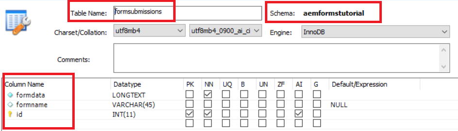

# Introducción

Los clientes suelen querer exportar los datos del formulario enviado en formato CSV. Este artículo resaltará los pasos necesarios para exportar los datos del formulario en formato CSV. Este artículo supone que los envíos de formularios se almacenan en la tabla RDBMS. La siguiente captura de pantalla detalla la estructura de tabla mínima necesaria para almacenar los envíos de formularios.

>[!NOTE]
>
>Este ejemplo solo funciona con formularios adaptables que no están basados en esquemas o en modelos de datos de formulario


tablaComo puede ver, el nombre del esquema es una estructura de formato.Dentro de este esquema está la tabla de envíos con las siguientes columnas definidas

* formdata: Esta columna contiene los datos de formulario enviados
* formname: Esta columna contiene el nombre del formulario enviado
* id: Esta es la clave principal y se configura en incremento automático

El nombre de tabla y los nombres de dos columnas se exponen como propiedades de configuración OSGi como se muestra en la captura de pantalla siguiente:

El código leerá estos valores y construirá la consulta SQL apropiada para ejecutar. Por ejemplo, la siguiente consulta se ejecutará en función de los valores anteriores
**SELECCIONE los datos de formulario DE aemformstutorial.formpapers donde formname=timeoffrequestform**
En la consulta anterior, el nombre del formulario (timeoffrequestform) se pasará como parámetro de solicitud al servlet.

## **Creación del servicio OSGi**

El siguiente servicio OSGI se creó para exportar los datos enviados en formato CSV.

* Línea 37: Estamos accediendo a la fuente de datos agrupada de la conexión Apache Sling.

* Línea 89: Este es el punto de entrada al servicio. El método `getCSVFile(..)` toma formName como parámetro de entrada y recupera los datos enviados pertenecientes al nombre de formulario dado.

>[!NOTE]
>
>El código supone que ha definido la conexión agrupada DataSource denominada &quot;aemformstutorial&quot; en la Consola Web Felix. El código también supone que tiene un esquema en la base de datos denominado aemformstutorial

```java
package com.aemforms.storeandexport.core;

import java.io.IOException;
import java.io.StringReader;
import java.sql.Connection;
import java.sql.PreparedStatement;
import java.sql.ResultSet;
import java.sql.SQLException;
import java.sql.Statement;
import java.util.ArrayList;
import java.util.List;

import javax.sql.DataSource;
import javax.xml.parsers.DocumentBuilder;
import javax.xml.parsers.DocumentBuilderFactory;
import javax.xml.parsers.ParserConfigurationException;
import javax.xml.xpath.XPath;
import javax.xml.xpath.XPathConstants;
import javax.xml.xpath.XPathExpressionException;
import javax.xml.xpath.XPathFactory;

import org.osgi.service.component.annotations.Component;
import org.osgi.service.component.annotations.Reference;
import org.slf4j.Logger;
import org.slf4j.LoggerFactory;
import org.w3c.dom.Document;
import org.w3c.dom.Node;
import org.w3c.dom.NodeList;
import org.xml.sax.InputSource;
import org.xml.sax.SAXException;

@Component(service = StoreAndExport.class)
public class StoreAndExportImpl implements StoreAndExport {

    private final Logger log = LoggerFactory.getLogger(getClass());
    @Reference
    StoreAndExportConfigurationService config;
    @Reference(target = "(&(objectclass=javax.sql.DataSource)(datasource.name=aemformstutorial))")
    private DataSource dataSource;

    private List<String> getRowValues(String row) {
        List<String> rowValues = new ArrayList<String>();
        //API to obtain DOM Document instance
        DocumentBuilderFactory factory = DocumentBuilderFactory.newInstance();
        DocumentBuilder builder = null;
        try {
            builder = factory.newDocumentBuilder();
            Document doc = builder.parse(new InputSource(new StringReader(row)));
            XPathFactory xpf = XPathFactory.newInstance();
            XPath xpath = xpf.newXPath();
            Node dataNode = (Node) xpath.evaluate("//afData/afUnboundData/data", doc, XPathConstants.NODE);
            NodeList dataElements = dataNode.getChildNodes();
            for (int i = 0; i < dataElements.getLength(); i++) {
                log.debug("The name of the node is" + dataElements.item(i).getNodeName() + " the node value is " + dataElements.item(i).getTextContent());
                rowValues.add(i, dataElements.item(i).getTextContent());
            }
            return rowValues;
        } catch (Exception e) {
            log.debug(e.getMessage());
        }
        return null;
    }

    private List<String> getHeaderValues(String row) {
        DocumentBuilderFactory factory = DocumentBuilderFactory.newInstance();
        List<String> rowValues = new ArrayList<String>();
        DocumentBuilder builder = null;
        try {
            //Create DocumentBuilder with default configuration
            builder = factory.newDocumentBuilder();
            Document doc = builder.parse(new InputSource(new StringReader(row)));
            XPathFactory xpf = XPathFactory.newInstance();
            XPath xpath = xpf.newXPath();
            Node dataNode = (Node) xpath.evaluate("//afData/afUnboundData/data", doc, XPathConstants.NODE);
            NodeList dataElements = dataNode.getChildNodes();
            for (int i = 0; i < dataElements.getLength(); i++) {
                rowValues.add(i, dataElements.item(i).getNodeName());
            }
            return rowValues;
        } catch (Exception e) {
            log.debug(e.getMessage());
        }
        return null;

    }

    @Override
    public StringBuilder getCSVFile(String formName) {
        log.debug("In get CSV File");
        String selectStatement = "SELECT " + config.getFORM_DATA_COLUMN() + " FROM aemformstutorial." + config.getTABLE_NAME() + " where " + config.getFORM_NAME_COLUMN() + "='" + formName + "'" + "";
        log.debug("The select statment is " + selectStatement);
        Connection con = getConnection();
        Statement st = null;
        ResultSet rs = null;
        CSVUtils csvUtils = new CSVUtils();
        try {
            st = con.createStatement();
            rs = st.executeQuery(selectStatement);
            log.debug("Got Result Set in getCSVFile");
            StringBuilder sb = new StringBuilder();
            while (rs.next()) {
                if (rs.isFirst()) {
                    sb = csvUtils.writeLine(getHeaderValues(rs.getString(1)), sb);
                }
                sb = csvUtils.writeLine(getRowValues(rs.getString(1)), sb);
                log.debug("$$$$The current strng buffer is " + sb.toString());
            }

            return sb;
        } catch (Exception e) {
            log.debug(e.getMessage());
        } finally {
            try {
                rs.close();
            } catch (Exception e) { /* ignored */ }
            try {
                st.close();
            } catch (Exception e) { /* ignored */ }
            try {
                con.close();
            } catch (Exception e) { /* ignored */ }
        }

        return null;

    }

    private Connection getConnection() {
        log.debug("Getting Connection ");
        Connection con = null;
        try {
            con = dataSource.getConnection();
            log.debug("got connection");
            return con;
        } catch (Exception e) {
            log.debug("not able to get connection ");
            log.debug(e.getMessage());
        }
        return null;
    }
    
    @Override
    public void inserFormData(String formData) {
        String formDataColumn = config.getFORM_DATA_COLUMN();
        String formNameColumn = config.getFORM_NAME_COLUMN();
        String tableName = config.getTABLE_NAME();
        String insertStatement = "Insert into aemformstutorial." + tableName + "(" + formDataColumn + "," + formNameColumn + ") VALUES(?,?)";
        log.debug("The insert statment is" + insertStatement);
        Connection con = getConnection();
        PreparedStatement pstmt = null;
        try {
            DocumentBuilderFactory factory = DocumentBuilderFactory.newInstance();
            DocumentBuilder builder = null;
            builder = factory.newDocumentBuilder();
            Document xmlDoc = builder.parse(new InputSource(new StringReader(formData)));
            XPath xPath = javax.xml.xpath.XPathFactory.newInstance().newXPath();
            org.w3c.dom.Node submittedFormNameNode = (org.w3c.dom.Node) xPath.compile("/afData/afSubmissionInfo/afPath").evaluate(xmlDoc, javax.xml.xpath.XPathConstants.NODE);
            String paths[] = submittedFormNameNode.getTextContent().split("/");
            String formName = paths[paths.length - 1];
            log.debug("The form name submiited is" + formName);
            pstmt = null;
            pstmt = con.prepareStatement(insertStatement);
            pstmt.setString(1, formData);
            pstmt.setString(2, formName);
            log.debug("Executing the insert statment  " + pstmt.execute());
            con.commit();
        } catch (SQLException e) {
            log.debug(e.getMessage());
        } catch (ParserConfigurationException e) {
            log.debug(e.getMessage());
        } catch (SAXException e) {
            log.debug(e.getMessage());
        } catch (IOException e) {
            log.debug(e.getMessage());
        } catch (XPathExpressionException e) {
            log.debug(e.getMessage());
        } finally {
            try {
                pstmt.close();
            } catch (Exception e) { /* ignored */ }
            try {
                con.close();
            } catch (Exception e) { /* ignored */ }
        }
    }
}
```

## Servicio de configuración

Hemos expuesto las tres propiedades siguientes como propiedades de configuración OSGI. La consulta SQL se construye leyendo estos valores en tiempo de ejecución.

```java
package com.aemforms.storeandexport.core;

import org.osgi.service.metatype.annotations.AttributeDefinition;
import org.osgi.service.metatype.annotations.ObjectClassDefinition;

@ObjectClassDefinition(name="Store and Export Configuration", description = "Details on the Database ")
public @interface StoreAndExportConfiguration {
    @AttributeDefinition(name = "Table Name", description = "Name of the table to store the submitted data")
    String tableName() default "formsubmissions";

    @AttributeDefinition(name = "Form Data Column Name", description = "Column name to hold submitted form data")
    String formDataColumn() default "formdata";

    @AttributeDefinition(name = "Form Name Column Name", description = "Column name to hold submitted form name")
    String formNameColumn() default "formname";
}
```

## Servlet

El siguiente es el código servlet que invoca el método `getCSVFile(..)` del servicio. El servicio devuelve el objeto StringBuffer que luego se retransmite a la aplicación que realiza la llamada

```java
package com.aemforms.storeandexport.core.servlets;

import java.io.IOException;
import javax.servlet.Servlet;
import javax.servlet.ServletOutputStream;

import org.apache.sling.api.SlingHttpServletRequest;
import org.apache.sling.api.SlingHttpServletResponse;
import org.apache.sling.api.servlets.SlingAllMethodsServlet;
import org.osgi.service.component.annotations.Component;
import org.osgi.service.component.annotations.Reference;
import com.aemforms.storeandexport.core.StoreAndExport;

@Component(
        service = {Servlet.class}, 
        property = {"sling.servlet.methods=get", "sling.servlet.paths=/bin/streamformdata"}
)
public class StreamCSVFile extends SlingAllMethodsServlet {
    private static final long serialVersionUID = -3703364266795135086L;

    @Reference
    StoreAndExport createCSVFile;

    protected void doGet(SlingHttpServletRequest request, SlingHttpServletResponse response) {
        StringBuilder stringToStream = createCSVFile.getCSVFile(request.getParameter("formName"));
        response.setHeader("Content-Type", "text/csv");
        response.setHeader("Content-Disposition", "attachment;filename=\"formdata.csv\"");
        try {
            final ServletOutputStream sout = response.getOutputStream();
            sout.print(stringToStream.toString());
        } catch (IOException e) {
            log.debug(e.getMessage());
        }
    }
}
```

### Implementar en el servidor

* Importe el [archivo SQL](assets/formsubmissions.sql) en el servidor MySQL utilizando MySQL Workbench. Esto crea un esquema llamado **formstutorial** y una tabla llamada **formdeliveries** con algunos datos de ejemplo.
* Implementar [OSGi Bundle](assets/store-export.jar) mediante la consola web Felix
* [Para obtener los envíos de TimeOffRequest](http://localhost:4502/bin/streamformdata?formName=timeoffrequestform). Debería obtener un archivo CSV transmitido de nuevo a usted.
