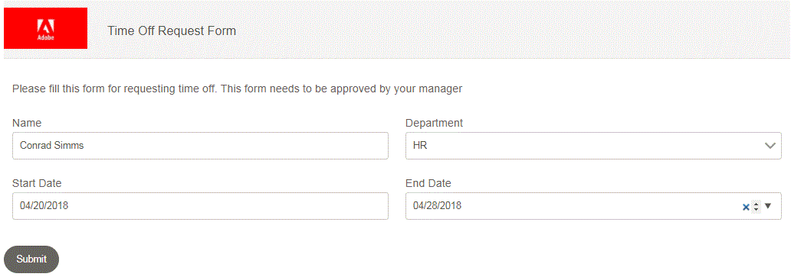

# Flujo de trabajo de tiempo de espera de pago simple

En este artículo, veremos un sencillo flujo de trabajo utilizado para solicitar el tiempo de espera pagado. Los requisitos comerciales son los siguientes:

* El usuario A solicita el tiempo de espera rellenando un formulario adaptable.
* El formulario se redirige al usuario administrador de AEM (en la vida real se redirige al administrador del remitente)
* El administrador abre el formulario. El administrador no debe poder editar ninguna información rellenada por el remitente.
* La sección Aprobador debe ser visible para el aprobador (en este caso es el usuario administrador de AEM).

Para cumplir el requisito anterior, se utiliza un campo oculto denominado **primer paso** en el formulario y su valor predeterminado se establece en Yes.Cuando se envía el formulario, el primer paso del flujo de trabajo establece el valor del primer paso en No. El formulario tiene reglas comerciales para ocultar y mostrar las secciones correspondientes en función del valor del paso inicial.

**Configurar el formulario para activar el flujo de trabajo de AEM**

>[!VIDEO](https://video.tv.adobe.com/v/28406?quality=9&learn=on)

**Recorrido del flujo de trabajo**

>[!VIDEO](https://video.tv.adobe.com/v/28407?quality=9&learn=on)

**Vista del remitente del formulario de solicitud de tiempo de espera**

**Vista del aprobador del formulario**

En la vista de aprobador, el aprobador no puede editar los datos enviados. También hay una nueva sección destinada únicamente a Aprobadores.

Para probar este flujo de trabajo en su sistema, siga los pasos que se indican a continuación:
* [Descargar e implementar DevelopingWitheServiceUserBundle](/help/forms/assets/common-osgi-bundles/DevelopingWithServiceUser.jar)
* [Descargar e implementar el paquete personalizado de OSGI de SetValue](/help/forms/assets/common-osgi-bundles/SetValueApp.core-1.0-SNAPSHOT.jar)
* [Importar los recursos relacionados con este artículo en AEM](assets/helpxworkflow.zip)
* Abra el [Formulario de solicitud de tiempo de espera](http://localhost:4502/content/dam/formsanddocuments/helpx/timeoffrequestform/jcr:content?wcmmode=disabled)
* Rellene los detalles y envíe
* Abra la [bandeja de entrada](http://localhost:4502/mnt/overlay/cq/inbox/content/inbox.html). Debería ver una nueva tarea asignada. Abra el formulario. Los datos del remitente deben ser de solo lectura y debe estar visible una nueva sección del aprobador.
* Explorar el [modelo de flujo de trabajo](http://localhost:4502/editor.html/conf/global/settings/workflow/models/helpxworkflow.html)
* Explore el paso del proceso. Este es el paso que establece el valor del paso inicial en No.
