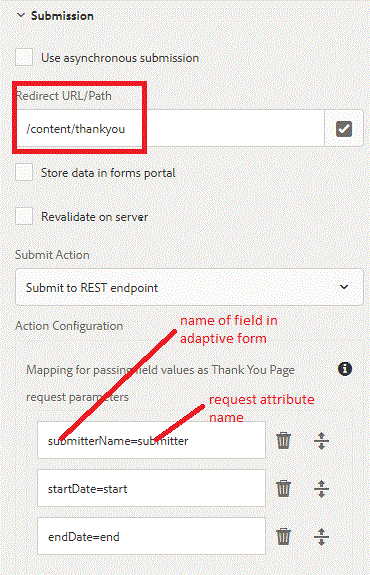

# Enviar A La Página De Agradecimiento {#submitting-to-thank-you-page}

La opción Enviar a extremo REST pasa los datos rellenados en el formulario a una página de confirmación configurada como parte de la solicitud de GET HTTP. Puede añadir el nombre de los campos que desea solicitar. El formato de la solicitud es:

\{fieldName\} = \{parameterName\}. Por ejemplo, el nombre del remitente es el nombre de un campo de formulario adaptable y el remitente es el nombre del parámetro. En la página de agradecimiento, puede acceder al parámetro de remitente utilizando request.getParameter(&quot;submitter&quot;) para obtener el valor del campo de nombre del remitente.

submitterName=submitter

En la captura de pantalla siguiente, presentamos el formulario adaptable para agradecerle a la página ubicada en /content/thankyou. A esta página de agradecimiento, se pasan 3 atributos de solicitud que albergarán los valores de campo del formulario.

También puede enviar al extremo externo a través de un POST. Para ello, solo tiene que seleccionar la casilla de verificación &quot;habilitar solicitud posterior&quot; y proporcionar la URL para el punto final externo. Al enviar el formulario, obtendrá la página de agradecimiento y el punto final del POST se invocará simultáneamente.

Para probar esta capacidad en su servidor, siga las instrucciones que se mencionan a continuación:

* Importe el [el archivo de activos asociado a este artículo en AEM usando el administrador de paquetes](assets/submittingtorestendpoint.zip)
* Apunte el navegador a [Formulario de solicitud de tiempo desactivado](http://localhost:4502/content/dam/formsanddocuments/helpx/timeoffrequestform/jcr:content?wcmmode=disabled)
* Rellene el campo requerido y envíe el formulario
* Debería obtener la página de agradecimiento con la información rellenada en la página
