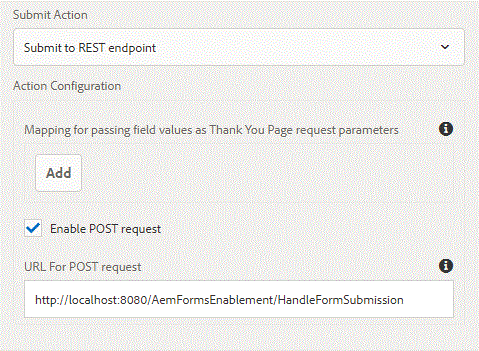

# Envío del formulario adaptable al servidor externo {#submitting-adaptive-form-to-external-server}

Utilice la acción Enviar a extremo REST para publicar los datos enviados en una URL de REST. La URL puede ser de un servidor interno (el servidor en el que se representa el formulario) o externo.

Normalmente, los clientes desean enviar los datos del formulario a un servidor externo para un procesamiento posterior.

Para enviar datos a un servidor interno, proporcione una ruta del recurso. Los datos se publican en la ruta del recurso. Por ejemplo, &lt;/content/restEndPoint> . Para esas solicitudes posteriores se utiliza la información de autenticación de la solicitud de envío.

Para enviar datos a un servidor externo, proporcione una URL. El formato de la dirección URL es <http://host:port/path_to_rest_end_point>. Asegúrese de haber configurado la ruta para gestionar la solicitud POST de forma anónima.

A los efectos de este artículo, he escrito un simple archivo war que puede ser desplegado en su instancia de tomcat. Suponiendo que el tomcat se esté ejecutando en el puerto 8080, la dirección URL POST se va a

<http://localhost:8080/AemFormsEnablement/HandleFormSubmission>

al configurar el formulario adaptable para que se envíe a este extremo, los datos del formulario y los archivos adjuntos, si los hay, se pueden extraer en el servlet mediante el siguiente código

```java
System.out.println("form was submitted");
Part attachment = request.getPart("attachments");
if(attachment!=null)
{
    System.out.println("The content type of the attachment added is "+attachment.getContentType());
}
Enumeration<String> params = request.getParameterNames();
while(params.hasMoreElements())
{
String paramName = params.nextElement();
System.out.println("The param Name is "+paramName);
String data = request.getParameter(paramName);System.out.println("The data  is "+data);
}
```


formsubmitPara probar esto en su servidor, haga lo siguiente

1. Instale Tomcat si todavía no lo tiene. [Las instrucciones para instalar tomcat están disponibles aquí](https://helpx.adobe.com/experience-manager/kt/forms/using/preparing-datasource-for-form-data-model-tutorial-use.html)
1. Descargue el [archivo zip](assets/aemformsenablement.zip) asociado a este artículo. Descomprima el archivo para obtener el archivo war.
1. Implemente el archivo war en su servidor tomcat.
1. Cree un formulario adaptable sencillo con componente de archivo adjunto y configure su acción de envío como se muestra en la captura de pantalla anterior. La dirección URL de POST es <http://localhost:8080/AemFormsEnablement/HandleFormSubmission>. Si su AEM y tomcat no se ejecutan en localhost, cambie la URL en consecuencia.
1. Para habilitar el envío de datos de formularios de varias partes a tomcat, añada el siguiente atributo al elemento de contexto de &lt;tomcatInstallDir>\conf\context.xml y reinicie el servidor Tomcat.
1. **&lt;context allowCasualMultipartParsing=&quot;true&quot;>**
1. Obtenga una vista previa del formulario adaptable, añada un adjunto y envíelo. Busque mensajes en la ventana de la consola tomcat.

