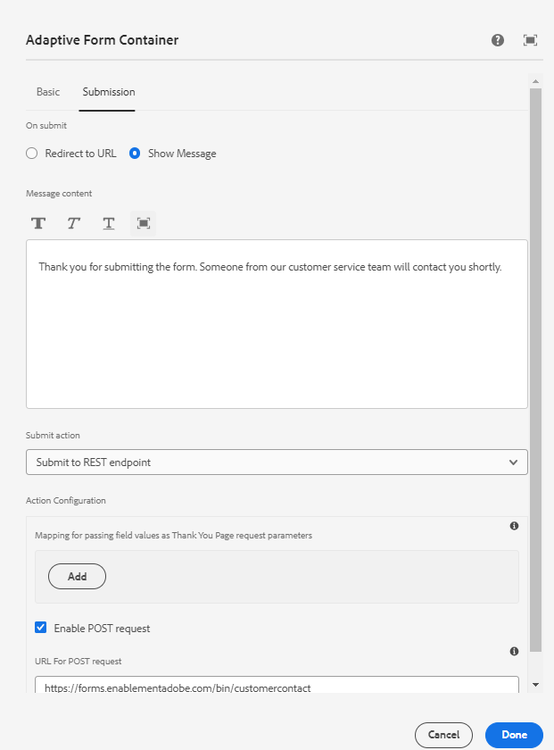

# Mostrar el mensaje de agradecimiento configurado

Un mensaje de agradecimiento sobre el envío de formularios es una forma reflexiva de reconocer y expresar gratitud al usuario por completar y enviar un formulario. Sirve como confirmación de que su presentación ha sido recibida y apreciada. El mensaje de agradecimiento se configura con la pestaña Envío del contenedor de guías del formulario adaptable



Se puede acceder al mensaje de agradecimiento configurado en el controlador de eventos onSuccess del supercomponente AdaptiveForm.
A continuación se muestra el código para asociar el evento onSuccess y el código para el controlador de eventos onSuccess

```javascript
<AdaptiveForm mappings={extendMappings} onSubmitSuccess={onSuccess} formJson={selectedForm}/>
```

```javascript
const onSuccess=(action) =>{
        let body = action.payload?.body;
        debugger;
        setThankYouMessage(body.thankYouMessage.replace(/<(.|\n)*?>/g, ''));
        console.log("Thank you message "+body.thankYouMessage.replace(/<(.|\n)*?>/g, ''));

      }
```

A continuación, se muestra el código completo del componente de función Contact

```javascript
import Form from './components/Form';
import PlainText from './components/plainText';
import TextField from './components/TextField';
import Button from './components/Button';
import { useState,useEffect } from "react";
import { AdaptiveForm } from "@aemforms/af-react-renderer";
export default function Contact(){
  
    const [selectedForm, setForm] = useState("");
    const [thankYouMessage, setThankYouMessage] = useState("");
    const [formSubmitted, setFormSubmitted] = useState(false);
  
    const extendMappings = {
        'plain-text' : PlainText,
        'text-input' : TextField,
        'button' : Button,
        'form': Form
      };
     const onSuccess=(action) =>{
        let body = action.payload?.body;
        debugger;
        setFormSubmitted(true);
        setThankYouMessage(body.thankYouMessage.replace(/<(.|\n)*?>/g, ''));
        // Remove any html tags in the thank you message
        console.log("Thank you message "+body.thankYouMessage.replace(/<(.|\n)*?>/g, ''));

      }
      
      const getForm = async () => {
        
        const resp = await fetch('/adobe/forms/af/L2NvbnRlbnQvZm9ybXMvYWYvY29udGFjdHVz');
        // Get the form id manually using the listform api
        let formJSON = await resp.json();
        setForm(formJSON.afModelDefinition)
      }
      useEffect( ()=>{
        getForm()
        

    },[]);
    
    return(
        
        <div>
           {!formSubmitted ?
            (
                <div>
                    <h1>Get in touch with us!!!!</h1>
                    <AdaptiveForm mappings={extendMappings} onSubmitSuccess={onSuccess} formJson={selectedForm}/>
                </div>
            ) :
            (
                <div>
                    <div>{thankYouMessage}</div>
                </div>
            )}
        </div>
      
          
        
    )
}
```

El código anterior utiliza componentes html nativos asignados a los componentes utilizados en el formulario adaptable. Por ejemplo, se asigna el componente de formulario adaptable de entrada de texto al componente TextField. Los componentes nativos utilizados en el artículo [se puede descargar desde aquí](./assets/native-components.zip)
