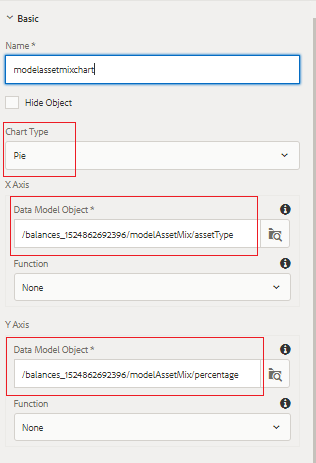

# Configuración del panel Mezcla de Inversiones

En esta parte, agregaremos gráficos circulares para mostrar la combinación de inversión actual y modelo.

* Inicie sesión en AEM Forms y vaya a Adobe Experience Manager > Formularios > Formularios y documentos.

* Abra la carpeta 401KStatement.

* Abra la instrucción 401KS en modo de edición.

* Añadiremos 2 gráficos circulares para representar la combinación de inversión actual y modelo del titular de la cuenta.

## Mezcla de activos actuales {#current-asset-mix}

* Pulse en el panel &quot;Combinación de recursos actual&quot; del lado derecho, seleccione el icono &quot;+&quot; e inserte el componente de texto. Cambie el texto predeterminado a &quot;Combinación de recursos actual&quot;.

* Pulse en el panel &quot;Combinación de recursos actual&quot; y seleccione el icono &quot;+&quot; e inserte el componente de gráfico. Pulse en el componente de gráfico recién insertado y haga clic en el icono &quot;llave inglesa&quot; para abrir la hoja de propiedades de configuración del gráfico.

* Establezca las propiedades como se muestra en la imagen siguiente. Asegúrese de que el tipo de gráfico sea circular.

* Tenga en cuenta el objeto del modelo de datos que está enlazado a los ejes X e Y. Debe seleccionar el elemento raíz del modelo de datos de formulario y, a continuación, desplazarse hacia abajo para seleccionar el elemento adecuado.

* 

## Mezcla de recursos de modelo {#model-asset-mix}

* Pulse en el panel &quot;Mezcla de recursos recomendados&quot; del lado derecho, seleccione el icono &quot;+&quot; e inserte el componente de texto. Cambie el texto predeterminado a &quot;Mezcla de recursos de modelo&quot;.

* Pulse en el panel &quot;Mezcla de recursos recomendados&quot; y seleccione el icono &quot;+&quot; e inserte el componente de gráfico. Pulse en el componente de gráfico recién insertado y haga clic en el icono &quot;llave inglesa&quot; para abrir la hoja de propiedades de configuración del gráfico.

* Establezca las propiedades como se muestra en la imagen siguiente. Asegúrese de que el tipo de gráfico sea circular.

* Tenga en cuenta el objeto del modelo de datos que está enlazado a los ejes X e Y. Debe seleccionar el elemento raíz del modelo de datos de formulario y, a continuación, desplazarse hacia abajo para seleccionar el elemento adecuado.

* 

