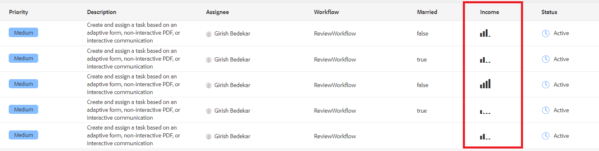

# Uso de una plantilla sutil para mostrar los datos de la bandeja de entrada

Puede utilizar una plantilla sutil para dar formato a los datos que se van a mostrar en las columnas de la bandeja de entrada. En este ejemplo se muestran iconos de coral-ui en función del valor de la columna de ingresos. La siguiente captura de pantalla muestra el uso de iconos en la columna de ingresos


[La plantilla sightly](assets/sightly-template.zip) se utiliza para mostrar los iconos personalizados de la interfaz de usuario de coral como parte de este artículo.

## Plantilla Sightly

A continuación, se muestra la plantilla. El código de la plantilla muestra un icono en función de los ingresos. Los iconos están disponibles como parte del [biblioteca de iconos de la interfaz de usuario de coral](https://helpx.adobe.com/experience-manager/6-3/sites/developing/using/reference-materials/coral-ui/coralui3/Coral.Icon.html#availableIcons) que viene con AEM.

```java
<template data-sly-template.incomeTemplate="${@ item}>">
    <td is="coral-table-cell" class="payload-income-cell">
         <div data-sly-test="${(item.workflowMetadata && item.workflowMetadata.income)}" data-sly-set.income ="${item.workflowMetadata.income}">
                 <coral-icon icon="confidenceOne" size="M" data-sly-test="${income >=0 && income <10000}"></coral-icon>
                 <coral-icon icon="confidenceTwo" size="M" data-sly-test="${income >=10000 && income <100000}"></coral-icon>
                 <coral-icon icon="confidenceThree" size="M" data-sly-test="${income >=100000 && income <500000}"></coral-icon>
                 <coral-icon icon="confidenceFour" size="M" data-sly-test="${income >=500000}"></coral-icon>
          </div>
    </td>
</template>
```

## Implementación del servicio

El siguiente código es la implementación de servicio para mostrar la columna de ingresos.

La línea 12 asocia la columna con la plantilla sightly

```java
import java.util.Map;
import org.osgi.service.component.annotations.Component;
import com.adobe.cq.inbox.ui.InboxItem;
import com.adobe.cq.inbox.ui.column.Column;
import com.adobe.cq.inbox.ui.column.provider.ColumnProvider;

@Component(service = ColumnProvider.class, immediate = true)
public class IncomeProvider implements ColumnProvider {
@Override
public Column getColumn() {

return new Column("income", "Income", String.class.getName(),"inbox/customization/column-templates.html", "incomeTemplate");
}

@Override
public Object getValue(InboxItem inboxItem) {
Object val = null;

Map workflowMetadata = inboxItem.getWorkflowMetadata();

if (workflowMetadata != null && workflowMetadata.containsKey("income"))
    val = workflowMetadata.get("income");

return val;
}
}
```

## Realizar pruebas en el servidor

>[!NOTE]
>
>Este artículo supone que ha instalado el [flujo de trabajo de muestra](assets/review-workflow.zip) y [formulario de ejemplo](assets/snap-form.zip) from [artículo anterior](https://experienceleague.adobe.com/docs/experience-manager-learn/forms/inbox-customization/add-married-column.html) en esta serie.

* [Inicie sesión en crx como usuario administrador](http://localhost:4502/crx/de/index.jsp)
* [importar plantilla](assets/sightly-template.zip)
* [Iniciar sesión en AEM consola web](http://localhost:4502/system/console/bundles)
* [Implementar e iniciar el paquete de personalización de la bandeja de entrada](assets/income-column-customization.jar)
* [Abra la bandeja de entrada](http://localhost:4502/aem/inbox)
* Abra Control de administración haciendo clic en Vista de lista junto al botón Crear
* Agregue la columna de ingresos a la bandeja de entrada y guarde los cambios
* [Obtener una vista previa del formulario](http://localhost:4502/content/dam/formsanddocuments/snapform/jcr:content?wcmmode=disabled)
* Seleccione el _estado civil_ y enviar el formulario
* [Ver bandeja de entrada](http://localhost:4502/aem/inbox)

Si se envía el formulario, se déclencheur el flujo de trabajo y se asigna una tarea al usuario &quot;admin&quot;. Debería ver el icono apropiado en la columna de ingresos
