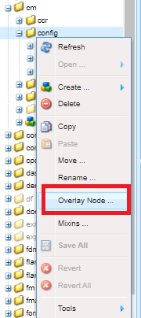
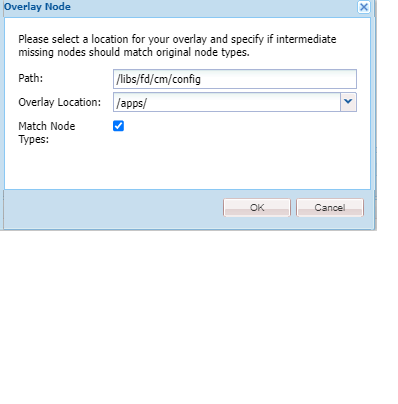

# Personalizar el editor de texto{#customize-text-editor}

## Información general {#overview}

Puede personalizar el editor de texto utilizado para crear fragmentos de documento para agregar más fuentes y tamaños de fuente. Estas fuentes incluyen fuentes inglesas y no inglesas, como las japonesas.

Puede personalizarlo para cambiar lo siguiente en la configuración de la fuente:

* Familia de fuentes y tamaño
* Propiedades como la altura y el espaciado entre letras
* Valores predeterminados de la familia de fuentes y el formato de tamaño, altura, espaciado entre letras y fecha
* Sangrías de viñetas

Para hacer esto, deberá:

1. [Personalizar fuentes al editar el archivo tbxeditor-config.xml en CRX](#customizefonts)
1. [Agregar fuentes personalizadas al equipo cliente](#addcustomfonts)

## Personalizar fuentes al editar el archivo tbxeditor-config.xml en CRX {#customizefonts}

Para personalizar fuentes al editar el archivo tbxeditor-config.xml, haga lo siguiente:

1. Vaya a `https://'[server]:[port]'/[ContextPath]/crx/de` e inicie sesión como administrador.
1. En la carpeta de aplicaciones, cree una carpeta denominada config con una ruta/estructura similar a la carpeta de configuración, que se encuentra en libs/fd/cm/config, para ello, siga los siguientes pasos:

   1. Haga clic con el botón derecho en la carpeta Elementos en la siguiente ruta y seleccione **Nodo de superposición**:

      `/libs/fd/cm/config`

      

   1. Asegúrese de que el cuadro de diálogo Nodo de superposición tenga los siguientes valores:

      **Ruta:** /libs/fd/cm/config

      **Ubicación:** /apps/

      **Tipos de nodos coincidentes:** Seleccionado

      

   1. Haga clic en **Aceptar**. La estructura de carpetas se crea en la carpeta de aplicaciones.

   1. Haga clic en **Guardar todo**.

1. Cree una copia del archivo tbxeditor-config.xml en la carpeta de configuración recién creada, para ello, siga estos pasos:

   1. Haga clic con el botón derecho en el archivo tbxeditor-config.xml en libs/fd/cm/config y seleccione **Copiar**.
   1. Haga clic con el botón derecho en la siguiente carpeta y seleccione **Pegar:**

      `apps/fd/cm/config`

   1. El nombre del archivo pegado, de forma predeterminada, es `copy of tbxeditor-config.xml.` Cambie el nombre del archivo a `tbxeditor-config.xml` y haga clic en **Guardar todo**.

1. Abra el archivo tbxeditor-config.xml en apps/fd/cm/config y realice los cambios necesarios.

   1. Haga doble clic en el archivo tbxeditor-config.xml en apps/fd/cm/config. Se abrirá el archivo.

      ```xml
      <editorConfig>
         <bulletIndent>0.25in</bulletIndent>
      
         <defaultDateFormat>DD-MM-YYYY</defaultDateFormat>
      
         <fonts>
            <default>Times New Roman</default>
            <font>_sans</font>
            <font>_serif</font>
            <font>_typewriter</font>
            <font>Arial</font>
            <font>Courier</font>
            <font>Courier New</font>
            <font>Geneva</font>
            <font>Georgia</font>
            <font>Helvetica</font>
            <font>Tahoma</font>
            <font>Times New Roman</font>
            <font>Times</font>
            <font>Verdana</font>
         </fonts>
      
         <fontSizes>
            <default>12</default>
            <fontSize>8</fontSize>
            <fontSize>9</fontSize>
            <fontSize>10</fontSize>
            <fontSize>11</fontSize>
            <fontSize>12</fontSize>
            <fontSize>14</fontSize>
            <fontSize>16</fontSize>
            <fontSize>18</fontSize>
            <fontSize>20</fontSize>
            <fontSize>22</fontSize>
            <fontSize>24</fontSize>
            <fontSize>26</fontSize>
            <fontSize>28</fontSize>
            <fontSize>36</fontSize>
            <fontSize>48</fontSize>
            <fontSize>72</fontSize>
         </fontSizes>
      
         <lineHeights>
            <default>2</default>     
            <lineHeight>2</lineHeight>
            <lineHeight>3</lineHeight>
            <lineHeight>4</lineHeight>
            <lineHeight>5</lineHeight>
            <lineHeight>6</lineHeight>
            <lineHeight>7</lineHeight>
            <lineHeight>8</lineHeight>
            <lineHeight>9</lineHeight>
            <lineHeight>10</lineHeight>
            <lineHeight>11</lineHeight>
            <lineHeight>12</lineHeight>
            <lineHeight>13</lineHeight>
            <lineHeight>14</lineHeight>
            <lineHeight>15</lineHeight>
            <lineHeight>16</lineHeight>
         </lineHeights>
      
         <letterSpacings>
            <default>0</default>
            <letterSpacing>0</letterSpacing>
            <letterSpacing>1</letterSpacing>
            <letterSpacing>2</letterSpacing>
            <letterSpacing>3</letterSpacing>
            <letterSpacing>4</letterSpacing>
            <letterSpacing>5</letterSpacing>
            <letterSpacing>6</letterSpacing>
            <letterSpacing>7</letterSpacing>
            <letterSpacing>8</letterSpacing>
            <letterSpacing>9</letterSpacing>
            <letterSpacing>10</letterSpacing>
            <letterSpacing>11</letterSpacing>
            <letterSpacing>12</letterSpacing>
            <letterSpacing>13</letterSpacing>
            <letterSpacing>14</letterSpacing>
            <letterSpacing>15</letterSpacing>
            <letterSpacing>16</letterSpacing>
         </letterSpacings>
      </editorConfig>
      ```

   1. Realice los cambios necesarios en el archivo para cambiar lo siguiente en la configuración de la fuente:

      * Agregar o quitar la familia y el tamaño de fuente
      * Propiedades como la altura y el espaciado entre letras
      * Valores predeterminados de la familia de fuentes y el formato de tamaño, altura, espaciado entre letras y fecha
      * Sangrías de viñetas

      Por ejemplo, para agregar una fuente japonesa denominada Sazanami Mincho Medium, debe incluir la siguiente entrada en el archivo XML: `<font>Sazanami Mincho Medium</font>`. También necesitará tener esta fuente instalada en el equipo cliente para acceder y trabajar con la personalización de fuentes. Para obtener más información, consulte [Agregar fuentes personalizadas al equipo cliente](#addcustomfonts).

      También puede cambiar los valores predeterminados de varios aspectos del texto y, al quitar las entradas, quitar las fuentes del editor de texto.

   1. Haga clic en **Guardar todo**.

## Agregar fuentes personalizadas al equipo cliente {#addcustomfonts}

Cuando accede a una fuente en el editor de texto de comunicaciones interactivas, debe estar presente en el equipo cliente que utilice para acceder a ella. Para poder utilizar una fuente personalizada en el editor de texto, primero debe instalar la misma en el equipo cliente.

Para obtener más información sobre la instalación de fuentes, consulte lo siguiente:

* [Instalar o desinstalar fuentes en Windows](https://windows.microsoft.com/es-es/windows-vista/install-or-uninstall-fonts)
* [Conceptos básicos de Mac: Libro de fuentes](https://support.apple.com/es-es/HT201749)

## Acceder a las personalizaciones de fuente {#access-font-customizations}

Después de realizar cambios en las fuentes en el archivo tbxeditor-config.xml en CRX e instalar las fuentes requeridas en el equipo cliente utilizado para acceder a AEM Forms, los cambios aparecerán en el editor de texto.

Por ejemplo, la fuente Sazanami Mincho Medium agregada en el procedimiento [Personalizar fuentes al editar el archivo tbxeditor-config.xml en CRX](#customizefonts), aparece en la interfaz de usuario del editor de texto de la siguiente manera:


>[!NOTE]
>
>Para ver texto en japonés, primero debe introducir el texto con caracteres japoneses. La aplicación de una fuente japonesa personalizada solo da formato al texto de una manera determinada. La aplicación de una fuente japonesa personalizada no cambia los caracteres ingleses u otros caracteres a los japoneses.
