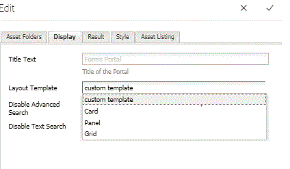

# Lista de tipos de recursos personalizados en AEM Forms {#listing-custom-asset-types-in-aem-forms}

## Creando plantilla personalizada {#creating-custom-template}


A los efectos de este artículo, crearemos una plantilla personalizada para mostrar los tipos de recursos personalizados y los tipos de recursos OOTB en la misma página. Para crear una plantilla personalizada, siga las instrucciones siguientes

1. Crear una sling: en /apps. Asigne un nombre a &quot;myportalcomponent&quot;
1. Añada una propiedad &quot;fpContentType&quot;. Establezca su valor en &quot;**/libs/fd/ fp/formTemplate&quot;.**
1. Añada una propiedad &quot;title&quot; y defina su valor en &quot;custom template&quot;. Este es el nombre que verá en la lista desplegable del componente Buscar y listar
1. Cree un archivo &quot;template.html&quot; en esta carpeta. Este archivo contendrá el código para aplicar estilo y mostrar los distintos tipos de recursos.


El siguiente código lista los distintos tipos de recursos mediante el componente de búsqueda y lista. Creamos elementos HTML independientes para cada tipo de recurso, como se muestra en la etiqueta data-type = &quot;videos&quot;. Para el tipo de recurso de &quot;vídeos&quot;, se utiliza el elemento &lt;video> para reproducir el vídeo en línea. Para el tipo de recurso de &quot;documentos de palabras&quot; utilizamos una marca HTML diferente.

```html
<div class="__FP_boxes-container __FP_single-color">
   <div  data-repeatable="true">
     <div class = "__FP_boxes-thumbnail" style="float:left;margin-right:20px;" data-type = "videos">
   <video width="400" controls>
       <source src="${path}" type="video/mp4">
    </video>
         <h3 class="__FP_single-color" title="${name}" tabindex="0">${name}</h3>
     </div>
     <div class="__FP_boxes-thumbnail" style="float:left;margin-right:20px;" data-type = "worddocuments">
       <a href="/assetdetails.html${path}" target="_blank">
           
          </a>
          <h3 class="__FP_single-color" title="${name}" tabindex="0">${name}</h3>
     </div>
  <div class="__FP_boxes-thumbnail" style="float:left;margin-right:20px;" data-type = "xfaForm">
       <a href="/assetdetails.html${path}" target="_blank">
           
          </a>
          <h3 class="__FP_single-color" title="${name}" tabindex="0">${name}</h3>
                <a href="{formUrl}"></a><p>

     </div>
  <div class="__FP_boxes-thumbnail" style="float:left;margin-right:20px;" data-type = "printForm">
       <a href="/assetdetails.html${path}" target="_blank">
           
          </a>
          <h3 class="__FP_single-color" title="${name}" tabindex="0">${name}</h3>
                <a href="{pdfUrl}"></a><p>
     </div>
   </div>
</div>
```

>[!NOTE]
>
>Línea 11 - Cambie la imagen src para que señale a una imagen de su elección en DAM.
>
>Para lista de Forms adaptable en esta plantilla, cree un nuevo div y defina su atributo de tipo de datos como &quot;guía&quot;. Puede copiar y pegar el div cuyo data-type=&quot;printForm&quot; y establecer el tipo de datos del div recién copiado en &quot;guide&quot;

## Configurar el componente Búsqueda y listado {#configure-search-and-lister-component}

Una vez definida la plantilla personalizada, ahora debemos asociar esta plantilla personalizada con el componente &quot;Buscar y listar&quot;. Apunte el explorador [a esta dirección URL ](http://localhost:4502/editor.html/content/AemForms/CustomPortal.html).

Cambie al modo Diseño y configure el sistema de párrafos para incluir el componente Buscar y listar en el grupo de componentes permitidos. El componente Buscar y listado forma parte del grupo Servicios de Documento.

Cambie al modo de edición y agregue el componente Búsqueda y listado a ParSys.

Abra las propiedades de configuración del componente &quot;Buscar y listar&quot;. Asegúrese de que la ficha &quot;Carpetas de recursos&quot; está seleccionada. Seleccione las carpetas en las que desea realizar la lista de los recursos en el componente de búsqueda y lista. A los efectos de este artículo, he seleccionado

* /content/dam/VideosAndWordDocuments
* /content/dam/formsanddocuments/assettypes


Ficha a la ficha &quot;Mostrar&quot;. Aquí elegirá la plantilla que desea que muestre los recursos en el componente de búsqueda y lista.

Seleccione &quot;plantilla personalizada&quot; en la lista desplegable como se muestra a continuación.



Configure los tipos de recursos que desea lista en el portal. Para configurar los tipos de fichas de recursos en la &quot;Lista de recursos&quot; y configurar los tipos de recursos. En este ejemplo hemos configurado los siguientes tipos de recursos

1. Archivos MP4
1. Documentos de palabras
1. Documento (es un tipo de recurso OOTB)
1. Plantilla de formulario(Es un tipo de recurso OOTB)

La siguiente captura de pantalla muestra los tipos de recursos configurados para la lista


Ahora que ha configurado el componente de Search and Lister Portal, es hora de ver el listado en acción. Apunte el explorador [a esta dirección URL ](http://localhost:4502/content/AemForms/CustomPortal.html?wcmmode=disabled). Los resultados deberían ser parecidos a la imagen que se muestra a continuación.

>[!NOTE]
>
>Si el portal está enumerando tipos de recursos personalizados en un servidor de publicación, asegúrese de dar permiso de &quot;lectura&quot; al usuario &quot;fd-service&quot; en el nodo **/apps/fd/fp/Extensions/querybuilder**


[assettypesDescargue e instale este paquete mediante el administrador de paquetes.](assets/customassettypekt1.zip) Contiene documentos mp4 y de palabras de ejemplo y archivos xdp que se utilizarán como tipos de recursos para la lista mediante el componente de búsqueda y lista
