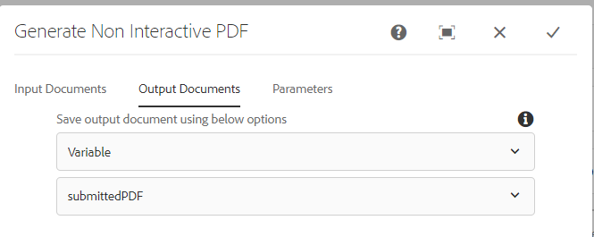

# Flujo de trabajo para revisar y aprobar el PDF enviado

El último y último paso es crear AEM flujo de trabajo que generará un PDF estático o no interactivo para su revisión y aprobación. El flujo de trabajo se activará mediante un iniciador de AEM configurado en el nodo `/content/pdfsubmissions`.

La siguiente captura de pantalla muestra los pasos involucrados en el flujo de trabajo.

## Paso para generar un flujo de trabajo de PDF no interactivo

La plantilla XDP y los datos que se combinarán con la plantilla se especifican aquí. Los datos que se combinarán son los datos enviados desde el PDF. Estos datos enviados se almacenan en el nodo `/content/pdfsubmissions`.

El PDF generado se asigna a la variable de flujo de trabajo denominada `submittedPDF`.

### Asignar el PDF generado para su revisión y aprobación

El componente Asignar flujo de trabajo de tarea se utiliza aquí para asignar el PDF generado para su revisión y aprobación. La variable `submittedPDF` se utiliza en la ficha Forms y Documentos del componente de flujo de trabajo Asignar Tarea.

