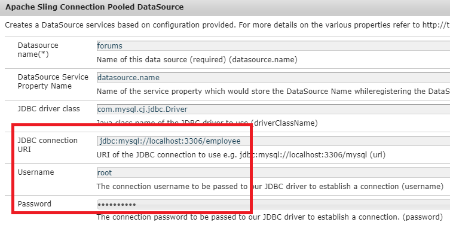

# Configuración del modelo de datos de formulario

## Fuente de datos obtenida de una conexión Apache Sling

El primer paso para crear un modelo de datos de formulario respaldado por RDBMS es configurar la fuente de datos agrupada de la conexión Apache Sling. Para configurar la fuente de datos, siga los pasos que se indican a continuación:

* Apunte el navegador a [configMgr](http://localhost:4502/system/console/configMgr)
* Busque la fuente de datos agrupada de la conexión Apache Sling **Apache Sling**
* Agregue una nueva entrada y proporcione los valores como se muestra en la captura de pantalla.
* 
* Guarde los cambios

>[!NOTE]
>El URI de conexión JDBC, el nombre de usuario y la contraseña cambiarán dependiendo de la configuración de la base de datos MySQL.

## Creación de un modelo de datos de formulario

* Apunte el navegador a [Integraciones de datos](http://localhost:4502/aem/forms.html/content/dam/formsanddocuments-fdm)
* Haga clic en _Crear_->_Modelo de datos de formulario_
* Proporcione un nombre y un título significativos al modelo de datos de formulario, como **Empleado**
* Haga clic en _Siguiente_
* Seleccione la fuente de datos creada en la sección(foros) anterior
* Haga clic en _Crear_->Editar para abrir el modelo de datos de formulario recién creado en modo de edición
* Expanda el nodo _forums_ para ver el esquema de empleado. Expanda el nodo empleado para ver las 2 tablas

## Añadir entidades al modelo

* Asegúrese de que el nodo de empleado esté expandido
* Seleccione las entidades de beneficiarios y nuevas y haga clic en _Agregar seleccionado_

## Añadir el servicio de lectura a toda la entidad

* Seleccionar entidad nueva
* Haga clic en _Editar propiedades_
* Seleccione obtener en la lista desplegable Leer servicio
* Haga clic en el icono + para añadir un parámetro al servicio get
* Especifique los valores tal y como se muestra en la captura de pantalla
* 
>[!NOTE]
> El servicio get espera un valor asignado a la columna empID de cualquier entidad. Existen varias formas de pasar este valor y en este tutorial, el empID se pasará a través del parámetro de solicitud denominado empID.
* Haga clic en _Listo_ para guardar los argumentos del servicio get
* Haga clic en _Listo_ para guardar los cambios en el modelo de datos de formulario

## Añadir asociación entre 2 entidades

Las asociaciones definidas entre entidades de base de datos no se crean automáticamente en el modelo de datos de formulario. Las asociaciones entre entidades deben definirse mediante el editor del modelo de datos de formulario. Cada entidad nueva puede tener uno o más beneficiarios, necesitamos definir una a varias asociaciones entre las entidades newhir y las entidades beneficiarias.
Los siguientes pasos le guían a través del proceso de creación de la asociación &quot;uno a varios&quot;

* Seleccione cualquier entidad y haga clic en _Agregar asociación_
* Proporcione un Título e identificador significativo a la asociación y a otras propiedades como se muestra en la captura de pantalla siguiente
   

* Haga clic en el icono _editar_ en la sección Argumentos

* Especifique los valores tal y como se muestra en esta captura de pantalla
* 
* **Se están vinculando las dos entidades mediante la columna empID de beneficiarios y entidades nuevas.**
* Haga clic en _Listo_ para guardar los cambios

## Probar el modelo de datos del formulario

Nuestro modelo de datos de formulario ahora tiene **_get_** servicio que acepta empID y devuelve los detalles del nuevo y sus beneficiarios. Para probar el servicio get, siga los pasos que se indican a continuación.

* Seleccionar entidad nueva
* Haga clic en _Test Model Object_
* Proporcione un empID válido y haga clic en _Test_
* Debería obtener resultados como se muestra en la captura de pantalla siguiente
* 
