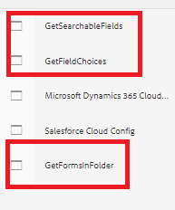

# Implementar el ejemplo en el servidor local

AEM Para que este caso de uso funcione en el servidor local, siga los pasos que se indican a continuación. Se supone que la instancia de la se está ejecutando en localhost, puerto 4502.

* [Instale el paquete](assets/azuredemo.all-1.0.0-SNAPSHOT.zip) mediante el administrador de paquetes.

* Proporcione las credenciales del portal de Azure mediante OSGi configMgr
  
Asegúrese de que el URI de almacenamiento termina en una barra diagonal y que el token SAS comienza con un símbolo ?
* Vaya a [AzureDemo](http://localhost:4502/libs/fd/fdm/gui/components/admin/fdmcloudservice/fdm.html/conf/azuredemo)

* Edite la configuración de autenticación de los tres orígenes de datos siguientes para que coincida con su entorno
  

* Previsualizar y enviar [formulario de contacto](http://localhost:4502/content/dam/formsanddocuments/azureportal/contactus/jcr:content?wcmmode=disabled)

* [Consulte el envío del formulario](http://localhost:4502/content/dam/formsanddocuments/azureportal/queryformsubmissions/jcr:content?wcmmode=disabled)
