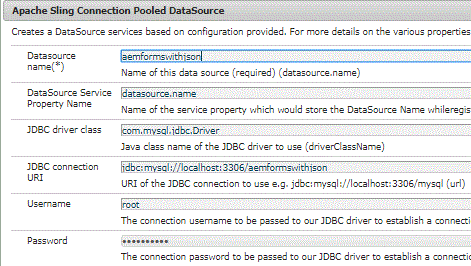

# Almacenamiento de datos enviados en la base de datos


>[!NOTE]
>
>Se recomienda utilizar MySQL 8 como base de datos, ya que es compatible con el tipo de datos JSON. También deberá instalar el controlador apropiado para MySQL DB. He utilizado el controlador disponible en esta ubicación https://mvnrepository.com/artifact/mysql/mysql-connector-java/8.0.12

Para almacenar los datos enviados en la base de datos, se escribirá un servlet para extraer los datos enlazados y el nombre del formulario y el almacén. A continuación se muestra el código completo para gestionar el envío del formulario y almacenar afBoundData en la base de datos.

Hemos creado un envío personalizado para gestionar el envío del formulario. En post.POST.jsp de este envío personalizado reenviamos la solicitud a nuestro servlet.

Para obtener más información sobre los ruegos de envío personalizados, lea este [artículo](https://helpx.adobe.com/experience-manager/kt/forms/using/custom-submit-aem-forms-article.html)

com.adobe.aemds.guide.utils.GuideSubmitUtils.setForwardPath(slingRequest,&quot;/bin/storeafsubmit&quot;,null,null);

```java
package com.aemforms.json.core.servlets;

import java.sql.Connection;
import java.sql.PreparedStatement;
import java.sql.SQLException;

import javax.servlet.Servlet;
import javax.servlet.ServletException;
import javax.sql.DataSource;

import org.apache.sling.api.SlingHttpServletRequest;
import org.apache.sling.api.SlingHttpServletResponse;
import org.apache.sling.api.servlets.SlingAllMethodsServlet;
import org.json.JSONException;
import org.json.JSONObject;
import org.osgi.service.component.annotations.Component;
import org.osgi.service.component.annotations.Reference;
import org.slf4j.Logger;
import org.slf4j.LoggerFactory;

@Component(service = Servlet.class, property = {

"sling.servlet.methods=get", "sling.servlet.methods=post",

"sling.servlet.paths=/bin/storeafsubmission"

})
public class HandleAdaptiveFormSubmission extends SlingAllMethodsServlet {
 private static final Logger log = LoggerFactory.getLogger(HandleAdaptiveFormSubmission.class);
 private static final long serialVersionUID = 1L;
 @Reference(target = "(&(objectclass=javax.sql.DataSource)(datasource.name=aemformswithjson))")
 private DataSource dataSource;

 protected void doPost(SlingHttpServletRequest request, SlingHttpServletResponse response) throws ServletException {
  JSONObject afSubmittedData;
  try {
   afSubmittedData = new JSONObject(request.getParameter("jcr:data"));
   // we will only store the data bound to schema
   JSONObject dataToStore = afSubmittedData.getJSONObject("afData").getJSONObject("afBoundData")
     .getJSONObject("data");
   String formName = afSubmittedData.getJSONObject("afData").getJSONObject("afSubmissionInfo")
     .getString("afPath");
   log.debug("The form name is " + formName);
   insertData(dataToStore, formName);

  } catch (JSONException e) {
   // TODO Auto-generated catch block
   e.printStackTrace();
  }

 }

 public void insertData(org.json.JSONObject jsonData, String formName) {
  log.debug("The json object I got to insert was " + jsonData.toString());
  String insertTableSQL = "INSERT INTO aemformswithjson.formsubmissions(formdata,formname) VALUES(?,?)";
  log.debug("The query is " + insertTableSQL);
  Connection c = getConnection();
  PreparedStatement pstmt = null;
  try {
   pstmt = null;
   pstmt = c.prepareStatement(insertTableSQL);
   pstmt.setString(1, jsonData.toString());
   pstmt.setString(2, formName);
   log.debug("Executing the insert statment  " + pstmt.executeUpdate());
   c.commit();
  } catch (SQLException e) {

   log.error("Getting errors", e);
  } finally {
   if (pstmt != null) {
    try {
     pstmt.close();
    } catch (SQLException e) {
     // TODO Auto-generated catch block
     e.printStackTrace();
    }
   }
   if (c != null) {
    try {
     c.close();
    } catch (SQLException e) {
     // TODO Auto-generated catch block
     e.printStackTrace();
    }
   }
  }
 }

 public Connection getConnection() {
  log.debug("Getting Connection ");
  Connection con = null;
  try {

   con = dataSource.getConnection();
   log.debug("got connection");
   return con;
  } catch (Exception e) {
   log.error("not able to get connection ", e);
  }
  return null;
 }

}
```



Para que esto funcione, su sistema siga los siguientes pasos

* [Descargue y descomprima el archivo zip](assets/aemformswithjson.zip)
* Crear un formulario adaptable con esquema JSON. Puede utilizar el esquema JSON proporcionado como parte de este artículo assets. Asegúrese de que la acción de envío del formulario está configurada correctamente. La acción de envío debe configurarse en &quot;CustomSubmitHelpx&quot;.
* Cree un esquema en la instancia MySQL importando el archivo schema.sql con la herramienta MySQL Workbench. El archivo schema.sql también se proporciona como parte de estos recursos de tutorial.
* Configuración de la fuente de datos agrupada de la conexión Apache Sling desde la consola web Felix
* Asegúrese de asignar el nombre de la fuente de datos &quot;aemformswithjson&quot;. Este es el nombre que utiliza el paquete OSGi de muestra que se le proporciona
* Consulte la imagen anterior para ver las propiedades. Esto supone que va a usar MySQL como base de datos.
* Implemente los paquetes OSGi que se proporcionan como parte de estos recursos de artículo.
* Previsualice el formulario y envíelo.
* Los datos JSON se almacenan en la base de datos que se creó al importar el archivo &quot;schema.sql&quot;.
