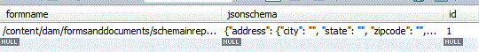

# Almacenar el esquema JSON en la base de datos {#storing-json-schema-in-database}


Para poder consultar los datos enviados, tendremos que almacenar el esquema JSON asociado al formulario enviado. El esquema JSON se utiliza en el generador de consultas para crear la consulta.

Cuando se envía un formulario adaptable, comprobamos si el esquema JSON asociado está en la base de datos. Si el esquema JSON no existe, recuperamos el esquema JSON y lo almacenamos en la tabla adecuada. También asociamos el nombre del formulario con el esquema JSON. La siguiente captura de pantalla muestra la tabla en la que se almacenan los esquemas JSON.



```java
public String getJSONSchema(String afPath) {
  // TODO Auto-generated method stub
  afPath = afPath.replaceAll("/content/dam/formsanddocuments/", "/content/forms/af/");
  Resource afResource = getResolver.getServiceResolver().getResource(afPath + "/jcr:content/guideContainer");
  javax.jcr.Node resNode = afResource.adaptTo(Node.class);
  String schemaNode = null;
  try {
   schemaNode = resNode.getProperty("schemaRef").getString();
  } catch (ValueFormatException e) {
   // TODO Auto-generated catch block
   e.printStackTrace();
  } catch (PathNotFoundException e) {
   // TODO Auto-generated catch block
   e.printStackTrace();
  } catch (RepositoryException e) {
   // TODO Auto-generated catch block
   e.printStackTrace();
  }
  if (schemaNode.startsWith("/content/dam")) {
   log.debug("The schema is in the dam");
   afResource = getResolver.getServiceResolver()
     .getResource(schemaNode + "/jcr:content/renditions/original/jcr:content");
   resNode = afResource.adaptTo(Node.class);
   InputStream jsonSchemaStream = null;
   try {
    jsonSchemaStream = resNode.getProperty("jcr:data").getBinary().getStream();
    Charset charset = StandardCharsets.UTF_8;
    String jasonSchemaString = IOUtils.toString(jsonSchemaStream, charset);
    log.debug("The Schema is " + jasonSchemaString);
    return jasonSchemaString;
   } catch (ValueFormatException e) {
    // TODO Auto-generated catch block
    e.printStackTrace();
   } catch (PathNotFoundException e) {
    // TODO Auto-generated catch block
    e.printStackTrace();
   } catch (RepositoryException e) {
    // TODO Auto-generated catch block
    e.printStackTrace();
   } catch (IOException e) {
    // TODO Auto-generated catch block
    e.printStackTrace();
   }
  }
  if (schemaNode.startsWith("/assets")) {
   afResource = getResolver.getServiceResolver()
     .getResource(afPath + "/jcr:content/guideContainer/" + schemaNode + "/jcr:content");
   resNode = afResource.adaptTo(Node.class);
   InputStream jsonSchemaStream = null;
   try {
    jsonSchemaStream = resNode.getProperty("jcr:data").getBinary().getStream();
    Charset charset = StandardCharsets.UTF_8;
    String jasonSchemaString = IOUtils.toString(jsonSchemaStream, charset);
    log.debug("The Schema is " + jasonSchemaString);
    return jasonSchemaString;
   } catch (ValueFormatException e) {
    // TODO Auto-generated catch block
    e.printStackTrace();
   } catch (PathNotFoundException e) {
    // TODO Auto-generated catch block
    e.printStackTrace();
   } catch (RepositoryException e) {
    // TODO Auto-generated catch block
    e.printStackTrace();
   } catch (IOException e) {
    // TODO Auto-generated catch block
    e.printStackTrace();
   }
  }

  return null;

 }
```

>[!NOTE]
>
>Al crear un formulario adaptable, puede utilizar el esquema JSON que se encuentra en el repositorio o cargar un esquema JSON. El código anterior funcionará en ambos casos.

El esquema recuperado se almacena en la base de datos utilizando las operaciones JDBC estándar. El siguiente código inserta el esquema en la base de datos

```java
public void insertJsonSchema(JSONObject jsonSchema, String afForm) {
  log.debug("$$$$ in insert Schema" + afForm);
  log.debug("$$$$$ The jsonSchema is  " + jsonSchema);
  Connection con = getConnection();
  log.debug("$$$$ got connection is insertJsonSchema");
  String insertTableSQL = "INSERT INTO leads.jsonschemas(jsonschema,formname) VALUES(?,?)";
  PreparedStatement pstmt = null;
  try {

   // org.json.JSONObject jsonSchemaObj = new
   // org.json.JSONObject(jsonSchema);
   pstmt = con.prepareStatement(insertTableSQL);
   pstmt.setString(1, jsonSchema.toString());
   pstmt.setString(2, afForm);
   log.debug("Executing the insert  json schema statment  " + pstmt.executeUpdate());
   con.commit();
  } catch (SQLException e) {
   // TODO Auto-generated catch block
   e.printStackTrace();
  } finally {
   if (con != null) {
    try {
     con.close();
    } catch (SQLException e) {
     // TODO Auto-generated catch block
     e.printStackTrace();
    }
   }
  }

 }
```

En resumen, hasta ahora hemos hecho lo siguiente

* Crear formulario adaptable basado en esquema JSON
* Si el formulario se envía la primera vez que almacenamos el esquema JSON asociado con el formulario en la base de datos.
* Almacenamos los datos enlazados del formulario adaptable en la base de datos.

Los siguientes pasos serían utilizar QueryBuilder para mostrar los campos que se buscarán en función del esquema JSON
