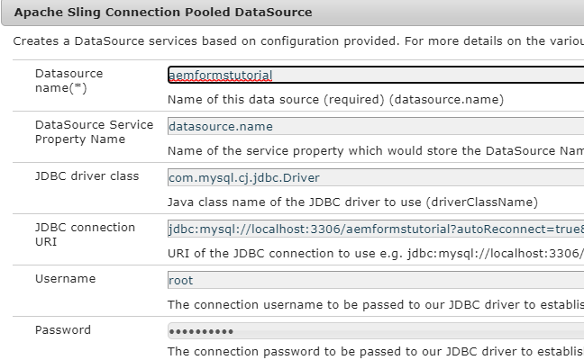

# Configurar fuente de datos

AEM Existen muchas maneras de habilitar la integración con una base de datos externa mediante el uso de la. Una de las formas más comunes de integrar una base de datos es usando las propiedades de configuración de la fuente de datos obtenida de una conexión Apache Sling a través de [configMgr](http://localhost:4502/system/console/configMgr).
AEM El primer paso es descargar e implementar los [controladores MySql](https://mvnrepository.com/artifact/mysql/mysql-connector-java) adecuados en el servidor de correo de.
Cree la fuente de datos obtenida de una conexión Apache Sling y proporcione las propiedades que se especifican en la captura de pantalla siguiente. El esquema de la base de datos se proporciona como parte de estos recursos de tutorial.

La base de datos tiene una tabla denominada formdata con las 3 columnas, como se muestra en la captura de pantalla siguiente.

>[!NOTE]
>Asegúrese de asignar un nombre a la fuente de datos **aemformstutorial**. El código de ejemplo utiliza el nombre para conectarse a la base de datos.

| Nombre de la propiedad | Valor |
| ------------------------|--------------------------------------- |
| Nombre de Datasource | `SaveAndContinue` |
| Clase de controlador JDBC | `com.mysql.cj.jdbc.Driver` |
| URI de conexión JDBC | `jdbc:mysql://localhost:3306/aemformstutorial` |

## Recursos

El archivo SQL para crear el esquema se puede [descargar desde aquí](assets/sign-multiple-forms.sql). Deberá importar este archivo mediante MySql Workbench para crear el esquema y la tabla.

## Siguientes pasos

[Crear un servicio OSGi para almacenar y recuperar datos en la base de datos](./create-osgi-service.md)
