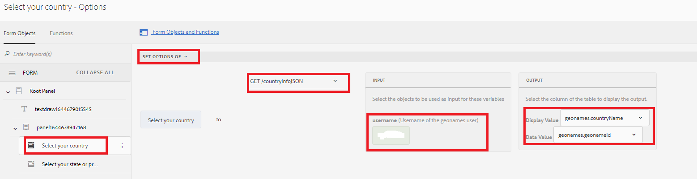

# Listas desplegables en cascada

Una lista desplegable en cascada es una serie de controles DropDownList dependientes en los que un control DropDownList depende de los controles principales o anteriores DropDownList. Los elementos del control DropDownList se rellenan en función de un elemento seleccionado por el usuario desde otro control DropDownList.

## Demostración del caso de uso

>[!VIDEO](https://video.tv.adobe.com/v/340344?quality=9&learn=on)

A los efectos de este tutorial, he utilizado [API de REST de Geonames](http://api.geonames.org/) para demostrar esta capacidad.
Existen varias organizaciones que proporcionan este tipo de servicio y, siempre y cuando tengan API de REST bien documentadas, podrá integrarlas fácilmente con AEM Forms mediante la funcionalidad de integración de datos

Se siguieron los siguientes pasos para implementar listas desplegables en cascada en AEM Forms

## Crear cuenta de desarrollador

Cree una cuenta de desarrollador con [Geonames](https://www.geonames.org/login). Anote el nombre de usuario. Este nombre de usuario será necesario para invocar las API de REST de geonames.org.

## Crear archivo Swagger/OpenAPI

La especificación OpenAPI (anteriormente la especificación Swagger) es un formato de descripción de API para las API de REST. Un archivo OpenAPI le permite describir toda la API, lo que incluye:

* Puntos finales disponibles (/usuarios) y operaciones en cada punto final (GET/usuarios, POST/usuarios)
* Parámetros de operación Entrada y salida para cada operación Métodos de autenticación
* Información de contacto, licencia, términos de uso y otra información.
* Las especificaciones de API se pueden escribir en YAML o JSON. El formato es fácil de aprender y de leer tanto para humanos como para máquinas.

Para crear su primer archivo swagger/OpenAPI, siga el [Documentación de OpenAPI](https://swagger.io/docs/specification/2-0/basic-structure/)

>[!NOTE]
> AEM Forms admite OpenAPI Specification versión 2.0 (FKA Swagger).

Utilice la variable [editor de swagger](https://editor.swagger.io/) para crear el archivo swagger para describir las operaciones que recuperan todos los países y elementos secundarios del país o estado. El archivo de intercambio se puede crear en formato JSON o YAML. El archivo de cambio completado se puede descargar desde [here](assets/swagger-files.zip)
Los archivos de intercambio describen la siguiente API de REST
* [Obtener todos los países](http://api.geonames.org/countryInfoJSON?username=yourusername)
* [Obtención de elementos secundarios del objeto Geoname](http://api.geonames.org/childrenJSON?formatted=true&amp;geonameId=6252001&amp;username=yourusername)

## Crear fuentes de datos

Para integrar AEM/AEM Forms con aplicaciones de terceros, necesitamos [crear fuente de datos](https://experienceleague.adobe.com/docs/experience-manager-learn/forms/ic-web-channel-tutorial/parttwo.html) en la configuración de cloud services. Utilice el [archivos swagger](assets/swagger-files.zip) para crear las fuentes de datos.
Deberá crear 2 fuentes de datos (una para recuperar todos los países y otra para obtener elementos secundarios)

## Crear modelo de datos de formulario

La integración de datos de AEM Forms proporciona una interfaz de usuario intuitiva para crear y trabajar con [modelos de datos de formulario](https://experienceleague.adobe.com/docs/experience-manager-65/forms/form-data-model/create-form-data-models.html). Base el modelo de datos de formulario en los orígenes de datos creados en el paso anterior. Modelo de datos de formulario con 2 fuentes de datos

## Crear formulario adaptable

Integre las invocaciones de GET del Modelo de datos de formulario con el formulario adaptable para rellenar las listas desplegables.
Cree un formulario adaptable con 2 listas desplegables. Uno para enumerar los países, y uno para enumerar los estados/provincias según el país seleccionado.

### Rellenar lista desplegable de países

La lista de países se rellena cuando se inicializa por primera vez el formulario. La siguiente captura de pantalla muestra el editor de reglas configurado para rellenar las opciones de la lista desplegable del país. Tendrá que proporcionar su nombre de usuario con la cuenta de nombres geográficos para que esto funcione.

#### Rellene la lista desplegable Estado/provincia

Es necesario rellenar la lista desplegable Estado/provincia en función del país seleccionado. La siguiente captura de pantalla muestra la configuración del editor de reglas

### Ejercicio

Agregue 2 listas desplegables llamadas condados y ciudades en el formulario para enumerar los condados y la ciudad según el país y el estado/provincia seleccionados.

