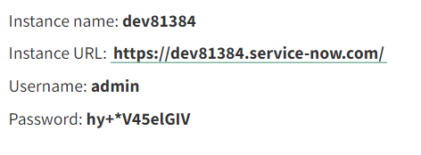

# Integrar AEM Forms con [!DNL ServiceNow]

Crear y mostrar incidencias en [!DNL ServiceNow] uso del modelo de datos de formulario en AEM Forms.

## Requisitos previos

* [!DNL ServiceNow] cuenta.
* Familiarizado con [creación de fuentes de datos](https://experienceleague.adobe.com/docs/experience-manager-learn/forms/ic-web-channel-tutorial/parttwo.html)
* Familiarizado con [Modelo de datos de formulario](https://experienceleague.adobe.com/docs/experience-manager-65/forms/form-data-model/create-form-data-models.html)

## Recursos de ejemplo

Los recursos de ejemplo que se proporcionan con este artículo son los siguientes

* Configuración del servicio en la nube
* Intercambiar archivos para crear un incidente y recuperar todos los incidentes
* Modelo de datos de formulario basado en los archivos de cambio
* Formulario adaptable para crear y enumerar [!DNL ServiceNow] incidentes

## Implementar los recursos en el servidor

* Descargue el [recursos de ejemplo](assets/service-now.zip)
* Importar los recursos en AEM mediante [gestor de paquetes](http://localhost:4502/crx/packmgr/index.jsp)
* El archivo swagger utilizado para esta integración se encuentra en la sección ```/conf/9957/settings/cloudconfigs/fdm``` carpeta en el repositorio crx
* Edite el [Configuración del servicio en la nube CreateIncidente](http://localhost:4502/mnt/overlay/fd/fdm/gui/components/admin/fdmcloudservice/properties.html?item=%2Fconf%2F9957%2Fsettings%2Fcloudconfigs%2Ffdm%2Fcreateincident)para que coincida con su instancia de ServiceNow.
* Edite el [Configuración del servicio en la nube GetAllIncidents](http://localhost:4502/mnt/overlay/fd/fdm/gui/components/admin/fdmcloudservice/properties.html?item=%2Fconf%2F9957%2Fsettings%2Fcloudconfigs%2Ffdm%2Fgetallincidents) para que coincida con su instancia de ServiceNow. Deberá cambiar el host, el nombre de usuario y la contraseña para que coincidan con sus credenciales de instancia de ServiceNow.

## Acceso a las credenciales de instancia de ServiceNow

* Haga clic en su perfil de usuario
   

* Haga clic en Administrar contraseña de instancia
* Los detalles de la instancia se mostrarán de la siguiente manera
   

## Probar la integración

* [Abrir el formulario adaptable](http://localhost:4502/content/dam/formsanddocuments/create-incident-in-service-now/jcr:content?wcmmode=disabled)
* Introduzca algunos valores en el campo descripción y comentarios y haga clic en el botón Crear incidente .
* El ID de incidente del incidente recién creado debe rellenarse en el campo de texto y la siguiente tabla debe enumerar todos los incidentes.
