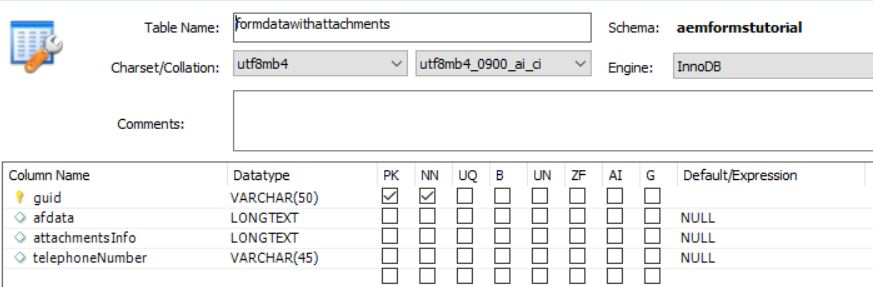

# Configurar fuente de datos

AEM Existen muchas maneras de habilitar la integración con una base de datos externa mediante el uso de la. Una de las prácticas más comunes y estándar de la integración de bases de datos es utilizar las propiedades de configuración de la fuente de datos obtenida de una conexión Apache Sling a través de la [configMgr](http://localhost:4502/system/console/configMgr).
El primer paso es descargar e implementar el adecuado [Controladores MySQL](https://mvnrepository.com/artifact/mysql/mysql-connector-java) AEM a la.
A continuación, establezca las propiedades del origen de datos agrupado de la conexión de Sling específicas de la base de datos. La siguiente captura de pantalla muestra la configuración utilizada para este tutorial. El esquema de la base de datos se proporciona como parte de estos recursos de tutorial.

>[!NOTE]
>Asegúrese de nombrar la fuente de datos `StoreAndRetrieveAfData` ya que es el nombre que se utiliza en el servicio OSGi.

| Nombre de la propiedad | Valor de propiedad |   |
|---------------------|------------------------------------------------------------------------------------|---|
| Nombre de la fuente de datos | StoreAndRetrieveAfData |   |
| Clase de unidad JDBC | jdbc:mysql://localhost:3306/aemformstutorial |   |
| URI de conexión JDBC | jdbc:mysql://localhost:3306/aemformstutorial?serverTimezone=UTC&amp;autoReconnect=true |   |
|                     |                                                                                    |   |

## Crear base de datos

La siguiente base de datos se utilizó para los fines de este caso de uso. La base de datos tiene una tabla llamada `formdatawithattachments` con las 4 columnas como se muestra en la captura de pantalla siguiente.

* La columna **afdata** contendrá los datos del formulario adaptable.
* La columna **attachmentsInfo** contendrá la información sobre los archivos adjuntos del formulario.
* Las columnas **telephoneNumber** contendrá el número de móvil de la persona que rellena el formulario.

Cree la base de datos importando [esquema base datos](assets/data-base-schema.sql)
uso de MySQL workbench.

## Crear modelo de datos de formulario

Cree el modelo de datos de formulario y baselo en la fuente de datos creada en el paso anterior.
Configure las variables **get** servicio de este modelo de datos de formulario como se muestra en la captura de pantalla siguiente.
Asegúrese de que no devuelve una matriz en **get** servicio.

El propósito de esto **get** El servicio de está diseñado para obtener el número de teléfono asociado con el id de aplicación de.

Este modelo de datos de formulario se utilizará en la variable **MyAccountForm** para obtener el número de teléfono asociado al id de aplicación.

## Pasos siguientes

[Escribir código para guardar archivos adjuntos en formularios](./store-form-attachments.md)
