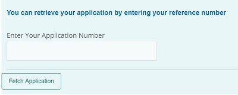

# Crear el MyAccountForm

El formulario **MyAccountForm** se utiliza para recuperar el formulario adaptable parcialmente completado después de que el usuario haya verificado el id de la aplicación y el número de móvil asociado con el id de la aplicación.



Cuando el usuario introduce el id de la aplicación y hace clic en el botón **FetchApplication**, el número de móvil asociado al id de la aplicación se obtiene de la base de datos mediante la operación Get del modelo de datos del formulario.

Este formulario utiliza la invocación POST del Modelo de datos de formulario para verificar el número de móvil mediante OTP. La acción de envío del formulario se activa cuando se verifica correctamente el número de móvil con el siguiente código. Se está activando el suceso click del botón de envío llamado **submitForm**.

>[!NOTE]
> Deberá proporcionar la clave de API y los valores de Secreto de API específicos de su cuenta [Nexmo](https://dashboard.nexmo.com/) en los campos correspondientes de MyAccountForm


Este formulario está asociado con una acción de envío personalizada que reenvía el envío del formulario al servlet montado en **/bin/renderaf**

```java
com.adobe.aemds.guide.utils.GuideSubmitUtils.setForwardPath(slingRequest,"/bin/renderaf",null,null);
```

El código del servlet montado en **/bin/renderaf** reenvía la solicitud para procesar el almacenamiento con archivos adjuntos de formulario adaptable rellenados previamente con los datos guardados.


* MyAccountForm se puede [descargar desde aquí](assets/my-account-form.zip)

* Los formularios de ejemplo se basan en [plantilla de formulario adaptable personalizada](assets/custom-template-with-page-component.zip) que debe importarse en AEM para que los formularios de ejemplo se representen correctamente.

* [El ](assets/custom-submit-my-account-form.zip) controlador de envío personalizado asociado con el envío MyAccountForm debe importarse en AEM.
