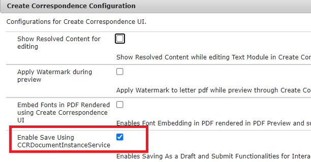

# Implementar los recursos de ejemplo en el servidor

Siga las siguientes instrucciones para que esta funcionalidad funcione en su servidor AEM

* Cree una carpeta llamada icrecluts en la unidad c
* [Crear el esquema de la base de datos](assets/icdrafts.sql)
* [Importar la biblioteca del cliente](assets/icdrafts.zip)
* [Importar el formulario adaptable](assets/SavedDraftsAdaptiveForm.zip)
* Cree una fuente de datos llamada _SaveAndContinue_

* [Implementar el paquete icrecluts](assets/icdrafts.icdrafts.core-1.0-SNAPSHOT.jar)
* Asegúrese de que _Habilitar Guardar usando CCRDocumentInstanceService_ en la configuración OSGI como se muestra a continuación
   
* Abra cualquier comunicación interactiva. Haga clic en Guardar como borrador para guardar
* [Ver borradores guardados](http://localhost:4502/content/dam/formsanddocuments/saveddrafts/jcr:content?wcmmode=disabled)

>[!NOTE]
>Los archivos xml se almacenan en la carpeta raíz de la instalación del servidor AEM. El proyecto de eclipse >se proporciona para personalizar la solución según sus necesidades.

El proyecto eclipse con implementación de muestra puede ser [descargado desde aquí](assets/icdrafts-eclipse-project.zip)
