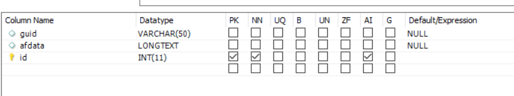

# Configurar fuentes de datos

Existen muchas maneras en que AEM habilita la integración con bases de datos externas. Una de las prácticas más comunes y estándar de integración de bases de datos es usar las propiedades de configuración de Apache Sling Connection Pooled DataSource a través de [configMgr](http://localhost:4502/system/console/configMgr).
El primer paso es descargar e implementar los [controladores MySql](https://mvnrepository.com/artifact/mysql/mysql-connector-java) adecuados en AEM.
Cree una fuente de datos agrupada de conexión Apache Sling y proporcione las propiedades especificadas en la captura de pantalla siguiente. El esquema de la base de datos se proporciona como parte de estos recursos de tutorial.

La base de datos tiene una tabla denominada formdata con las 3 columnas, como se muestra en la captura de pantalla siguiente.

El archivo sql para crear el esquema se puede [descargar desde aquí](assets/form-data-db.sql). Deberá importar este archivo utilizando MySql Workbench para crear el esquema y la tabla.

>[!NOTE]
>Asegúrese de asignar un nombre a la fuente de datos **SaveAndContinue**. El código de ejemplo utiliza el nombre para conectarse a la base de datos.

| Nombre de propiedad | Value |
------------------------|---------------------------------------
| Nombre del origen de datos | SaveAndContinue |
| Clase de controlador JDBC | com.mysql.cj.jdbc.Driver |
| URI de conexión JDBC | jdbc:mysql://localhost:3306/aemformstutorial |

