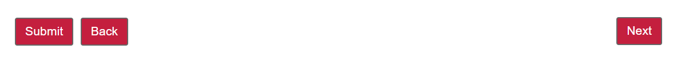

# Espaciar el botón de barra de herramientas

Cuando se agregan botones Siguiente y Anterior a la barra de herramientas de AEM Forms, los botones predeterminados se colocan uno junto al otro. Puede presionar el botón Next en el extremo derecho de la barra de herramientas, mientras mantiene el botón prev/back en la izquierda

## Aplicar estilo a la barra de herramientas

El caso de uso anterior se puede realizar fácilmente mediante el editor de estilos. Una vez añadido el botón Anterior/Siguiente a la barra de herramientas, asegúrese de haber seleccionado la capa Estilo en el menú de edición. Con el modo de estilo seleccionado, seleccione la barra de herramientas para abrir su hoja de propiedades de estilo. Expanda la sección Dimension y posición y asegúrese de ver todas las propiedades. Establezca las siguientes propiedades
* Dimensiones y posición
   * Anchura: 100%
   * Posición: relativa

Guarde los cambios

## Aplicar estilo al botón Siguiente

Seleccione el botón Siguiente y asegúrese de abrir la hoja de propiedades de estilo del botón siguiente (no el texto del botón siguiente). Establezca las siguientes propiedades
* Dimensiones y posición
   * posición: absoluta superior 1px derecha 1px
* Borde
   * Radio de borde: 4 px (superior, derecha, inferior, izquierda)

Guarde los cambios
