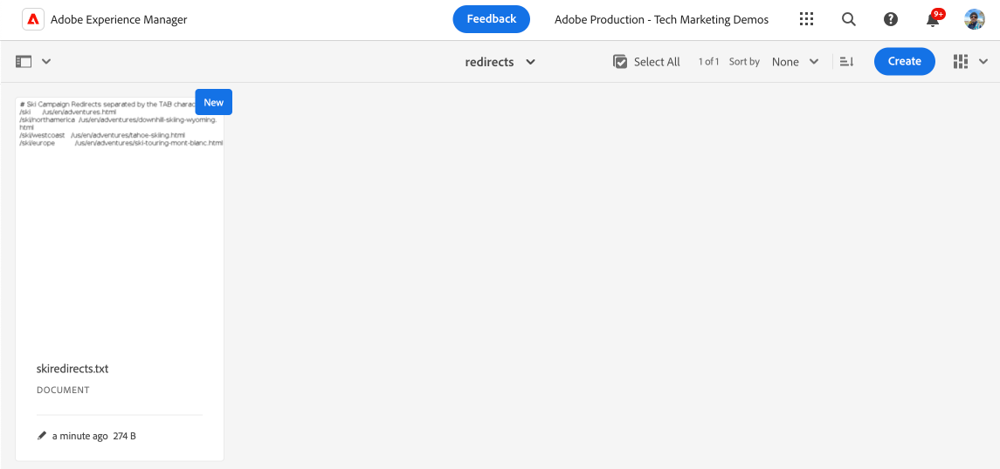

# Implementación de redirecciones de URL sin canalización

Aprenda a implementar [redirecciones de URL sin canalizaciones](https://experienceleague.adobe.com/en/docs/experience-manager-cloud-service/content/implementing/content-delivery/pipeline-free-url-redirects) en AEM as a Cloud Service para permitir que el equipo de marketing administre las redirecciones sin necesidad de un desarrollador.

Hay varias opciones para administrar URL redirecciones en AEM, para obtener más información, consulte [URL redirecciones](url-redirection.md).

El tutorial se centra en crear URL redirecciones como pares clave-valor en un archivo de texto gustar [Apache RewriteMap](https://httpd.apache.org/docs/2.4/rewrite/rewritemap.html) y utiliza AEM como una configuración específica de Cloud Service para cargarlas en el módulo Apache/Dispatcher.

## Requisitos previos

Para completar este tutorial, necesita lo siguiente:

- Entorno AEM as a Cloud Service con versión **18311 o superior**.

- Se debe implementar el proyecto de muestra [WKND Sites](https://github.com/adobe/aem-guides-wknd) en él.

## Caso de uso del tutorial

Para el propósito de demostración, supongamos que el equipo de marketing de WKND está lanzando una nueva campaña de esquí. Les gustaría crear URL cortas para las páginas de aventura de esquí y administrarlas por su cuenta, como administran el contenido. Decidieron utilizar el [enfoque de redirecciones de URL gratuito](https://experienceleague.adobe.com/en/docs/experience-manager-cloud-service/content/implementing/content-delivery/pipeline-free-url-redirects) canalización para administrar las redirecciones de URL.

En función de los requisitos del equipo de marketing, las siguientes son las URL redirecciones que deben crearse.

| Origen URL | URL de destino |
|------------|------------|
| /ski | /us/en/adventures.html |
| /ski/norteamérica | /us/en/adventures/downhill-skiing-wyoming.html |
| /ski/westcoast | /us/en/adventures/tahoe-skiing.html |
| /ski/europe | /us/en/adventures/ski-touring-mont-blanc.html |

Ahora, veamos cómo administrar estas redirecciones URL y las configuraciones de Dispatcher únicas requeridas en el entorno de AEM as a Cloud Service.

## Cómo administrar las redirecciones URL{#manage-redirects}

Para administrar las redirecciones URL hay múltiples opciones disponibles, exploremoslas.

### Archivo de texto en DAM

Las redirecciones URL se pueden administrar como pares clave-valor en un archivo de texto y cargarse en AEM Digital Asset Management (DAM).

Por ejemplo, las redirecciones de URL anteriores se pueden guardar en un archivo de texto denominado `skicampaign.txt` y cargarse en la carpeta DAM @ `/content/dam/wknd/redirects`. Tras su revisión y aprobación, el equipo de marketing puede publicar el archivo de texto.

```
# Ski Campaign Redirects separated by the TAB character
/ski      /us/en/adventures.html
/ski/northamerica  /us/en/adventures/downhill-skiing-wyoming.html
/ski/westcoast   /us/en/adventures/tahoe-skiing.html
/ski/europe          /us/en/adventures/ski-touring-mont-blanc.html
```



### ACS Commons - Administrador de mapas de redireccionamiento

ACS [Commons - Redirect Map Manager](https://adobe-consulting-services.github.io/acs-aem-commons/features/redirect-map-manager/index.html) proporciona una interfaz usuario fácil de usar para administrar las redirecciones de URL.

Por ejemplo, el equipo marketing puede crear un nuevo *Página de mapas* de redirección con nombre `SkiCampaign` y agregar las redirecciones de URL anteriores utilizando el pestaña Entradas **de** Editar. Las URL redirecciones están disponibles en `/etc/acs-commons/redirect-maps/skicampaign/jcr:content.redirectmap.txt`.


>[!IMPORTANT]
>
>Se requiere la versión **6.7.0 o superior** de ACS Commons para usar el Administrador de mapas de redireccionamiento, para obtener más información, consulte el [Administrador](https://adobe-consulting-services.github.io/acs-aem-commons/features/redirect-manager/index.html) de redireccionamiento de ACS Commons.

### ACS Commons - Administrador de redireccionamiento

Como alternativa, [ACS Commons - Administrador de redireccionamiento](https://adobe-consulting-services.github.io/acs-aem-commons/features/redirect-manager/index.html) también proporciona una interfaz fácil de usar para administrar las redirecciones de URL.

Por ejemplo, el equipo de marketing puede crear una nueva configuración denominada `/conf/wknd` y agregar las redirecciones de URL anteriores mediante el botón **+ Configuración de redireccionamiento**. Las redirecciones de URL están disponibles en `/conf/wknd/settings/redirects.txt`.


>[!IMPORTANT]
>
>Se requiere la versión de ACS Commons **6.10.0 o superior** para usar el Administrador de redireccionamiento. Para obtener más información, consulte [ACS Commons - Administrador de redireccionamiento](https://adobe-consulting-services.github.io/acs-aem-commons/features/redirect-manager/subpages/rewritemap.html).

## Configuración del Dispatcher

Para cargar las redirecciones URL como un mapa de reescritura y aplicarlas a las solicitudes entrantes, se requieren las siguientes configuraciones Dispatcher.

### Habilitación Dispatcher módulo para el modo flexible

En primer lugar, compruebe que el módulo Dispatcher esté habilitado para _modo flexible_. La presencia del archivo `USE_SOURCES_DIRECTLY` en la carpeta `dispatcher/src/opt-in` indica que Dispatcher se encuentra en modo flexible.

### Cargar redirecciones URL como RewriteMap

A continuación, cree un nuevo archivo de configuración `managed-rewrite-maps.yaml` en la carpeta `dispatcher/src/opt-in` con la siguiente estructura.

```yaml
maps:
- name: <MAPNAME>.map # e.g. skicampaign.map
    path: <ABSOLUTE_PATH_TO_URL_REDIRECTS_FILE> # e.g. /content/dam/wknd/redirects/skicampaign.txt, /etc/acs-commons/redirect-maps/skicampaign/jcr:content.redirectmap.txt, /conf/wknd/settings/redirects.txt
    wait: false # Optional, default is false, when true, the Apache waits for the map to be loaded before starting
    ttl: 300 # Optional, default is 300 seconds, the reload interval for the map
```

Durante la implementación, Dispatcher crea el archivo `<MAPNAME>.map` en la carpeta `/tmp/rewrites`.

>[!IMPORTANT]
>
> El nombre de archivo (`managed-rewrite-maps.yaml`) y la ubicación (`dispatcher/src/opt-in`) deben ser exactamente como se mencionó anteriormente, piense en ellos como una convención a seguir.

### Aplicar URL redirige a las solicitudes entrantes

Finalmente, cree o actualice el archivo de configuración de reescritura de Apache para usar el mapa anterior (`<MAPNAME>.map`). Por ejemplo, usemos el `rewrite.rules` archivo de la `dispatcher/src/conf.d/rewrites` carpeta para aplicar las URL redirecciones.

```
...
# Use the RewriteMap to define the URL redirects
RewriteMap <MAPALIAS> dbm=sdbm:/tmp/rewrites/<MAPNAME>.map

RewriteCond ${<MAPALIAS>:$1} !=""
RewriteRule ^(.*)$ ${<MAPALIAS>:$1|/} [L,R=301]    
...
```

### Configuraciones de ejemplo

Revisemos las configuraciones de Dispatcher para cada una de las opciones de administración de redireccionamiento de URL mencionadas [arriba](#manage-redirects).

>[!BEGINTABS]

>[!TAB Archivo de texto en DAM]

Cuando las redirecciones URL se administran como pares clave-valor en un archivo de texto y se cargan en el DAM, las configuraciones son las siguientes.

[!BADGE dispatcher/src/opt-in/managed-rewrite-maps.yaml]{type=Neutral tooltip="Nombre de archivo del ejemplo de código siguiente."}

```yaml
maps:
- name: skicampaign.map
  path: /content/dam/wknd/redirects/skicampaign.txt
```

[!BADGE dispatcher/src/conf.d/rewrites/rewrite.rules]{type=Neutral tooltip="Nombre de archivo del ejemplo de código siguiente."}

```
...

# The DAM-managed skicampaign.txt file as skicampaign.map
RewriteMap skicampaign dbm=sdbm:/tmp/rewrites/skicampaign.map

# Apply the RewriteMap for matching request URIs
RewriteCond ${skicampaign:%{$1}} !=""
RewriteRule ^(.*)$ ${skicampaign:%{$1}|/} [L,R=301]

...
```

>[!TAB ACS Commons - Administrador de mapas de redireccionamiento]

Cuando las redirecciones URL se administran mediante ACS Commons - Administrador de mapas de redireccionamiento, las configuraciones son las siguientes.

[!BADGE dispatcher/src/opt-in/managed-rewrite-maps.yaml]{type=Neutral tooltip="Archivo nombre de la muestra de código que aparece a continuación."}

```yaml
maps:
- name: skicampaign.map
  path: /etc/acs-commons/redirect-maps/skicampaign/jcr:content.redirectmap.txt
```

[!BADGE dispatcher/src/conf.d/rewrites/rewrite.rules]{type=Neutral tooltip="Archivo nombre de la muestra de código que aparece a continuación."}

```
...

# The Redirect Map Manager-managed skicampaign.map
RewriteMap skicampaign dbm=sdbm:/tmp/rewrites/skicampaign.map

# Apply the RewriteMap for matching request URIs
RewriteCond ${skicampaign:%{$1}} !=""
RewriteRule ^(.*)$ ${skicampaign:%{$1}|/} [L,R=301]

...
```

>[!TAB ACS Commons - Administrador de redireccionamiento]

Cuando las redirecciones URL se administran mediante ACS Commons - Redirect Manager, las configuraciones son las siguientes.

[!BADGE dispatcher/src/opt-in/managed-rewrite-maps.yaml]{type=Neutral tooltip="Nombre de archivo del ejemplo de código siguiente."}

```yaml
maps:
- name: skicampaign.map
  path: /conf/wknd/settings/redirects.txt
```

[!BADGE dispatcher/src/conf.d/rewrites/rewrite.rules]{type=Neutral tooltip="Archivo nombre de la muestra de código que aparece a continuación."}

```
...

# The Redirect Manager-managed skicampaign.map
RewriteMap skicampaign dbm=sdbm:/tmp/rewrites/skicampaign.map

# Apply the RewriteMap for matching request URIs
RewriteCond ${skicampaign:%{$1}} !=""
RewriteRule ^(.*)$ ${skicampaign:%{$1}|/} [L,R=301]

...
```

>[!ENDTABS]

## Cómo implementar las configuraciones

>[!IMPORTANT]
>
>El *término gratuito* de canalización se usa para enfatizar que las configuraciones se implementan *solo una vez* y que el equipo marketing puede administrar el URL redirige actualizando el archivo de texto.

Para implementar las configuraciones, usa la canalización [full-stack](https://experienceleague.adobe.com/en/docs/experience-manager-cloud-service/content/implementing/using-cloud-manager/cicd-pipelines/introduction-ci-cd-pipelines#full-stack-pipeline) o [configuración de nivel web](https://experienceleague.adobe.com/en/docs/experience-manager-cloud-service/content/implementing/using-cloud-manager/cicd-pipelines/introduction-ci-cd-pipelines#web-tier-config-pipelines) en [Cloud Manager](https://my.cloudmanager.adobe.com/).


Una vez implementada correctamente, las redirecciones URL están activas y el equipo de marketing puede administrarlas sin necesidad de un desarrollador.

## Prueba de las redirecciones URL

Probemos las redirecciones de URL usando el explorador o el comando `curl`. Acceda a la dirección URL `/ski/westcoast` y verifique que redirige a `/us/en/adventures/tahoe-skiing.html`.

## Resumen

En este tutorial, ha aprendido a administrar las redirecciones URL mediante configuraciones sin canalización en el entorno de AEM as a Cloud Service.

El equipo de marketing puede administrar las redirecciones URL como pares clave-valor en un archivo de texto y cargarlas en DAM o utilizar ACS Commons - Gestor de mapas de redireccionamiento o Gestor de redireccionamiento. Las configuraciones de Dispatcher se actualizan para cargar las redirecciones URL como un RewriteMap y aplicarlas a las solicitudes entrantes.

## Recursos adicionales

- [Redirecciones de URL sin canalización](https://experienceleague.adobe.com/en/docs/experience-manager-cloud-service/content/implementing/content-delivery/pipeline-free-url-redirects)
- [URL redirecciones](url-redirection.md)

