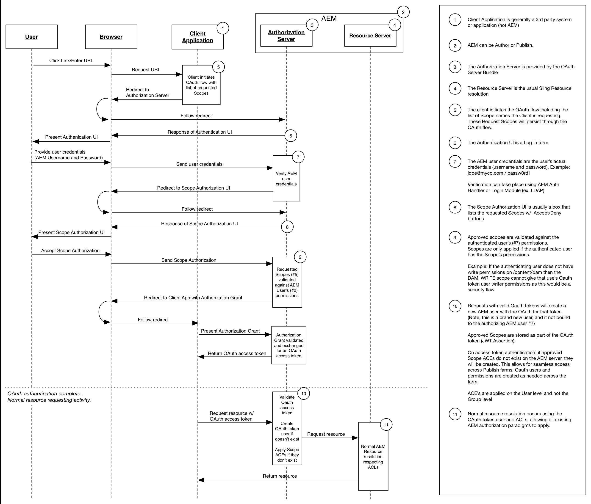

# Desarrollo de ámbitos de OAuth

Los ámbitos OAuth ampliables de Adobe Experience Manager permiten el control de acceso para los recursos de una aplicación cliente autorizada por un usuario final. El diagrama siguiente ilustra el flujo de solicitudes en el contexto de AEM.

AEM ofrece tres ámbitos:

* Perfil
* Acceso sin conexión
* Replicar

Los ámbitos de OAuth ampliables de AEM permiten definir otros ámbitos personalizados. Por ejemplo, se puede desarrollar e implementar un ámbito personalizado en AEM que permita que una aplicación móvil autorizada mediante OAuth esté restringida a la lectura, pero no a la escritura de recursos.

OAuth es el método preferido para autorizar una aplicación cliente, ya que utiliza un token de acceso en lugar de exigir que se proporcionen a dicha aplicación las credenciales de un usuario de AEM.

* [Ver el código](https://github.com/Adobe-Consulting-Services/acs-aem-samples/blob/legacy/bundle/src/main/java/com/adobe/acs/samples/authentication/oauth/impl/SampleScopeWithPrivileges.java)
