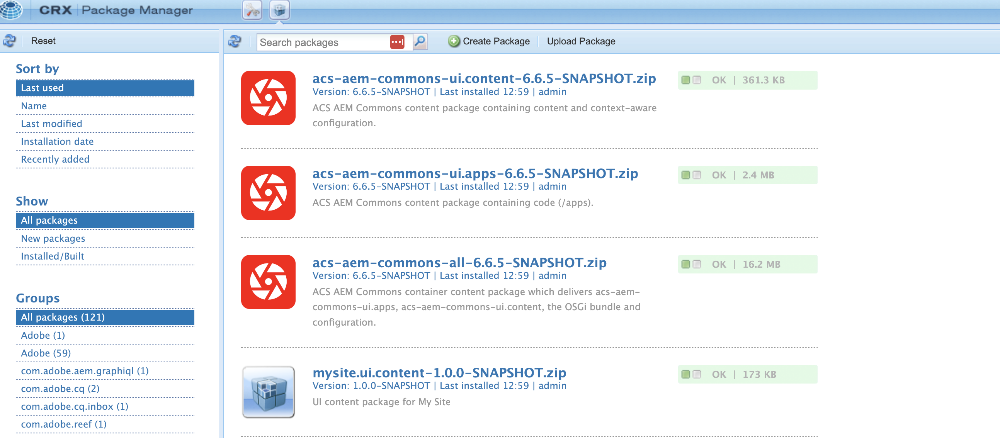

# Instalar artefactos de terceros: no disponible en el repositorio público de Maven

AEM Obtenga información sobre cómo instalar artefactos de terceros que *no están disponibles en el repositorio público de Maven* al crear e implementar un proyecto de.

Los **artefactos de terceros** pueden ser:

- [Paquete OSGi](https://www.osgi.org/resources/architecture/): Un paquete OSGi es un archivo Java™ que contiene clases Java, recursos y un manifiesto que describe el paquete y sus dependencias.
- [Java jar](https://docs.oracle.com/javase/tutorial/deployment/jar/basicsindex.html): un archivo Java™ que contiene clases y recursos Java.
- [Paquete](https://experienceleague.adobe.com/en/docs/experience-manager-65/content/sites/administering/contentmanagement/package-manager#what-are-packages): un paquete es un archivo zip que contiene contenido del repositorio en forma de serialización del sistema de archivos.

## Escenario estándar

AEM Normalmente, instalaría el paquete de terceros, el paquete que *está disponible* en el repositorio público de Maven como dependencia en el archivo `pom.xml` de su proyecto de la.

Por ejemplo:

- AEM [Los componentes principales de WCM de WCM [](https://github.com/adobe/aem-core-wcm-components) **paquete** se agrega como dependencia en el archivo `pom.xml` ](https://github.com/adobe/aem-guides-wknd/blob/main/pom.xml#L747-L753) del proyecto WKND. AEM AEM En este caso, el ámbito `provided` se utiliza ya que el tiempo de ejecución de la aplicación proporciona el paquete de componentes principales de WCM de. AEM Si el motor en tiempo de ejecución del paquete no lo proporciona el motor en tiempo de ejecución de la, utilizaría el ámbito `compile` y es el predeterminado.

- [WKND compartido](https://github.com/adobe/aem-guides-wknd-shared) **el paquete** se agrega como dependencia en el archivo `pom.xml` ](https://github.com/adobe/aem-guides-wknd/blob/main/pom.xml#L767-L773) del proyecto [WKND.


## Escenario poco frecuente

AEM En ocasiones, al crear e implementar un proyecto de, es posible que tenga que instalar un paquete de terceros o un jar o paquete **que no esté disponible** en el [Repositorio de Maven Central](https://mvnrepository.com/) o en el [Repositorio Público de Adobe](https://repo.adobe.com/index.html).

Las razones podrían ser:

- El paquete o paquete lo proporciona un equipo interno o un proveedor de terceros y _no está disponible en el repositorio Maven público_.

- El archivo jar Java™ _no es un paquete OSGi_ y puede que esté o no disponible en el repositorio Maven público.

- Necesita una función que aún no se haya lanzado en la última versión del paquete de terceros disponible en el repositorio público de Maven. Ha decidido instalar la versión de RELEASE o SNAPSHOT creada localmente.

## Requisitos previos

Para seguir este tutorial, necesita lo siguiente:

- AEM La configuración de [entorno de desarrollo local](https://experienceleague.adobe.com/en/docs/experience-manager-learn/cloud-service/local-development-environment-set-up/overview) o [Entorno de desarrollo rápido (RDE)](https://experienceleague.adobe.com/en/docs/experience-manager-learn/cloud-service/developing/rde/overview).

- AEM El [proyecto WKND ](https://github.com/adobe/aem-guides-wknd)de _para agregar el paquete de terceros, el JAR o el paquete_ y comprobar los cambios.

## Configuración

- AEM Configure el entorno de desarrollo local o el entorno RDE de AEM as a Cloud Service (AEMCS) o de 6.X.

- AEM Clonar e implementar el proyecto WKND de la.

  ```
  $ git clone git@github.com:adobe/aem-guides-wknd.git
  $ cd aem-guides-wknd
  $ mvn clean install -PautoInstallPackage 
  ```

  Compruebe que las páginas del sitio WKND se representan correctamente.

## AEM Instalación de un paquete de terceros en un proyecto de{#install-third-party-bundle}

AEM Instalemos y utilicemos un OSGi de demostración [my-example-bundle](./assets/install-third-party-articafcts/my-example-bundle.zip) que _no está disponible en el repositorio Maven público_ para el proyecto WKND de la.

El **my-example-bundle** exporta el servicio OSGi `HelloWorldService`, su método `sayHello()` devuelve el mensaje `Hello Earth!`.

Para obtener más información, consulte el archivo README.md en el archivo [my-example-bundle.zip](./assets/install-third-party-articafcts/my-example-bundle.zip).

### Agregar el paquete al módulo `all`

AEM El primer paso es agregar `my-example-bundle` al módulo `all` del proyecto WKND de la.

- Descargue y extraiga el archivo [my-example-bundle.zip](./assets/install-third-party-articafcts/my-example-bundle.zip).

- AEM En el módulo `all` del proyecto de WKND de, cree la estructura de directorios `all/src/main/content/jcr_root/apps/wknd-vendor-packages/container/install`. El directorio `/all/src/main/content` existe, solamente necesita crear los directorios `jcr_root/apps/wknd-vendor-packages/container/install`.

- Copie el archivo `my-example-bundle-1.0-SNAPSHOT.jar` del directorio `target` extraído al directorio `all/src/main/content/jcr_root/apps/wknd-vendor-packages/container/install` anterior.

  

### Usar el servicio del paquete

AEM Vamos a usar el servicio OSGi `HelloWorldService` de `my-example-bundle` en el proyecto de WKND de.

- AEM En el módulo `core` del proyecto de WKND de, cree el servlet Sling `SayHello.java` en `core/src/main/java/com/adobe/aem/guides/wknd/core/servlet`.

  ```java
  package com.adobe.aem.guides.wknd.core.servlet;
  
  import java.io.IOException;
  
  import javax.servlet.Servlet;
  import javax.servlet.ServletException;
  
  import org.apache.sling.api.SlingHttpServletRequest;
  import org.apache.sling.api.SlingHttpServletResponse;
  import org.apache.sling.api.servlets.HttpConstants;
  import org.apache.sling.api.servlets.ServletResolverConstants;
  import org.apache.sling.api.servlets.SlingSafeMethodsServlet;
  import org.osgi.service.component.annotations.Component;
  import org.osgi.service.component.annotations.Reference;
  import com.example.services.HelloWorldService;
  
  @Component(service = Servlet.class, property = {
      ServletResolverConstants.SLING_SERVLET_PATHS + "=/bin/sayhello",
      ServletResolverConstants.SLING_SERVLET_METHODS + "=" + HttpConstants.METHOD_GET
  })
  public class SayHello extends SlingSafeMethodsServlet {
  
          private static final long serialVersionUID = 1L;
  
          // Injecting the HelloWorldService from the `my-example-bundle` bundle
          @Reference
          private HelloWorldService helloWorldService;
  
          @Override
          protected void doGet(SlingHttpServletRequest request, SlingHttpServletResponse response) throws ServletException, IOException {
              // Invoking the HelloWorldService's `sayHello` method
              response.getWriter().write("My-Example-Bundle service says: " + helloWorldService.sayHello());
          }
  }
  ```

- AEM En el archivo raíz `pom.xml` del proyecto de WKND de la, agregue `my-example-bundle` como dependencia.

  ```xml
  ...
  <!-- My Example Bundle -->
  <dependency>
      <groupId>com.example</groupId>
      <artifactId>my-example-bundle</artifactId>
      <version>1.0-SNAPSHOT</version>
      <scope>system</scope>
      <systemPath>${maven.multiModuleProjectDirectory}/all/src/main/content/jcr_root/apps/wknd-vendor-packages/container/install/my-example-bundle-1.0-SNAPSHOT.jar</systemPath>
  </dependency>
  ...
  ```

  Aquí:
   - El ámbito `system` indica que no se debe buscar la dependencia en el repositorio Maven público.
   - AEM `systemPath` es la ruta de acceso al archivo `my-example-bundle` en el módulo `all` del proyecto WKND de la.
   - `${maven.multiModuleProjectDirectory}` es una propiedad de Maven que señala al directorio raíz del proyecto de varios módulos.

- AEM En el archivo `core/pom.xml` del módulo `core` del proyecto de WKND de, agregue `my-example-bundle` como dependencia.

  ```xml
  ...
  <!-- My Example Bundle -->
  <dependency>
      <groupId>com.example</groupId>
      <artifactId>my-example-bundle</artifactId>
  </dependency>
  ...
  ```

- AEM Genere e implemente el proyecto WKND de con el siguiente comando:

  ```
  $ mvn clean install -PautoInstallPackage
  ```

- Compruebe que el servlet `SayHello` funciona según lo esperado teniendo acceso a la dirección URL `http://localhost:4502/bin/sayhello` en el explorador.

- AEM Confirme los cambios anteriores en el repositorio del proyecto WKND de la. AEM A continuación, compruebe los cambios en el entorno de RDE o de ejecutando la canalización de Cloud Manager.

  

AEM La rama [tutorial/install-3rd-party-bundle](https://github.com/adobe/aem-guides-wknd/compare/main...tutorial/install-3rd-party-bundle) del proyecto de WKND de tiene los cambios anteriores para su referencia.

### Aprendizajes clave{#key-learnings-bundle}

AEM Los paquetes OSGi que no están disponibles en el repositorio público de Maven se pueden instalar en un proyecto de siguiendo estos pasos:

- Copie el paquete OSGi en el directorio `jcr_root/apps/<PROJECT-NAME>-vendor-packages/container/install` del módulo `all`. AEM Este paso es necesario para empaquetar e implementar el paquete en la instancia de.

- Actualice los archivos `pom.xml` del módulo principal y raíz para agregar el paquete OSGi como dependencia con el ámbito `system` y `systemPath` que apuntan al archivo del paquete. Este paso es necesario para compilar el proyecto.

## AEM Instalación de un JAR de terceros en un proyecto de

En este ejemplo, `my-example-jar` no es un paquete OSGi, sino un archivo jar Java.

AEM Instalemos y utilicemos una demostración de [my-example-jar](./assets/install-third-party-articafcts/my-example-jar.zip) que _no está disponible en el repositorio público de Maven_ para el proyecto de WKND de.

**my-example-jar** es un archivo jar Java que contiene una clase `MyHelloWorldService` con un método `sayHello()` que devuelve el mensaje `Hello World!`.

Para obtener más información, consulte el archivo README.md en el archivo [my-example-jar.zip](./assets/install-third-party-articafcts/my-example-jar.zip).

### Agregar el jar al módulo `all`

AEM El primer paso es agregar `my-example-jar` al módulo `all` del proyecto WKND de la.

- Descargue y extraiga el archivo [my-example-jar.zip](./assets/install-third-party-articafcts/my-example-jar.zip).

- AEM En el módulo `all` del proyecto de WKND de, cree la estructura de directorios `all/resource/jar`.

- Copie el archivo `my-example-jar-1.0-SNAPSHOT.jar` del directorio `target` extraído al directorio `all/resource/jar` anterior.

  

### Usar el servicio del JAR

AEM Usemos `MyHelloWorldService` del `my-example-jar` en el proyecto de WKND de la.

- AEM En el módulo `core` del proyecto de WKND de, cree el servlet Sling `SayHello.java` en `core/src/main/java/com/adobe/aem/guides/wknd/core/servlet`.

  ```java
  package com.adobe.aem.guides.wknd.core.servlet;
  
  import java.io.IOException;
  
  import javax.servlet.Servlet;
  import javax.servlet.ServletException;
  
  import org.apache.sling.api.SlingHttpServletRequest;
  import org.apache.sling.api.SlingHttpServletResponse;
  import org.apache.sling.api.servlets.HttpConstants;
  import org.apache.sling.api.servlets.ServletResolverConstants;
  import org.apache.sling.api.servlets.SlingSafeMethodsServlet;
  import org.osgi.service.component.annotations.Component;
  
  import com.my.example.MyHelloWorldService;
  
  @Component(service = Servlet.class, property = {
          ServletResolverConstants.SLING_SERVLET_PATHS + "=/bin/sayhello",
          ServletResolverConstants.SLING_SERVLET_METHODS + "=" + HttpConstants.METHOD_GET
  })
  public class SayHello extends SlingSafeMethodsServlet {
  
      private static final long serialVersionUID = 1L;
  
      @Override
      protected void doGet(SlingHttpServletRequest request, SlingHttpServletResponse response)
              throws ServletException, IOException {
  
          // Creating an instance of MyHelloWorldService
          MyHelloWorldService myHelloWorldService = new MyHelloWorldService();
  
          // Invoking the MyHelloWorldService's `sayHello` method
          response.getWriter().write("My-Example-JAR service says: " + myHelloWorldService.sayHello());
      }
  }    
  ```

- AEM En el archivo raíz `pom.xml` del proyecto de WKND de la, agregue `my-example-jar` como dependencia.

  ```xml
  ...
  <!-- My Example JAR -->
  <dependency>
      <groupId>com.my.example</groupId>
      <artifactId>my-example-jar</artifactId>
      <version>1.0-SNAPSHOT</version>
      <scope>system</scope>
      <systemPath>${maven.multiModuleProjectDirectory}/all/resource/jar/my-example-jar-1.0-SNAPSHOT.jar</systemPath>
  </dependency>            
  ...
  ```

  Aquí:
   - El ámbito `system` indica que no se debe buscar la dependencia en el repositorio Maven público.
   - AEM `systemPath` es la ruta de acceso al archivo `my-example-jar` en el módulo `all` del proyecto WKND de la.
   - `${maven.multiModuleProjectDirectory}` es una propiedad de Maven que señala al directorio raíz del proyecto de varios módulos.

- AEM Realice dos cambios en el archivo `core/pom.xml` del módulo `core` del proyecto de WKND de:

   - Agregue `my-example-jar` como dependencia.

     ```xml
     ...
     <!-- My Example JAR -->
     <dependency>
         <groupId>com.my.example</groupId>
         <artifactId>my-example-jar</artifactId>
     </dependency>
     ...
     ```

   - Actualice la configuración de `bnd-maven-plugin` para incluir `my-example-jar` en el paquete OSGi (aem-guides-wknd.core) que se está creando.

     ```xml
     ...
     <plugin>
         <groupId>biz.aQute.bnd</groupId>
         <artifactId>bnd-maven-plugin</artifactId>
         <executions>
             <execution>
                 <id>bnd-process</id>
                 <goals>
                     <goal>bnd-process</goal>
                 </goals>
                 <configuration>
                     <bnd><![CDATA[
                 Import-Package: javax.annotation;version=0.0.0,*
                 <!-- Include the 3rd party jar as inline resource-->
                 -includeresource: \
                 lib/my-example-jar.jar=my-example-jar-1.0-SNAPSHOT.jar;lib:=true
                         ]]></bnd>
                 </configuration>
             </execution>
         </executions>
     </plugin>        
     ...
     ```

- AEM Genere e implemente el proyecto WKND de con el siguiente comando:

  ```
  $ mvn clean install -PautoInstallPackage
  ```

- Compruebe que el servlet `SayHello` funciona según lo esperado teniendo acceso a la dirección URL `http://localhost:4502/bin/sayhello` en el explorador.

- AEM Confirme los cambios anteriores en el repositorio del proyecto WKND de la. AEM A continuación, compruebe los cambios en el entorno de RDE o de ejecutando la canalización de Cloud Manager.

  

AEM La rama [tutorial/install-3rd-party-jar](https://github.com/adobe/aem-guides-wknd/compare/main...tutorial/install-3rd-party-jar) del proyecto de WKND tiene los cambios anteriores para su referencia.

En escenarios donde el archivo jar Java _está disponible en el repositorio Maven público pero NO es un paquete OSGi_, puede seguir los pasos anteriores excepto que el ámbito `system` de `<dependency>` y los elementos `systemPath` no son obligatorios.

### Aprendizajes clave{#key-learnings-jar}

AEM Los Jars de Java que no son paquetes OSGi y que pueden estar o no disponibles en el repositorio público de Maven se pueden instalar en un proyecto de siguiendo estos pasos:

- Actualice la configuración `bnd-maven-plugin` en el archivo `pom.xml` del módulo principal para incluir el jar de Java como recurso en línea en el paquete OSGi que se está creando.

Los siguientes pasos solo son necesarios si el JAR de Java no está disponible en el repositorio Maven público:

- Copie el JAR de Java en el directorio `resource/jar` del módulo `all`.

- Actualice los archivos `pom.xml` del módulo principal y raíz para agregar el JAR de Java como dependencia con el ámbito `system` y `systemPath` que apuntan al archivo JAR.

## AEM Instalación de un paquete de terceros en un proyecto de

AEM Instalemos la versión de [ACS Commons](https://adobe-consulting-services.github.io/acs-aem-commons/) _SNAPSHOT_ creada localmente desde la rama principal.

AEM Se realiza exclusivamente para mostrar los pasos para instalar un paquete de que no está disponible en el repositorio público de Maven.

AEM El paquete ACS Commons está disponible en el repositorio público de Maven. AEM AEM AEM Consulte [Agregar ACS Commons a su proyecto de Maven de la](https://adobe-consulting-services.github.io/acs-aem-commons/pages/maven.html) para agregarlo a su proyecto de la lista de proyectos de la lista de proyectos de la lista de proyectos de Maven.

### Agregar el paquete al módulo `all`

AEM El primer paso es agregar el paquete al módulo `all` del proyecto WKND de la.

- AEM Comente o elimine la dependencia de versión de ACS Commons del archivo POM. AEM AEM Consulte [Agregar ACS Commons a su proyecto de Maven de la](https://adobe-consulting-services.github.io/acs-aem-commons/pages/maven.html) para identificar la dependencia.

- AEM Clona la rama `master` del [repositorio ACS Commons](https://github.com/Adobe-Consulting-Services/acs-aem-commons) a su equipo local.

- AEM Genere la versión de ACS Commons SNAPSHOT con el siguiente comando:

  ```
  $mvn clean install
  ```

- El paquete generado localmente se encuentra en `all/target`, hay dos archivos .zip, el que termina con `-cloud` está diseñado para AEM as a Cloud Service AEM y el otro es para 6.X.

- AEM En el módulo `all` del proyecto de WKND de, cree la estructura de directorios `all/src/main/content/jcr_root/apps/wknd-vendor-packages/container/install`. El directorio `/all/src/main/content` existe, solamente necesita crear los directorios `jcr_root/apps/wknd-vendor-packages/container/install`.

- Copie el archivo del paquete creado localmente (.zip) en el directorio `/all/src/main/content/jcr_root/apps/mysite-vendor-packages/container/install`.

- AEM Genere e implemente el proyecto WKND de con el siguiente comando:

  ```
  $ mvn clean install -PautoInstallPackage
  ```

- AEM Compruebe el paquete instalado ACS Commons:

   - Administrador de paquetes CRX en `http://localhost:4502/crx/packmgr/index.jsp`

     AEM 

   - La consola OSGi en `http://localhost:4502/system/console/bundles`

     AEM 

- AEM Confirme los cambios anteriores en el repositorio del proyecto WKND de la. AEM A continuación, compruebe los cambios en el entorno de RDE o de ejecutando la canalización de Cloud Manager.

### Aprendizajes clave{#key-learnings-package}

AEM AEM Los paquetes de datos que no están disponibles en el repositorio público de Maven se pueden instalar en un proyecto de siguiendo estos pasos:

- Copie el paquete en el directorio `jcr_root/apps/<PROJECT-NAME>-vendor-packages/container/install` del módulo `all`. AEM Este paso es necesario para empaquetar e implementar el paquete en la instancia de.


## Resumen

AEM En este tutorial, ha aprendido a instalar artefactos de terceros (paquete, Java jar y paquete) que no están disponibles en el repositorio público de Maven al crear e implementar un proyecto de.
