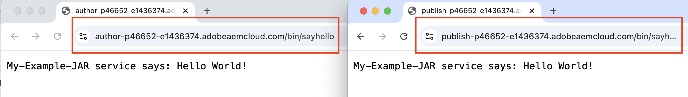

# Instalar artefactos de terceros: no disponible en el repositorio público de Maven

Aprenda a instalar artefactos de terceros que *no están disponibles en el repositorio público de Maven* al crear e implementar un proyecto de AEM.

Los **artefactos de terceros** pueden ser:

- [Paquete OSGi](https://www.osgi.org/resources/architecture/): Un paquete OSGi es un archivo Java™ que contiene clases Java, recursos y un manifiesto que describe el paquete y sus dependencias.
- [Java jar](https://docs.oracle.com/javase/tutorial/deployment/jar/basicsindex.html): un archivo Java™ que contiene clases y recursos Java.
- [Paquete](https://experienceleague.adobe.com/en/docs/experience-manager-65/content/sites/administering/contentmanagement/package-manager#what-are-packages): un paquete es un archivo zip que contiene contenido del repositorio en forma de serialización del sistema de archivos.

## Escenario estándar

Normalmente, instalaría el paquete de terceros, el paquete que *está disponible* en el repositorio Maven público como dependencia en el archivo `pom.xml` de su proyecto de AEM.

Por ejemplo:

- [Componentes principales de WCM de AEM](https://github.com/adobe/aem-core-wcm-components) **paquete** se agrega como dependencia en el archivo `pom.xml` [&#128279;](https://github.com/adobe/aem-guides-wknd/blob/main/pom.xml#L747-L753) del proyecto WKND de. En este caso, el ámbito `provided` se utiliza como paquete de componentes principales de WCM de AEM proporcionado por el tiempo de ejecución de AEM. Si el tiempo de ejecución de AEM no proporciona el paquete, utilizaría el ámbito `compile` y es el predeterminado.

- [WKND compartido](https://github.com/adobe/aem-guides-wknd-shared) **el paquete** se agrega como dependencia en el archivo `pom.xml` [&#128279;](https://github.com/adobe/aem-guides-wknd/blob/main/pom.xml#L767-L773) del proyecto WKND.


## Escenario poco frecuente

En ocasiones, al crear e implementar un proyecto de AEM, es posible que deba instalar un paquete de terceros, un jar o un paquete **que no esté disponible** en el [Repositorio de Maven Central](https://mvnrepository.com/) o en el [Repositorio Público de Adobe](https://repo.adobe.com/index.html).

Las razones podrían ser:

- El paquete o paquete lo proporciona un equipo interno o un proveedor de terceros y _no está disponible en el repositorio Maven público_.

- El archivo jar Java™ _no es un paquete OSGi_ y puede que esté o no disponible en el repositorio Maven público.

- Necesita una función que aún no se haya lanzado en la última versión del paquete de terceros disponible en el repositorio público de Maven. Ha decidido instalar la versión de RELEASE o SNAPSHOT creada localmente.

## Requisitos previos

Para seguir este tutorial, necesita lo siguiente:

- Configuración del [entorno de desarrollo local de AEM](https://experienceleague.adobe.com/en/docs/experience-manager-learn/cloud-service/local-development-environment-set-up/overview) o del [entorno de desarrollo rápido (RDE)](https://experienceleague.adobe.com/en/docs/experience-manager-learn/cloud-service/developing/rde/overview).

- El [proyecto WKND de AEM](https://github.com/adobe/aem-guides-wknd) _para agregar el paquete, jar o paquete de terceros_ y comprobar los cambios.

## Configuración

- Configure el entorno de desarrollo local de AEM 6.X o AEM as a Cloud Service (AEMCS) o el entorno RDE.

- Clonar e implementar el proyecto WKND de AEM.

  ```
  $ git clone git@github.com:adobe/aem-guides-wknd.git
  $ cd aem-guides-wknd
  $ mvn clean install -PautoInstallPackage 
  ```

  Compruebe que las páginas del sitio WKND se representan correctamente.

## Instalación de un paquete de terceros en un proyecto de AEM{#install-third-party-bundle}

Instalemos y utilicemos un OSGi de demostración [my-example-bundle](./assets/install-third-party-articafcts/my-example-bundle.zip) que _no está disponible en el repositorio Maven público_ del proyecto WKND de AEM.

El **my-example-bundle** exporta el servicio OSGi `HelloWorldService`, su método `sayHello()` devuelve el mensaje `Hello Earth!`.

Para obtener más información, consulte el archivo README.md en el archivo [my-example-bundle.zip](./assets/install-third-party-articafcts/my-example-bundle.zip).

### Agregar el paquete al módulo `all`

El primer paso es agregar `my-example-bundle` al módulo `all` del proyecto WKND de AEM.

- Descargue y extraiga el archivo [my-example-bundle.zip](./assets/install-third-party-articafcts/my-example-bundle.zip).

- En el módulo `all` del proyecto WKND de AEM, cree la estructura de directorios `all/src/main/content/jcr_root/apps/wknd-vendor-packages/container/install`. El directorio `/all/src/main/content` existe, solamente necesita crear los directorios `jcr_root/apps/wknd-vendor-packages/container/install`.

- Copie el archivo `my-example-bundle-1.0-SNAPSHOT.jar` del directorio `target` extraído al directorio `all/src/main/content/jcr_root/apps/wknd-vendor-packages/container/install` anterior.

  

### Usar el servicio del paquete

Usemos el servicio OSGi `HelloWorldService` de `my-example-bundle` en el proyecto WKND de AEM.

- En el módulo `core` del proyecto WKND de AEM, cree el servlet Sling `SayHello.java` en `core/src/main/java/com/adobe/aem/guides/wknd/core/servlet`.

  ```java
  package com.adobe.aem.guides.wknd.core.servlet;
  
  import java.io.IOException;
  
  import javax.servlet.Servlet;
  import javax.servlet.ServletException;
  
  import org.apache.sling.api.SlingHttpServletRequest;
  import org.apache.sling.api.SlingHttpServletResponse;
  import org.apache.sling.api.servlets.HttpConstants;
  import org.apache.sling.api.servlets.ServletResolverConstants;
  import org.apache.sling.api.servlets.SlingSafeMethodsServlet;
  import org.osgi.service.component.annotations.Component;
  import org.osgi.service.component.annotations.Reference;
  import com.example.services.HelloWorldService;
  
  @Component(service = Servlet.class, property = {
      ServletResolverConstants.SLING_SERVLET_PATHS + "=/bin/sayhello",
      ServletResolverConstants.SLING_SERVLET_METHODS + "=" + HttpConstants.METHOD_GET
  })
  public class SayHello extends SlingSafeMethodsServlet {
  
          private static final long serialVersionUID = 1L;
  
          // Injecting the HelloWorldService from the `my-example-bundle` bundle
          @Reference
          private HelloWorldService helloWorldService;
  
          @Override
          protected void doGet(SlingHttpServletRequest request, SlingHttpServletResponse response) throws ServletException, IOException {
              // Invoking the HelloWorldService's `sayHello` method
              response.getWriter().write("My-Example-Bundle service says: " + helloWorldService.sayHello());
          }
  }
  ```

- En el archivo raíz `pom.xml` del proyecto WKND de AEM, agregue `my-example-bundle` como dependencia.

  ```xml
  ...
  <!-- My Example Bundle -->
  <dependency>
      <groupId>com.example</groupId>
      <artifactId>my-example-bundle</artifactId>
      <version>1.0-SNAPSHOT</version>
      <scope>system</scope>
      <systemPath>${maven.multiModuleProjectDirectory}/all/src/main/content/jcr_root/apps/wknd-vendor-packages/container/install/my-example-bundle-1.0-SNAPSHOT.jar</systemPath>
  </dependency>
  ...
  ```

  Aquí:
   - El ámbito `system` indica que no se debe buscar la dependencia en el repositorio Maven público.
   - `systemPath` es la ruta al archivo `my-example-bundle` en el módulo `all` del proyecto WKND de AEM.
   - `${maven.multiModuleProjectDirectory}` es una propiedad de Maven que señala al directorio raíz del proyecto de varios módulos.

- En el archivo `core/pom.xml` del módulo `core` del proyecto WKND de AEM, agregue `my-example-bundle` como dependencia.

  ```xml
  ...
  <!-- My Example Bundle -->
  <dependency>
      <groupId>com.example</groupId>
      <artifactId>my-example-bundle</artifactId>
  </dependency>
  ...
  ```

- Cree e implemente el proyecto WKND de AEM con el siguiente comando:

  ```
  $ mvn clean install -PautoInstallPackage
  ```

- Compruebe que el servlet `SayHello` funciona según lo esperado teniendo acceso a la dirección URL `http://localhost:4502/bin/sayhello` en el explorador.

- Confirme los cambios anteriores en el repositorio del proyecto WKND de AEM. A continuación, compruebe los cambios en el entorno de RDE o AEM ejecutando la canalización de Cloud Manager.

  

La rama [tutorial/install-3rd-party-bundle](https://github.com/adobe/aem-guides-wknd/compare/main...tutorial/install-3rd-party-bundle) del proyecto WKND de AEM tiene los cambios anteriores para su referencia.

### Aprendizajes clave{#key-learnings-bundle}

Los paquetes OSGi que no están disponibles en el repositorio público de Maven se pueden instalar en un proyecto de AEM siguiendo estos pasos:

- Copie el paquete OSGi en el directorio `jcr_root/apps/<PROJECT-NAME>-vendor-packages/container/install` del módulo `all`. Este paso es necesario para empaquetar e implementar el paquete en la instancia de AEM.

- Actualice los archivos `pom.xml` del módulo principal y raíz para agregar el paquete OSGi como dependencia con el ámbito `system` y `systemPath` que apuntan al archivo del paquete. Este paso es necesario para compilar el proyecto.

## Instalar un jar de terceros en un proyecto de AEM

En este ejemplo, `my-example-jar` no es un paquete OSGi, sino un archivo jar Java.

Instalemos y utilicemos una demostración [my-example-jar](./assets/install-third-party-articafcts/my-example-jar.zip) que _no está disponible en el repositorio Maven público_ del proyecto WKND de AEM.

**my-example-jar** es un archivo jar Java que contiene una clase `MyHelloWorldService` con un método `sayHello()` que devuelve el mensaje `Hello World!`.

Para obtener más información, consulte el archivo README.md en el archivo [my-example-jar.zip](./assets/install-third-party-articafcts/my-example-jar.zip).

### Agregar el jar al módulo `all`

El primer paso es agregar `my-example-jar` al módulo `all` del proyecto WKND de AEM.

- Descargue y extraiga el archivo [my-example-jar.zip](./assets/install-third-party-articafcts/my-example-jar.zip).

- En el módulo `all` del proyecto WKND de AEM, cree la estructura de directorios `all/resource/jar`.

- Copie el archivo `my-example-jar-1.0-SNAPSHOT.jar` del directorio `target` extraído al directorio `all/resource/jar` anterior.

  

### Usar el servicio del JAR

Usemos `MyHelloWorldService` de `my-example-jar` en el proyecto WKND de AEM.

- En el módulo `core` del proyecto WKND de AEM, cree el servlet Sling `SayHello.java` en `core/src/main/java/com/adobe/aem/guides/wknd/core/servlet`.

  ```java
  package com.adobe.aem.guides.wknd.core.servlet;
  
  import java.io.IOException;
  
  import javax.servlet.Servlet;
  import javax.servlet.ServletException;
  
  import org.apache.sling.api.SlingHttpServletRequest;
  import org.apache.sling.api.SlingHttpServletResponse;
  import org.apache.sling.api.servlets.HttpConstants;
  import org.apache.sling.api.servlets.ServletResolverConstants;
  import org.apache.sling.api.servlets.SlingSafeMethodsServlet;
  import org.osgi.service.component.annotations.Component;
  
  import com.my.example.MyHelloWorldService;
  
  @Component(service = Servlet.class, property = {
          ServletResolverConstants.SLING_SERVLET_PATHS + "=/bin/sayhello",
          ServletResolverConstants.SLING_SERVLET_METHODS + "=" + HttpConstants.METHOD_GET
  })
  public class SayHello extends SlingSafeMethodsServlet {
  
      private static final long serialVersionUID = 1L;
  
      @Override
      protected void doGet(SlingHttpServletRequest request, SlingHttpServletResponse response)
              throws ServletException, IOException {
  
          // Creating an instance of MyHelloWorldService
          MyHelloWorldService myHelloWorldService = new MyHelloWorldService();
  
          // Invoking the MyHelloWorldService's `sayHello` method
          response.getWriter().write("My-Example-JAR service says: " + myHelloWorldService.sayHello());
      }
  }    
  ```

- En el archivo raíz `pom.xml` del proyecto WKND de AEM, agregue `my-example-jar` como dependencia.

  ```xml
  ...
  <!-- My Example JAR -->
  <dependency>
      <groupId>com.my.example</groupId>
      <artifactId>my-example-jar</artifactId>
      <version>1.0-SNAPSHOT</version>
      <scope>system</scope>
      <systemPath>${maven.multiModuleProjectDirectory}/all/resource/jar/my-example-jar-1.0-SNAPSHOT.jar</systemPath>
  </dependency>            
  ...
  ```

  Aquí:
   - El ámbito `system` indica que no se debe buscar la dependencia en el repositorio Maven público.
   - `systemPath` es la ruta al archivo `my-example-jar` en el módulo `all` del proyecto WKND de AEM.
   - `${maven.multiModuleProjectDirectory}` es una propiedad de Maven que señala al directorio raíz del proyecto de varios módulos.

- Realice dos cambios en el archivo `core/pom.xml` del módulo `core` del proyecto WKND de AEM:

   - Agregue `my-example-jar` como dependencia.

     ```xml
     ...
     <!-- My Example JAR -->
     <dependency>
         <groupId>com.my.example</groupId>
         <artifactId>my-example-jar</artifactId>
     </dependency>
     ...
     ```

   - Actualice la configuración de `bnd-maven-plugin` para incluir `my-example-jar` en el paquete OSGi (aem-guides-wknd.core) que se está creando.

     ```xml
     ...
     <plugin>
         <groupId>biz.aQute.bnd</groupId>
         <artifactId>bnd-maven-plugin</artifactId>
         <executions>
             <execution>
                 <id>bnd-process</id>
                 <goals>
                     <goal>bnd-process</goal>
                 </goals>
                 <configuration>
                     <bnd><![CDATA[
                 Import-Package: javax.annotation;version=0.0.0,*
                 <!-- Include the 3rd party jar as inline resource-->
                 -includeresource: \
                 lib/my-example-jar.jar=my-example-jar-1.0-SNAPSHOT.jar;lib:=true
                         ]]></bnd>
                 </configuration>
             </execution>
         </executions>
     </plugin>        
     ...
     ```

- Cree e implemente el proyecto WKND de AEM con el siguiente comando:

  ```
  $ mvn clean install -PautoInstallPackage
  ```

- Compruebe que el servlet `SayHello` funciona según lo esperado teniendo acceso a la dirección URL `http://localhost:4502/bin/sayhello` en el explorador.

- Confirme los cambios anteriores en el repositorio del proyecto WKND de AEM. A continuación, compruebe los cambios en el entorno de RDE o AEM ejecutando la canalización de Cloud Manager.

  

La rama [tutorial/install-3rd-party-jar](https://github.com/adobe/aem-guides-wknd/compare/main...tutorial/install-3rd-party-jar) del proyecto WKND de AEM tiene los cambios anteriores para su referencia.

En escenarios donde el archivo jar Java _está disponible en el repositorio Maven público pero NO es un paquete OSGi_, puede seguir los pasos anteriores excepto que el ámbito `system` de `<dependency>` y los elementos `systemPath` no son obligatorios.

### Aprendizajes clave{#key-learnings-jar}

Los Jars de Java que no son paquetes OSGi y que pueden estar o no disponibles en el repositorio público de Maven se pueden instalar en un proyecto de AEM siguiendo estos pasos:

- Actualice la configuración `bnd-maven-plugin` en el archivo `pom.xml` del módulo principal para incluir el jar de Java como recurso en línea en el paquete OSGi que se está creando.

Los siguientes pasos solo son necesarios si el JAR de Java no está disponible en el repositorio Maven público:

- Copie el JAR de Java en el directorio `resource/jar` del módulo `all`.

- Actualice los archivos `pom.xml` del módulo principal y raíz para agregar el JAR de Java como dependencia con el ámbito `system` y `systemPath` que apuntan al archivo JAR.

## Instalación de un paquete de terceros en un proyecto de AEM

Instalemos la versión de [ACS AEM Commons](https://adobe-consulting-services.github.io/acs-aem-commons/) _SNAPSHOT_ creada localmente desde la rama principal.

Se realiza exclusivamente para mostrar los pasos para instalar un paquete de AEM que no está disponible en el repositorio Maven público.

El paquete ACS AEM Commons está disponible en el repositorio público de Maven. Consulte [Agregar ACS AEM Commons a su proyecto AEM Maven](https://adobe-consulting-services.github.io/acs-aem-commons/pages/maven.html) para agregarlo a su proyecto AEM.

### Agregar el paquete al módulo `all`

El primer paso es agregar el paquete al módulo `all` del proyecto WKND de AEM.

- Comente o elimine la dependencia de la versión ACS AEM Commons del archivo POM. Consulte [Agregar ACS AEM Commons a su proyecto AEM Maven](https://adobe-consulting-services.github.io/acs-aem-commons/pages/maven.html) para identificar la dependencia.

- Clone la rama `master` del [repositorio ACS AEM Commons](https://github.com/Adobe-Consulting-Services/acs-aem-commons) en su equipo local.

- Cree la versión ACS AEM Commons SNAPSHOT con el siguiente comando:

  ```
  $mvn clean install
  ```

- El paquete generado localmente se encuentra en `all/target`, hay dos archivos .zip, el que termina con `-cloud` está diseñado para AEM as a Cloud Service y el otro es para AEM 6.X.

- En el módulo `all` del proyecto WKND de AEM, cree la estructura de directorios `all/src/main/content/jcr_root/apps/wknd-vendor-packages/container/install`. El directorio `/all/src/main/content` existe, solamente necesita crear los directorios `jcr_root/apps/wknd-vendor-packages/container/install`.

- Copie el archivo del paquete creado localmente (.zip) en el directorio `/all/src/main/content/jcr_root/apps/mysite-vendor-packages/container/install`.

- Cree e implemente el proyecto WKND de AEM con el siguiente comando:

  ```
  $ mvn clean install -PautoInstallPackage
  ```

- Compruebe el paquete ACS AEM Commons instalado:

   - Administrador de paquetes CRX en `http://localhost:4502/crx/packmgr/index.jsp`

     

   - La consola OSGi en `http://localhost:4502/system/console/bundles`

     

- Confirme los cambios anteriores en el repositorio del proyecto WKND de AEM. A continuación, compruebe los cambios en el entorno de RDE o AEM ejecutando la canalización de Cloud Manager.

### Aprendizajes clave{#key-learnings-package}

Los paquetes de AEM que no están disponibles en el repositorio público de Maven se pueden instalar en un proyecto de AEM siguiendo estos pasos:

- Copie el paquete en el directorio `jcr_root/apps/<PROJECT-NAME>-vendor-packages/container/install` del módulo `all`. Este paso es necesario para empaquetar e implementar el paquete en la instancia de AEM.


## Resumen

En este tutorial, ha aprendido a instalar artefactos de terceros (paquete, Java jar y paquete) que no están disponibles en el repositorio público de Maven al crear e implementar un proyecto de AEM.
