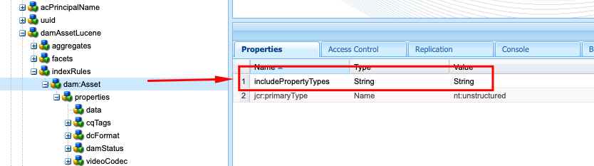

# Prácticas recomendadas de indexación en AEM

Obtenga información acerca de las prácticas recomendadas de indexación en Adobe Experience Manager (AEM). Apache [Jackrabbit Oak](https://jackrabbit.apache.org/oak/docs/query/query.html) activa la búsqueda de contenido en AEM y los siguientes son puntos clave:

- De serie, AEM proporciona varios índices para admitir la funcionalidad de búsqueda y consulta, por ejemplo `damAssetLucene`, `cqPageLucene` y más.
- Todas las definiciones de índice se almacenan en el repositorio en el nodo `/oak:index`.
- AEM as a Cloud Service solo admite índices Oak Lucene.
- La configuración del índice debe administrarse en la base de código del proyecto de AEM e implementarse mediante canalizaciones de CI/CD de Cloud Manager.
- Si hay varios índices disponibles para una consulta determinada, se utiliza el **índice con el costo estimado más bajo**.
- Si no hay ningún índice disponible para una consulta determinada, se atraviesa el árbol de contenido para encontrar el contenido coincidente. Sin embargo, el límite predeterminado a través de `org.apache.jackrabbit.oak.query.QueryEngineSettingsService` es atravesar solo 100 000 nodos.
- Los resultados de una consulta se han **filtrado al menos** para garantizar que el usuario actual tenga acceso de lectura. Esto significa que los resultados de la consulta pueden ser menores que el número de nodos indexados.
- La reindexación del repositorio después de los cambios de definición de índice requiere tiempo y depende del tamaño del repositorio.

Para tener una funcionalidad de búsqueda eficiente y correcta que no afecte al rendimiento de la instancia de AEM, es importante comprender las prácticas recomendadas de indexación.

## Índice personalizado frente a OOTB

A veces, debe crear índices personalizados para satisfacer los requisitos de búsqueda. Sin embargo, siga estas directrices antes de crear índices personalizados:

- Comprenda los requisitos de búsqueda y compruebe si los índices OOTB pueden admitir los requisitos de búsqueda. Use la **Herramienta de rendimiento de consultas**, disponible en [SDK local](http://localhost:4502/libs/granite/operations/content/diagnosistools/queryPerformance.html) y AEM CS a través de Developer Console o `https://author-pXXXX-eYYYY.adobeaemcloud.com/ui#/aem/libs/granite/operations/content/diagnosistools/queryPerformance.html?appId=aemshell`.

- Defina una consulta óptima, use el diagrama de flujo [optimizando consultas](https://experienceleague.adobe.com/es/docs/experience-manager-cloud-service/content/operations/query-and-indexing-best-practices) y la [Hoja de referencia de consultas JCR](https://experienceleague.adobe.com/docs/experience-manager-65/assets/JCR_query_cheatsheet-v1.1.pdf?lang=es) como referencia.

- Si los índices OOTB no admiten los requisitos de búsqueda, tiene dos opciones. Sin embargo, revise las [sugerencias para crear índices eficientes](https://experienceleague.adobe.com/es/docs/experience-manager-65/content/implementing/deploying/practices/best-practices-for-queries-and-indexing)
   - Personalice el índice OOTB: opción preferida ya que es fácil de mantener y actualizar.
   - Índice totalmente personalizado: Solo si la opción anterior no funciona.

### Personalización del índice OOTB

- En **AEMCS**, al personalizar el índice OOTB, use **\&lt;OOTBndexName>-\&lt;productVersion>-custom-\&lt;customVersion>** convención de nomenclatura. Por ejemplo, `cqPageLucene-custom-1` o `damAssetLucene-8-custom-1`. Esto ayuda a combinar la definición de índice personalizada cada vez que se actualiza el índice OOTB. Consulte [Cambios en los índices predeterminados](https://experienceleague.adobe.com/es/docs/experience-manager-cloud-service/content/operations/indexing) para obtener más información.

- En **AEM 6.X**, el nombre anterior _no funciona_; sin embargo, simplemente actualice el índice OOTB con las propiedades necesarias en el nodo `indexRules`.

- Copie siempre la definición de índice OOTB más reciente de la instancia de AEM mediante el Administrador de paquetes DE de CRX (/crx/packmgr/), cambie su nombre y agregue personalizaciones dentro del archivo XML.

- Almacene la definición de índice en el proyecto de AEM en `ui.apps/src/main/content/jcr_root/_oak_index` e impleméntelo usando las canalizaciones CI/CD de Cloud Manager. Consulte [Implementación de definiciones de índice personalizadas](https://experienceleague.adobe.com/es/docs/experience-manager-cloud-service/content/operations/indexing) para obtener más información.

### Índice totalmente personalizado

La creación de un índice totalmente personalizado debe ser la última opción y solo si la opción anterior no funciona.

- Al crear un índice totalmente personalizado, utilice **\&lt;prefix>.\&lt;customIndexName>-\&lt;version>-custom-\&lt;customVersion>** convención de nomenclatura. Por ejemplo, `wknd.adventures-1-custom-1`. Esto ayuda a evitar conflictos de nombres. Aquí, `wknd` es el prefijo y `adventures` es el nombre de índice personalizado. Esta convención es aplicable tanto a AEM 6.X como a AEM CS y sirve para preparar la migración futura a AEM CS.

- AEMCS solo admite índices Lucene, por lo que, para prepararse para una migración futura a AEMCS, utilice siempre índices Lucene. Consulte [Índices Lucene vs. Índices de propiedad](https://experienceleague.adobe.com/es/docs/experience-manager-65/content/implementing/deploying/practices/best-practices-for-queries-and-indexing) para obtener más detalles.

- Evite crear un índice personalizado en el mismo tipo de nodo que el índice OOTB. En su lugar, personalice el índice OOTB con las propiedades necesarias en el nodo `indexRules`. Por ejemplo, no cree un índice personalizado en el tipo de nodo `dam:Asset`, sino que personalice el índice OOTB `damAssetLucene`. _Ha sido una causa raíz común de problemas funcionales y de rendimiento_.

- Además, evite agregar varios tipos de nodo, por ejemplo `cq:Page` y `cq:Tag`, bajo el nodo de reglas de indexación (`indexRules`). En su lugar, cree índices independientes para cada tipo de nodo.

- Como se mencionó en la sección anterior, almacene la definición de índice en el proyecto de AEM en `ui.apps/src/main/content/jcr_root/_oak_index` e impleméntelo usando las canalizaciones CI/CD de Cloud Manager. Consulte [Implementación de definiciones de índice personalizadas](https://experienceleague.adobe.com/es/docs/experience-manager-cloud-service/content/operations/indexing) para obtener más información.

- Las directrices de definición de índice son:
   - El tipo de nodo (`jcr:primaryType`) debe ser `oak:QueryIndexDefinition`
   - El tipo de índice (`type`) debe ser `lucene`
   - La propiedad asincrónica (`async`) debe ser `async,nrt`
   - Use `includedPaths` y evite la propiedad `excludedPaths`. Establezca siempre `queryPaths` valor con el mismo valor que `includedPaths` valor.
   - Para aplicar la restricción de ruta de acceso, use la propiedad `evaluatePathRestrictions` y establézcala en `true`.
   - Utilice la propiedad `tags` para etiquetar el índice y, al consultar, especifique este valor de etiquetas para utilizar el índice. La sintaxis general de la consulta es `<query> option(index tag <tagName>)`.

  ```xml
  /oak:index/wknd.adventures-1-custom-1
      - jcr:primaryType = "oak:QueryIndexDefinition"
      - type = "lucene"
      - compatVersion = 2
      - async = ["async", "nrt"]
      - includedPaths = ["/content/wknd"]
      - queryPaths = ["/content/wknd"]
      - evaluatePathRestrictions = true
      - tags = ["customAdvSearch"]
  ...
  ```

### Ejemplos

Para comprender las prácticas recomendadas, veamos algunos ejemplos.

#### Uso incorrecto de la propiedad de etiquetas

La siguiente imagen muestra la definición de índice personalizada y OOTB, destacando la propiedad `tags`. Ambos índices utilizan el mismo valor `visualSimilaritySearch`.


##### Análisis

Es un uso incorrecto de la propiedad `tags` en el índice personalizado. El motor de consultas de Oak elige el índice personalizado por encima del índice OOTB, la causa del coste estimado más bajo.

La forma correcta es personalizar el índice OOTB y agregar las propiedades necesarias en el nodo `indexRules`. Consulte [Personalización del índice OOTB](#customize-the-ootb-index) para obtener más información.

#### Índice en el tipo de nodo `dam:Asset`

La siguiente imagen muestra el índice personalizado para el tipo de nodo `dam:Asset` con la propiedad `includedPaths` establecida en una ruta de acceso específica.


##### Análisis

Si realiza Omnisearch en Assets, devuelve resultados incorrectos porque el índice personalizado tiene un coste estimado más bajo.

No cree un índice personalizado en el tipo de nodo `dam:Asset`, sino que personalice el índice OOTB `damAssetLucene` con las propiedades necesarias en el nodo `indexRules`.

#### Varios tipos de nodo en reglas de indexación

La siguiente imagen muestra un índice personalizado con varios tipos de nodos bajo el nodo `indexRules`.


##### Análisis

No se recomienda agregar varios tipos de nodo en un solo índice. Sin embargo, puede indizar los tipos de nodo en el mismo índice si están estrechamente relacionados, por ejemplo, `cq:Page` y `cq:PageContent`.

Una solución válida es personalizar el índice OOTB `cqPageLucene` y `damAssetLucene`, agregar las propiedades necesarias en el nodo `indexRules` existente.

#### Ausencia de la propiedad `queryPaths`

La imagen siguiente muestra el índice personalizado (que no sigue también la convención de nomenclatura) sin la propiedad `queryPaths`.


##### Análisis

Establezca siempre `queryPaths` valor con el mismo valor que `includedPaths` valor. Además, para aplicar la restricción de ruta de acceso, establezca la propiedad `evaluatePathRestrictions` en `true`.

#### Consulta con etiqueta de índice

La siguiente imagen muestra el índice personalizado con la propiedad `tags` y cómo utilizarlo al consultar.


```
/jcr:root/content/dam//element(*,dam:Asset)[(jcr:content/@contentFragment = 'true' and jcr:contains(., '/content/sitebuilder/test/mysite/live/ja-jp/mypage'))]order by @jcr:created descending option (index tag assetPrefixNodeNameSearch)
```

##### Análisis

Muestra cómo establecer el valor de la propiedad `tags` correcto y sin conflictos en el índice y utilizarlo durante la consulta. La sintaxis general de la consulta es `<query> option(index tag <tagName>)`. Consulte también [Etiqueta de índice de opciones de consulta](https://jackrabbit.apache.org/oak/docs/query/query-engine.html#query-option-index-tag)

#### Índice personalizado

La siguiente imagen muestra un índice personalizado con el nodo `suggestion` para lograr la funcionalidad de búsqueda avanzada.


##### Análisis

Es un caso de uso válido crear un índice personalizado para la funcionalidad [búsqueda avanzada](https://jackrabbit.apache.org/oak/docs/query/lucene.html#advanced-search-features). Sin embargo, el nombre del índice debe ir después de **\&lt;prefix>.\&lt;customIndexName>-\&lt;version>-custom-\&lt;customVersion>** convención de nomenclatura.

## Optimización de índice al deshabilitar Apache Tika

AEM usa [Apache Tika](https://tika.apache.org/) para _extraer metadatos y contenido de texto de tipos de archivos_ como PDF, Word, Excel y más. El contenido extraído se almacena en el repositorio y se indexa mediante el índice Oak Lucene.

A veces, los usuarios no requieren la capacidad de buscar dentro del contenido de un archivo/recurso; en estos casos, puede mejorar el rendimiento de indexación deshabilitando el Apache Tika. Las ventajas son:

- Indexación más rápida
- Reducción de tamaño de índice
- Menos uso de hardware

>[!CAUTION]
>
>Antes de deshabilitar Apache Tika, asegúrese de que los requisitos de búsqueda no requieran la capacidad de buscar dentro del contenido de un recurso.


### Deshabilitar por tipo MIME

Para deshabilitar Apache Tika por tipo MIME, siga estos pasos:

- Agregue el nodo `tika` de tipo `nt:unstructured` en la definición de índice OOBT o personalizada. En el ejemplo siguiente, el tipo MIME de PDF está deshabilitado para el índice OOTB `damAssetLucene`.

```xml
/oak:index/damAssetLucene
    - jcr:primaryType = "oak:QueryIndexDefinition"
    - type = "lucene"
    ...
    <tika jcr:primaryType="nt:unstructured">
        <config.xml/>
    </tika>
```

- Agregue `config.xml` con los siguientes detalles en el nodo `tika`.

```xml
<properties>
  <parsers>
    <parser class="org.apache.tika.parser.EmptyParser">
      <mime>application/pdf</mime>
      <!-- Add more mime types to disable -->
  </parsers>
</properties>
```

- Para actualizar el índice almacenado, establezca la propiedad `refresh` en `true` bajo el nodo de definición de índice, consulte [Propiedades de definición de índice](https://jackrabbit.apache.org/oak/docs/query/lucene.html#index-definition:~:text=Defaults%20to%2010000-,refresh,-Optional%20boolean%20property) para obtener más detalles.

La siguiente imagen muestra el índice OOTB `damAssetLucene` con el nodo `tika` y el archivo `config.xml` que deshabilita PDF y otros tipos de MIME.


### Deshabilitar completamente

Para deshabilitar Apache Tika por completo, siga los siguientes pasos:

- Agregue la propiedad `includePropertyTypes` en `/oak:index/<INDEX-NAME>/indexRules/<NODE-TYPE>` y establezca el valor en `String`. Por ejemplo, en la siguiente imagen, la propiedad `includePropertyTypes` se agrega para el tipo de nodo `dam:Asset` del índice OOBT `damAssetLucene`.



- Agregue `data` con las propiedades siguientes bajo el nodo `properties`, asegúrese de que se encuentre el primer nodo por encima de la definición de la propiedad. Por ejemplo, vea la siguiente imagen:

```xml
/oak:index/<INDEX-NAME>/indexRules/<NODE-TYPE>/properties/data
    - jcr:primaryType = "nt:unstructured"
    - type = "String"
    - name = "jcr:data"
    - nodeScopeIndex = false
    - propertyIndex = false
    - analyze = false
```


- Reindexe la definición de índice actualizada estableciendo la propiedad `reindex` en `true` bajo el nodo de definición de índice.

## Herramientas útiles

Revisemos algunas herramientas que pueden ayudarle a definir, analizar y optimizar los índices.

### Herramientas de creación de índices y Oak

La herramienta [Generador de definiciones de índice de Oak](https://thomasmueller.github.io/oakTools/indexDefGenerator.html) ayuda a **generar la definición de índice** basada en las consultas de entrada. Es un buen punto de partida para crear un índice personalizado.

Las [Herramientas de Oak](https://thomasmueller.github.io/oakTools/index.html) también contienen otros
utilidades relacionadas con la indexación y la consulta, por ejemplo para convertir índices entre el formato JSON y el formato XML,
para convertir consultas XPath a SQL-2 y comparar índices.

### Herramienta de rendimiento de consultas

La _herramienta de rendimiento de consultas OOTB_ disponible en [SDK local](http://localhost:4502/libs/granite/operations/content/diagnosistools/queryPerformance.html) y AEMCS a través de Developer Console o `https://author-pXXXX-eYYYY.adobeaemcloud.com/ui#/aem/libs/granite/operations/content/diagnosistools/queryPerformance.html?appId=aemshell` ayuda a **analizar el rendimiento de las consultas** y [Hoja de características clave de consultas JCR](https://experienceleague.adobe.com/docs/experience-manager-65/assets/JCR_query_cheatsheet-v1.1.pdf?lang=es) para definir la consulta óptima.

### Herramientas y sugerencias para la resolución de problemas

La mayoría de lo siguiente es aplicable a AEM 6.X y a la resolución de problemas local.

- Administrador de índices disponible en `http://host:port/libs/granite/operations/content/diagnosistools/indexManager.html` para obtener información de índices como tipo, última actualización y tamaño.

- Registro detallado de Oak query y paquetes Java™ relacionados con la indexación como `org.apache.jackrabbit.oak.plugins.index`, `org.apache.jackrabbit.oak.query` y `com.day.cq.search` a través de `http://host:port/system/console/slinglog` para la resolución de problemas.

- MBean JMX de tipo _IndexStats_ disponible en `http://host:port/system/console/jmx` para obtener información de índice como estado, progreso o estadísticas relacionadas con la indexación asincrónica. También proporciona _FailingIndexStats_, si no hay resultados aquí, significa que no hay índices dañados. AsyncIndexerService marca como dañado cualquier índice que no se actualice durante 30 minutos (configurable) y detiene su indexación. Si una consulta no da los resultados esperados, es útil que los desarrolladores comprueben esto antes de continuar con la reindexación, ya que esta es computacionalmente costosa y lleva tiempo.

- MBean de JMX del tipo _LuceneIndex_ disponible en `http://host:port/system/console/jmx` para estadísticas de índice de Lucene como tamaño, número de documentos por definición de índice.

- MBean de JMX del tipo _QueryStat_ disponible en `http://host:port/system/console/jmx` para Oak Query Statistics, que incluye consultas lentas y populares con detalles como consulta y tiempo de ejecución.

## Recursos adicionales

Consulte la siguiente documentación para obtener más información:

- [Consultas e indexación de Oak](https://experienceleague.adobe.com/es/docs/experience-manager-65/content/implementing/deploying/deploying/queries-and-indexing)
- [Prácticas recomendadas de consulta e indexación](https://experienceleague.adobe.com/es/docs/experience-manager-cloud-service/content/operations/query-and-indexing-best-practices)
- [Prácticas recomendadas para consultas e indexación](https://experienceleague.adobe.com/es/docs/experience-manager-65/content/implementing/deploying/practices/best-practices-for-queries-and-indexing)

