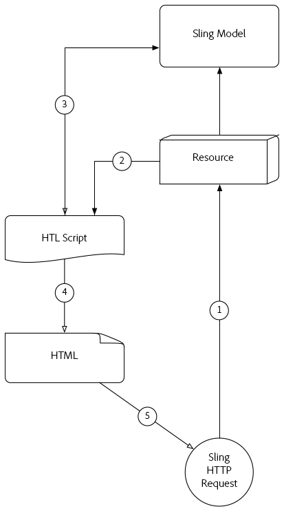

# Comprender [!DNL Sling Model Exporter]

Apache [!DNL Sling Models] 1.3.0 introduce [!DNL Sling Model Exporter], una forma elegante de exportar o serializar [!DNL Sling Model] objetos en abstracciones personalizadas. Este artículo yuxtapone el caso de uso tradicional de [!DNL Sling Models] para rellenar scripts HTL, con el fin de aprovechar el [!DNL Sling Model Exporter] marco para serializar un [!DNL Sling Model] en JSON.

## Flujo de solicitud HTTP del modelo tradicional de Sling

El caso de uso tradicional de [!DNL Sling Models] es proporcionar una abstracción empresarial para un recurso o solicitud, que proporciona scripts HTL (o, anteriormente, JSP) una interfaz para acceder a funciones comerciales.

Se están desarrollando patrones comunes [!DNL Sling Models] que representan AEM componentes o páginas y que usan la variable [!DNL Sling Model] objetos para alimentar las secuencias de comandos HTL con datos, con un resultado final de HTML que se muestra en el explorador.

### Flujo de solicitud HTTP del modelo Sling

1. [!DNL HTTP GET] La solicitud se realiza para un recurso en AEM.

   Ejemplo: `HTTP GET /content/my-resource.html`

1. Basado en el informe del recurso de solicitud `sling:resourceType`, se resuelve el script correspondiente.

1. La secuencia de comandos adapta la solicitud o el recurso al [!DNL Sling Model].

1. La secuencia de comandos utiliza la variable [!DNL Sling Model] para generar la representación del HTML.

1. El HTML generado por el script se devuelve en la respuesta HTTP.

Este patrón tradicional funciona bien en el contexto de la generación de HTML como el [!DNL Sling Model] se puede aprovechar fácilmente mediante HTL. Crear datos más estructurados como JSON o XML es un esfuerzo mucho más tedioso, ya que HTL no se presta naturalmente a la definición de estos formatos.

## [!DNL Sling Model Exporter] Flujo de solicitud HTTP

Apache [!DNL Sling Model Exporter] viene con un Sling proporcionado por Jackson Exporter que serializa automáticamente un &quot;ordinario&quot; [!DNL Sling Model] en JSON. El exportador Jackson, aunque bastante configurable, en su núcleo inspecciona el [!DNL Sling Model] y genera JSON utilizando cualquier método &quot;getter&quot; como claves JSON, y el captador devuelve valores como valores JSON.

La serialización directa de [!DNL Sling Models] les permite atender ambas solicitudes web normales con sus respuestas de HTML creadas utilizando la [!DNL Sling Model] flujo de solicitudes (consulte más arriba), pero también muestra las representaciones JSON que pueden consumir los servicios web o las aplicaciones JavaScript.

*Este flujo describe el flujo utilizando el exportador Jackson proporcionado para producir la salida JSON. El uso de exportadores personalizados sigue el mismo flujo pero con su formato de salida.*

1. La solicitud de GET HTTP se realiza para un recurso en AEM con el selector y la extensión registrados con la variable [!DNL Sling Model]Exportador de .

   Ejemplo: `HTTP GET /content/my-resource.model.json`

1. Sling resuelve el problema del recurso solicitado `sling:resourceType`, selector y extensión a un Servlet Sling Exporter generado dinámicamente, que está asignado al [!DNL Sling Model] con Exporter.
1. El Servlet Sling Exporter resuelto invoca la variable [!DNL Sling Model Exporter] contra [!DNL Sling Model] objeto adaptado de la solicitud o recurso (tal como determinan los modelos adaptables de Sling).
1. El exportador serializa el [!DNL Sling Model] basado en las anotaciones Opciones del exportador y en el modelo de Sling específico del exportador, y devuelve el resultado al servlet del exportador de Sling.
1. El Servlet de Sling Exporter devuelve la representación JSON de la variable [!DNL Sling Model] en la respuesta HTTP.

>[!NOTE]
>
>Mientras que el proyecto Apache Sling proporciona el exportador Jackson que serializa [!DNL Sling Models] para JSON, el marco de exportación también admite exportadores personalizados. Por ejemplo, un proyecto podría implementar un Exportador personalizado que serialice un [!DNL Sling Model] en XML.

>[!NOTE]
>
>No solo [!DNL Sling Model Exporter] *serialize* [!DNL Sling Models], también puede exportarlos como objetos Java. La exportación a otros objetos Java no tiene una función en el flujo de solicitudes HTTP y, por lo tanto, no aparece en el diagrama anterior.

## Materiales de apoyo

* [Apache [!DNL Sling Model Exporter] Documentación del marco](https://sling.apache.org/documentation/bundles/models.html#exporter-framework-since-130)
