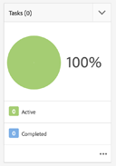

# Desarrollar proyectos en AEM

Este es un tutorial de desarrollo que ilustra cómo desarrollar para [!DNL AEM Projects].  En este tutorial crearemos una plantilla de proyecto personalizada que se pueda utilizar para crear nuevos proyectos en AEM para administrar los flujos de trabajo y las tareas de creación de contenido.

>[!VIDEO](https://video.tv.adobe.com/v/16904/?quality=12&learn=on)

*Este vídeo ofrece una breve demostración del flujo de trabajo terminado que se crea en el tutorial siguiente.*

## Introducción {#introduction}

[[!DNL AEM Projects]](https://helpx.adobe.com/experience-manager/6-5/sites/authoring/using/projects.html) es una función de AEM diseñada para facilitar la gestión y agrupación de todos los flujos de trabajo y tareas asociados con la creación de contenido como parte de una implementación de AEM Sites o Assets.

AEM Proyectos incluye varios [Plantillas de proyecto OOTB](https://helpx.adobe.com/experience-manager/6-5/sites/authoring/using/projects.html#ProjectTemplates). Al crear un nuevo proyecto, los autores pueden elegir entre estas plantillas disponibles. Las implementaciones AEM grandes con requisitos empresariales únicos desearán crear plantillas de proyecto personalizadas, adaptadas a sus necesidades. Al crear una plantilla de proyecto personalizada, los desarrolladores pueden configurar el panel del proyecto, conectar los flujos de trabajo personalizados y crear funciones comerciales adicionales para un proyecto. Echaremos un vistazo a la estructura de una plantilla de proyecto y crearemos una plantilla de ejemplo.


## Configuración

Este tutorial detalla el código necesario para crear una plantilla de proyecto personalizada. Puede descargar e instalar el [paquete adjunto](./assets/develop-aem-projects/projects-tasks-guide.ui.apps-0.0.1-SNAPSHOT.zip) a un entorno local para que lo siga junto con el tutorial. También puede acceder al proyecto completo de Maven alojado en [GitHub](https://github.com/Adobe-Marketing-Cloud/aem-guides/tree/feature/projects-tasks-guide).

* [Paquete de tutorial finalizado](./assets/develop-aem-projects/projects-tasks-guide.ui.apps-0.0.1-SNAPSHOT.zip)
* [Repositorio de código completo en GitHub](https://github.com/Adobe-Marketing-Cloud/aem-guides/tree/feature/projects-tasks-guide)

Este tutorial asume algunos conocimientos básicos de [AEM prácticas de desarrollo](https://helpx.adobe.com/es/experience-manager/6-5/sites/developing/using/the-basics.html) y cierta familiaridad con [AEM configuración del proyecto de Maven](https://helpx.adobe.com/es/experience-manager/6-5/sites/developing/using/ht-projects-maven.html). Todo el código mencionado está pensado para utilizarse como referencia y solo debe implementarse en un [instancia de AEM de desarrollo local](https://helpx.adobe.com/experience-manager/6-5/sites/deploying/using/deploy.html#GettingStarted).

## Estructura de una plantilla de proyecto

Las plantillas de proyecto deben estar bajo control de código fuente y deben estar debajo de la carpeta de la aplicación en /apps. Lo ideal es que se coloquen en una subcarpeta con la convención de nomenclatura de **&#42;/projects/templates/**&lt;my-template>. Al colocar después de esta convención de nombres, las nuevas plantillas personalizadas estarán disponibles automáticamente para los autores al crear un proyecto. La configuración de las plantillas de proyecto disponibles se establece en: **/content/projects/jcr:content** por el nodo **cq:allowedTemplates** propiedad. De forma predeterminada, se trata de una expresión regular: **/(apps|libs)/.&#42;/projects/templates/.&#42;**

El nodo raíz de una plantilla de proyecto tendrá un **jcr:primaryType** de **cq:Template**. Debajo del nodo raíz hay 3 nodos: **gadgets**, **roles** y **flujos de trabajo**. Estos nodos son todos **nt:unstructured**. Debajo del nodo raíz también puede haber un archivo thumbnail.png que se muestra al seleccionar la plantilla en el asistente Crear proyecto .

La estructura completa del nodo:

```shell
/apps/<my-app>
    + projects (nt:folder)
         + templates (nt:folder)
              + <project-template-root> (cq:Template)
                   + gadgets (nt:unstructured)
                   + roles (nt:unstructured)
                   + workflows (nt:unstructured)
```

### Raíz de plantilla del proyecto

El nodo raíz de la plantilla de proyecto será del tipo **cq:Template**. En este nodo puede configurar las propiedades **jcr:title** y **jcr:description** que se mostrará en el Asistente para crear proyectos. También hay una propiedad llamada **asistente** que señala a un formulario que rellenará las propiedades del proyecto. El valor predeterminado de: **/libs/cq/core/content/projects/wizard/steps/defaultproject.html** debería funcionar bien en la mayoría de los casos, ya que permite al usuario rellenar las propiedades básicas de Project y agregar miembros de grupo.

*&#42;Tenga en cuenta que el Asistente para crear proyectos no utiliza el servlet de POST de Sling. En su lugar, los valores se publican en un servlet personalizado:**com.adobe.cq.projects.impl.servlet.ProjectServlet**. Esto debe tenerse en cuenta al añadir campos personalizados.*

Puede encontrar un ejemplo de asistente personalizado para la plantilla de proyecto de traducción: **/libs/cq/core/content/projects/wizard/translate project/defaultproject**.

### Gadgets {#gadgets}

No hay propiedades adicionales en este nodo, pero los elementos secundarios del nodo gadgets controlan qué mosaicos de proyecto rellenan el panel del proyecto cuando se crea un nuevo proyecto. [Mosaicos del proyecto](https://helpx.adobe.com/experience-manager/6-5/sites/authoring/using/projects.html#ProjectTiles) (también conocidos como gadgets o pods) son tarjetas simples que rellenan el lugar de trabajo de un proyecto. Puede encontrar una lista completa de los mosaicos ootb en: **/libs/cq/gui/components/projects/admin/pod. **Los propietarios del proyecto siempre pueden agregar o eliminar mosaicos después de crear un proyecto.

### Funciones {#roles}

Hay 3 [funciones predeterminadas](https://helpx.adobe.com/experience-manager/6-5/sites/authoring/using/projects.html#UserRolesinaProject) para cada proyecto: **Observadores**, **Editores** y **Propietarios**. Al agregar nodos secundarios debajo del nodo de funciones, puede agregar funciones de proyecto específicas del negocio adicionales para la plantilla. A continuación, puede vincular estas funciones a flujos de trabajo específicos asociados al proyecto.

### Flujos de trabajo {#workflows}

Una de las razones más atractivas para crear una plantilla de proyecto personalizada es que le permite configurar los flujos de trabajo disponibles para usar con el proyecto. Pueden utilizar flujos de trabajo OOTB o flujos de trabajo personalizados. Debajo de la variable **flujos de trabajo** nodo ahí necesita ser un **modelos** nodo (también `nt:unstructured`) y los nodos secundarios situados debajo especifican los modelos de flujo de trabajo disponibles. La propiedad **modelId **apunta al modelo de flujo de trabajo en /etc/workflow y la propiedad **asistente** apunta al cuadro de diálogo utilizado al iniciar el flujo de trabajo. Una gran ventaja de Proyectos es la capacidad de agregar un cuadro de diálogo personalizado (asistente) para capturar metadatos específicos de la empresa al principio del flujo de trabajo que pueden impulsar más acciones dentro del flujo de trabajo.

```shell
<projects-template-root> (cq:Template)
    + workflows (nt:unstructured)
         + models (nt:unstructured)
              + <workflow-model> (nt:unstructured)
                   - modelId = points to the workflow model
                   - wizard = dialog used to start the workflow
```

## Creación de una plantilla de proyecto {#creating-project-template}

Como principalmente copiaremos/configuraremos nodos, utilizaremos CRXDE Lite. En la instancia de AEM local, abra [CRXDE Lite](http://localhost:4502/crx/de/index.jsp).

1. Comience creando una nueva carpeta debajo de `/apps/&lt;your-app-folder&gt;` named `projects`. Cree otra carpeta debajo de ese nombre `templates`.

   ```shell
   /apps/aem-guides/projects-tasks/
                       + projects (nt:folder)
                                + templates (nt:folder)
   ```

1. Para facilitar las cosas, iniciaremos nuestra plantilla personalizada desde la plantilla de proyecto simple existente.

   1. Copiar y pegar el nodo **/libs/cq/core/content/projects/templates/default** debajo del *plantillas* carpeta creada en el paso 1.

   ```shell
   /apps/aem-guides/projects-tasks/
                + templates (nt:folder)
                     + default (cq:Template)
   ```

1. Ahora debería tener una ruta como **/apps/aem-guides/projects-tasks/projects/templates/authoring-project**.

   1. Edite el **jcr:title** y **jcr:description** propiedades del nodo author-project a valores de título y descripción personalizados.

      1. Deje el **asistente** que señala a las propiedades predeterminadas de Project.

   ```shell
   /apps/aem-guides/projects-tasks/projects/
            + templates (nt:folder)
                 + authoring-project (cq:Template)
                      - jcr:title = "Authoring Project"
                      - jcr:description = "A project to manage approval and publish process for AEM Sites or Assets"
                      - wizard = "/libs/cq/core/content/projects/wizard/steps/defaultproject.html"
   ```

1. Para esta plantilla de proyecto queremos utilizar Tareas.
   1. Agregar una nueva **nt:unstructured** nodo debajo de authoring-project/gadgets llamado **tasks**.
   1. Agregar propiedades de cadena al nodo de tareas para **cardWeight** = &quot;100&quot;, **jcr:title**=&quot;Tareas&quot; y **sling:resourceType**=&quot;cq/gui/components/projects/admin/pod/taskpod&quot;.

   Ahora, la variable [mosaico Tareas](https://experienceleague.adobe.com/docs/#Tasks) se mostrará de forma predeterminada cuando se cree un nuevo proyecto.

   ```shell
   ../projects/templates/authoring-project
       + gadgets (nt:unstructured)
            + team (nt:unstructured)
            + asset (nt:unstructured)
            + work (nt:unstructured)
            + experiences (nt:unstructured)
            + projectinfo (nt:unstructured)
            ..
            + tasks (nt:unstructured)
                 - cardWeight = "100"
                 - jcr:title = "Tasks"
                 - sling:resourceType = "cq/gui/components/projects/admin/pod/taskpod"
   ```

1. Añadiremos una función de aprobador personalizada a nuestra plantilla de proyecto.

   1. Debajo del nodo plantilla de proyecto (authoring-project) agregue una nueva **nt:unstructured** nodo etiquetado **roles**.
   1. Agregue otro **nt:unstructured** nodo etiquetado aprobadores como secundario del nodo roles .
   1. Agregar propiedades de cadena **jcr:title** = &quot;**Aprobadores**&quot;, **roleclass** =&quot;**propietario**&quot;, **roleid**=&quot;**aprobadores**&quot;.
      1. El nombre del nodo aprobadores, así como jcr:title y roleid pueden ser cualquier valor de cadena (siempre que roleid sea único).
      1. **roleclass** gobierna los permisos aplicados a esa función en función del [3 roles de OOTB](https://docs.adobe.com/docs/en/aem/6-3/author/projects.html#User Funciones en un proyecto): **propietario**, **editor** y **observador**.
      1. En general, si la función personalizada es más una función de gestión, entonces la categoría puede ser **propietario;** si se trata de una función de creación más específica, como fotógrafo o Designer, entonces **editor** la clase debería ser suficiente. La gran diferencia entre **propietario** y **editor** es que los propietarios del proyecto pueden actualizar las propiedades del proyecto y agregar nuevos usuarios al proyecto.

   ```shell
   ../projects/templates/authoring-project
       + gadgets (nt:unstructured)
       + roles (nt:unstructured)
           + approvers (nt:unstructured)
                - jcr:title = "Approvers"
                - roleclass = "owner"
                - roleid = "approver"
   ```

1. Al copiar la plantilla Proyecto simple , se configurarán 4 flujos de trabajo OOTB. Cada nodo debajo de flujos de trabajo o modelos apunta a un flujo de trabajo específico y a un asistente de diálogo de inicio para ese flujo de trabajo. Más adelante en este tutorial, se creará un flujo de trabajo personalizado para este proyecto. Por ahora, elimine los nodos debajo del flujo de trabajo o los modelos:

   ```shell
   ../projects/templates/authoring-project
       + gadgets (nt:unstructured)
       + roles (nt:unstructured)
       + workflows (nt:unstructured)
            + models (nt:unstructured)
               - (remove ootb models)
   ```

1. Para facilitar a los autores de contenido la identificación de la plantilla de proyecto, puede agregar una miniatura personalizada. El tamaño recomendado sería de 319 x 319 píxeles.
   1. En CRXDE Lite, cree un nuevo archivo como un elemento del mismo nivel de gadgets, funciones y nodos de flujos de trabajo asignados **thumbnail.png**.
   1. Guarde y, a continuación, vaya a la `jcr:content` y haga doble clic en el botón `jcr:data` (evite hacer clic en &quot;ver&quot;).
      1. Esto le pedirá que edite `jcr:data` y puede cargar una miniatura personalizada.

   ```shell
   ../projects/templates/authoring-project
       + gadgets (nt:unstructured)
       + roles (nt:unstructured)
       + workflows (nt:unstructured)
       + thumbnail.png (nt:file)
   ```

Representación XML finalizada de la plantilla de proyecto:

```xml
<?xml version="1.0" encoding="UTF-8"?>
<jcr:root xmlns:sling="http://sling.apache.org/jcr/sling/1.0" xmlns:cq="http://www.day.com/jcr/cq/1.0" xmlns:jcr="http://www.jcp.org/jcr/1.0" xmlns:nt="http://www.jcp.org/jcr/nt/1.0"
    jcr:description="A project to manage approval and publish process for AEM Sites or Assets"
    jcr:primaryType="cq:Template"
    jcr:title="Authoring Project"
    ranking="{Long}1"
    wizard="/libs/cq/core/content/projects/wizard/steps/defaultproject.html">
    <jcr:content
        jcr:primaryType="nt:unstructured"
        detailsHref="/projects/details.html"/>
    <gadgets jcr:primaryType="nt:unstructured">
        <team
            jcr:primaryType="nt:unstructured"
            jcr:title="Team"
            sling:resourceType="cq/gui/components/projects/admin/pod/teampod"
            cardWeight="60"/>
        <tasks
            jcr:primaryType="nt:unstructured"
            jcr:title="Tasks"
            sling:resourceType="cq/gui/components/projects/admin/pod/taskpod"
            cardWeight="100"/>
        <work
            jcr:primaryType="nt:unstructured"
            jcr:title="Workflows"
            sling:resourceType="cq/gui/components/projects/admin/pod/workpod"
            cardWeight="80"/>
        <experiences
            jcr:primaryType="nt:unstructured"
            jcr:title="Experiences"
            sling:resourceType="cq/gui/components/projects/admin/pod/channelpod"
            cardWeight="90"/>
        <projectinfo
            jcr:primaryType="nt:unstructured"
            jcr:title="Project Info"
            sling:resourceType="cq/gui/components/projects/admin/pod/projectinfopod"
            cardWeight="100"/>
    </gadgets>
    <roles jcr:primaryType="nt:unstructured">
        <approvers
            jcr:primaryType="nt:unstructured"
            jcr:title="Approvers"
            roleclass="owner"
            roleid="approvers"/>
    </roles>
    <workflows
        jcr:primaryType="nt:unstructured"
        tags="[]">
        <models jcr:primaryType="nt:unstructured">
        </models>
    </workflows>
</jcr:root>
```

## Prueba de la plantilla de proyecto personalizada

Ahora podemos probar nuestra plantilla de proyecto creando un nuevo proyecto.

1. Debería ver la plantilla personalizada como una de las opciones para la creación del proyecto.

   

1. Después de seleccionar la plantilla personalizada, haga clic en &quot;Siguiente&quot; y observe que al rellenar Miembros del proyecto puede agregarlos como una función Aprobador .

   

1. Haga clic en &quot;Crear&quot; para terminar de crear el proyecto basado en la plantilla personalizada. Verá en el panel del proyecto que el mosaico Tareas y los demás mosaicos configurados en gadgets aparecen automáticamente.

   


## ¿Por qué el flujo de trabajo?

Tradicionalmente, AEM flujos de trabajo centrados en un proceso de aprobación han utilizado los pasos del flujo de trabajo Participante. AEM Bandeja de entrada incluye detalles sobre Tareas y Flujo de trabajo, así como una integración mejorada con Proyectos AEM. Estas funciones hacen que el uso de los pasos del proceso Crear tarea de proyectos sea una opción más atractiva.

### ¿Por qué las tareas?

El uso de un paso de creación de tareas sobre los pasos de participante tradicionales ofrece un par de ventajas:

* **Fecha de inicio y de vencimiento** - facilita a los autores la gestión de su tiempo, la nueva función Calendario hace uso de estas fechas.
* **Prioridad** - las prioridades integradas de Bajo, Normal y Alto permiten a los autores priorizar el trabajo
* **Comentarios enlazados** - a medida que los autores trabajan en una tarea, tienen la capacidad de dejar comentarios y aumentar la colaboración
* **Visibilidad** - Los mosaicos de tareas y las vistas con Proyectos permiten a los administradores ver cómo se está invirtiendo el tiempo
* **Integración de proyectos** - Las tareas ya están integradas con las funciones y los paneles del proyecto

Al igual que los pasos del participante, las tareas se pueden asignar y enrutar dinámicamente. Los metadatos de tareas como Título, Prioridad también se pueden definir dinámicamente en función de acciones anteriores, como se verá en el siguiente tutorial.

Aunque las tareas tienen algunas ventajas con respecto a los pasos de los participantes, conllevan gastos adicionales y no son tan útiles fuera de un proyecto. Además, todo el comportamiento dinámico de Tasks debe codificarse mediante secuencias de comandos ecma que tengan sus propias limitaciones.

## Requisitos de caso de uso de muestra {#goals-tutorial}


El diagrama anterior describe los requisitos de alto nivel para nuestro flujo de trabajo de aprobación de muestras.

El primer paso será crear una tarea para finalizar la edición de un fragmento de contenido. Permitiremos que el iniciador del flujo de trabajo elija el usuario asignado de esta primera tarea.

Una vez finalizada la primera tarea, el usuario asignado tendrá tres opciones para enrutar el flujo de trabajo:

**Normal **- el enrutamiento normal crea una tarea asignada al grupo Aprobador del proyecto para revisarla y aprobarla. La prioridad de la tarea es Normal y la fecha de vencimiento es de 5 días a partir de la fecha de creación.

**Rush** - el enrutamiento de carrera también crea una tarea asignada al grupo Aprobador del proyecto. La prioridad de la tarea es Alta y la fecha de vencimiento es solo 1 día.

**Omitir** : en este flujo de trabajo de muestra, el participante inicial tiene la opción de omitir el grupo de aprobación. (sí, esto podría ser contrario al objetivo de un flujo de trabajo &quot;Aprobación&quot;, pero nos permite ilustrar capacidades de enrutamiento adicionales)

El grupo de aprobadores puede aprobar el contenido o enviarlo de nuevo al usuario asignado inicial para que lo vuelva a trabajar. En el caso de que se devuelva para que se vuelva a trabajar, se crea una nueva tarea con la etiqueta &quot;Enviado de nuevo para que se vuelva a trabajar&quot;.

El último paso del flujo de trabajo utiliza el paso de proceso Activar página/recurso y replica la carga útil.

## Creación del modelo de flujo de trabajo

1. En el menú Inicio de AEM, vaya a Herramientas -> Flujo de trabajo -> Modelos. Haga clic en &quot;Crear&quot; en la esquina superior derecha para crear un nuevo modelo de flujo de trabajo.

   Asigne un título al nuevo modelo: &quot;Flujo de trabajo de aprobación de contenido&quot; y un nombre de URL: &quot;content-approval-workflow&quot;.

   

   Para obtener más información relacionada con [creación de flujos de trabajo leer aquí](https://helpx.adobe.com/experience-manager/6-5/sites/developing/using/workflows-models.html).

1. Como práctica recomendada, los flujos de trabajo personalizados deben agruparse en su propia carpeta debajo de /etc/workflow/models. En CRXDE Lite, cree un **&#39;nt:folder&#39;** debajo de /etc/workflow/models llamados **&quot;aem-guides&quot;**. Añadir una subcarpeta garantiza que los flujos de trabajo personalizados no se sobrescriban accidentalmente durante las actualizaciones o instalaciones del Service Pack.

   &#42;Tenga en cuenta que es importante no colocar nunca la carpeta o los flujos de trabajo personalizados debajo de subcarpetas ootb como /etc/workflow/models/dam o /etc/workflow/models/projects, ya que todas las subcarpetas también se pueden sobrescribir mediante actualizaciones o service packs.

   

   Ubicación del modelo de flujo de trabajo en 6.3

   >[!NOTE]
   >
   >Si se utiliza AEM 6.4+, la ubicación del flujo de trabajo ha cambiado. Consulte [aquí para más detalles.](https://helpx.adobe.com/experience-manager/6-5/sites/developing/using/workflows-best-practices.html#LocationsWorkflowModels)

   Si se utiliza AEM 6.4 o posterior, el modelo de flujo de trabajo se creará en `/conf/global/settings/workflow/models`. Repita los pasos anteriores con el directorio /conf y añada una subcarpeta llamada `aem-guides` y mueva el `content-approval-workflow` debajo.

   
Ubicación del modelo de flujo de trabajo en 6.4+

1. La introducción de AEM 6.3 es la capacidad de añadir etapas de flujo de trabajo a un flujo de trabajo determinado. Los pasos aparecerán para el usuario desde la bandeja de entrada en la pestaña Información del flujo de trabajo . Muestra al usuario la fase actual del flujo de trabajo, así como las etapas anteriores y posteriores al flujo de trabajo.

   Para configurar los escenarios, abra el cuadro de diálogo Propiedades de página desde la barra de tareas. La cuarta pestaña se denomina &quot;Etapas&quot;. Añada los siguientes valores para configurar las tres etapas de este flujo de trabajo:

   1. Editar contenido
   1. Aprobación
   1. Publicación

   

   Configure las etapas del flujo de trabajo desde el cuadro de diálogo Propiedades de página.

   

   La barra de progreso del flujo de trabajo tal como se ve desde la bandeja de entrada de AEM.

   Si lo desea, puede cargar un **Imagen** a las Propiedades de página que se utilizarán como la miniatura del flujo de trabajo cuando los usuarios lo seleccionen. Las dimensiones de la imagen deben ser de 319 x 319 píxeles. Adición de un **Descripción** a Propiedades de página también se mostrará cuando un usuario vaya a seleccionar el flujo de trabajo.

1. El proceso de flujo de trabajo Crear tarea de proyecto está diseñado para crear una tarea como paso en el flujo de trabajo. Solo después de completar la tarea avanzará el flujo de trabajo. Un aspecto importante del paso Crear tarea de proyecto es que puede leer los valores de metadatos del flujo de trabajo y utilizarlos para crear la tarea de forma dinámica.

   Primero elimine la etapa de participante que se crea de forma predeterminada. En la barra de tareas del menú de componentes, expanda el **&quot;Proyectos&quot;** y arrastre y suelte el **&quot;Crear tarea de proyecto&quot;** en el modelo.

   Haga doble clic en el paso &quot;Crear tarea de proyecto&quot; para abrir el cuadro de diálogo del flujo de trabajo. Configure las siguientes propiedades:

   Esta pestaña es común para todos los pasos del proceso del flujo de trabajo y estableceremos el Título y la Descripción (estos no serán visibles para el usuario final). La propiedad importante que estableceremos es el paso de flujo de trabajo a **&quot;Editar contenido&quot;** en el menú desplegable.

   ```shell
   Common Tab
   -----------------
       Title = "Start Task Creation"
       Description = "This the first task in the Workflow"
       Workflow Stage = "Edit Content"
   ```

   El proceso de flujo de trabajo Crear tarea de proyecto está diseñado para crear una tarea como paso en el flujo de trabajo. La pestaña Task permite establecer todos los valores de la tarea. En nuestro caso, queremos que el usuario asignado sea dinámico, por lo que lo dejaremos en blanco. El resto de los valores de propiedad:

   ```shell
   Task Tab
   -----------------
       Name* = "Edit Content"
       Task Priority = "Medium"
       Description = "Edit the content and finalize for approval. Once finished submit for approval."
       Due In - Days = "2"
   ```

   La pestaña routing es un cuadro de diálogo opcional que puede especificar acciones disponibles para el usuario que completa la tarea. Estas acciones son solo valores de cadena y se guardan en los metadatos del flujo de trabajo. Estos valores se pueden leer mediante secuencias de comandos o pasos de proceso más adelante en el flujo de trabajo para &quot;enrutar&quot; dinámicamente el flujo de trabajo. En función de la variable [objetivos de flujo de trabajo](#goals-tutorial) agregaremos tres acciones a esta pestaña:

   ```shell
   Routing Tab
   -----------------
       Actions =
           "Normal Approval"
           "Rush Approval"
           "Bypass Approval"
   ```

   Esta pestaña nos permite configurar una secuencia de comandos de tarea previa a la creación en la que podemos decidir mediante programación varios valores de la tarea antes de crearla. Tenemos la opción de apuntar el script a un archivo externo o incrustar un script corto directamente en el cuadro de diálogo. En nuestro caso, apuntaremos el Script de tarea de precreación a un archivo externo. En el paso 5 crearemos ese script.

   ```shell
   Advanced Settings Tab
   -----------------
      Pre-Create Task Script = "/apps/aem-guides/projects/scripts/start-task-config.ecma"
   ```

1. En el paso anterior hemos hecho referencia a un script de tarea de precreación. Ahora crearemos esa secuencia de comandos en la que estableceremos el usuario asignado de la tarea en función del valor de un valor de metadatos de flujo de trabajo &quot;**usuario asignado**&quot;. La variable **&quot;cesionario&quot;** se establecerá cuando se inicie el flujo de trabajo. También leeremos los metadatos del flujo de trabajo para elegir dinámicamente la prioridad de la tarea leyendo el &quot;**taskPriority&quot;** de los metadatos del flujo de trabajo, así como el **&quot;taskDueDate&quot; **para establecer dinámicamente cuando se debe realizar la primera tarea.

   Con fines organizativos, hemos creado una carpeta debajo de la carpeta de la aplicación para guardar todos los scripts relacionados con el proyecto: **/apps/aem-guides/projects-tasks/projects/scripts**. Cree un nuevo archivo debajo de esta carpeta con el nombre **&quot;start-task-config.ecma&quot;**. &#42;Tenga en cuenta que la ruta al archivo start-task-config.ecma coincide con la ruta establecida en la ficha Configuración avanzada del paso 4.

   Añada lo siguiente como contenido del archivo :

   ```
   // start-task-config.ecma
   // Populate the task using values stored as workflow metadata originally posted by the start workflow wizard
   
   // set the assignee based on start workflow wizard
   var assignee = workflowData.getMetaDataMap().get("assignee", Packages.java.lang.String);
   task.setCurrentAssignee(assignee);
   
   //Set the due date for the initial task based on start workflow wizard
   var dueDate = workflowData.getMetaDataMap().get("taskDueDate", Packages.java.util.Date);
   if (dueDate != null) {
       task.setProperty("taskDueDate", dueDate);
   }
   
   //Set the priority based on start workflow wizard
   var taskPriority = workflowData.getMetaDataMap().get("taskPriority", "Medium");
   task.setProperty("taskPriority", taskPriority);
   ```

1. Vuelva al flujo de trabajo de aprobación de contenido. Arrastrar y soltar el **División OR** componente (que se encuentra en la barra de tareas dentro de la categoría &quot;Flujo de trabajo&quot;) debajo de **Iniciar tarea** Paso. En el cuadro de diálogo común, seleccione el botón de opción para 3 ramas. La división OR leerá el valor de los metadatos del flujo de trabajo **&quot;lastTaskAction&quot;** para determinar la ruta del flujo de trabajo. La variable **&quot;lastTaskAction&quot;** se establecerá en uno de los valores de la ficha Enrutamiento configurada en el paso 4. Para cada una de las fichas Rama, rellene el **Secuencia de comandos** área de texto con los siguientes valores:

   ```
   function check() {
   var lastAction = workflowData.getMetaDataMap().get("lastTaskAction","");
   
   if(lastAction == "Normal Approval") {
       return true;
   }
   
   return false;
   }
   ```

   ```
   function check() {
   var lastAction = workflowData.getMetaDataMap().get("lastTaskAction","");
   
   if(lastAction == "Rush Approval") {
       return true;
   }
   
   return false;
   }
   ```

   ```
   function check() {
   var lastAction = workflowData.getMetaDataMap().get("lastTaskAction","");
   
   if(lastAction == "Bypass Approval") {
       return true;
   }
   
   return false;
   }
   ```

   &#42;Tenga en cuenta que estamos haciendo una coincidencia de cadena directa para determinar la ruta, por lo que es importante que los valores establecidos en las secuencias de comandos de rama coincidan con los valores de ruta establecidos en el paso 4.

1. Arrastrar y soltar otro &quot;**Crear tarea de proyecto**&quot; pase al modelo a la izquierda (Rama 1) debajo de la división OR. Complete el cuadro de diálogo con las siguientes propiedades:

   ```
   Common Tab
   -----------------
       Title = "Approval Task Creation"
       Description = "Create a an approval task for Project Approvers. Priority is Medium."
       Workflow Stage = "Approval"
   
   Task Tab
   ------------
       Name* = "Approve Content for Publish"
       Task Priority = "Medium"
       Description = "Approve this content for publication."
       Days = "5"
   
   Routing Tab - Actions
   ----------------------------
       "Approve and Publish"
       "Send Back for Revision"
   ```

   Dado que esta es la ruta de aprobación normal, la prioridad de la tarea se establece en Media. Además, damos al grupo Aprobadores 5 días para completar la tarea. El usuario asignado se deja en blanco en la ficha Tarea, ya que lo asignaremos de forma dinámica en la ficha Configuración avanzada . Asignamos al grupo Aprobadores dos rutas posibles al completar esta tarea: **&quot;Aprobar y publicar&quot;** si aprueban el contenido y puede publicarse y **&quot;Enviar para revisión&quot;** si hay problemas que el editor original debe corregir. El aprobador puede dejar comentarios que el editor original verá si se le devuelve el flujo de trabajo.

Anteriormente, en este tutorial, creamos una plantilla de proyecto que incluía una función de aprobadores. Cada vez que se crea un nuevo proyecto a partir de esta plantilla, se crea un grupo específico para el proyecto para la función Aprobadores . Al igual que una etapa de participante, una tarea solo se puede asignar a un usuario o grupo. Queremos asignar esta tarea al grupo de proyectos que corresponda al Grupo de Aprobadores. Todos los flujos de trabajo que se inician desde un proyecto tienen metadatos que asignan las funciones del proyecto al grupo específico del proyecto.

Copie y pegue el siguiente código en la sección **Secuencia de comandos** área de texto de la pestaña **Configuración avanzada **. Este código leerá los metadatos del flujo de trabajo y asignará la tarea al grupo Aprobadores del proyecto. Si no encuentra el valor del grupo aprobadores, volverá a asignar la tarea al grupo Administradores .

```
var projectApproverGrp = workflowData.getMetaDataMap().get("project.group.approvers","administrators");

task.setCurrentAssignee(projectApproverGrp);
```

1. Arrastrar y soltar otro &quot;**Crear tarea de proyecto**&quot; pase al modelo a la rama media (Rama 2) debajo de la división OR. Complete el cuadro de diálogo con las siguientes propiedades:

   ```
   Common Tab
   -----------------
       Title = "Rush Approval Task Creation"
       Description = "Create a an approval task for Project Approvers. Priority is High."
       Workflow Stage = "Approval"
   
   Task Tab
   ------------
       Name* = "Rush Approve Content for Publish"
       Task Priority = "High"
       Description = "Rush approve this content for publication."
       Days = "1"
   
   Routing Tab - Actions
   ----------------------------
       "Approve and Publish"
       "Send Back for Revision"
   ```

   Dado que esta es la ruta Rush Approval, la prioridad de la tarea se establece en High. Además, damos al grupo Aprobadores un solo día para completar la tarea. El usuario asignado se deja en blanco en la ficha Tarea, ya que lo asignaremos de forma dinámica en la ficha Configuración avanzada .

   Podemos reutilizar el mismo fragmento de secuencia de comandos que en el paso 7 para rellenar la variable **Secuencia de comandos** área de texto en la pestaña** Configuración avanzada **. Copie y pegue el siguiente código:

   ```
   var projectApproverGrp = workflowData.getMetaDataMap().get("project.group.approvers","administrators");
   
   task.setCurrentAssignee(projectApproverGrp);
   ```

1. Arrastre y suelte un componente** Sin operación** a la rama derecha (Rama 3). El componente Sin operación no realiza ninguna acción y avanzará inmediatamente, representando el deseo del editor original de omitir el paso de aprobación. Técnicamente, podemos dejar esta rama sin ningún paso de flujo de trabajo, pero como práctica recomendada añadiremos un paso Sin operación . Esto deja claro a otros desarrolladores cuál es el propósito de la Rama 3.

   Haga doble clic en el paso del flujo de trabajo y configure el Título y la Descripción:

   ```
   Common Tab
   -----------------
       Title = "Bypass Approval"
       Description = "Placeholder step to indicate that the original editor decided to bypass the approver group."
   ```

   

   El modelo de flujo de trabajo debe tener este aspecto después de configurar las tres ramas de la división OR.

1. Dado que el grupo Aprobadores tiene la opción de enviar el flujo de trabajo de nuevo al editor original para futuras revisiones, confiaremos en la variable **Ir** paso para leer la última acción realizada y enrutar el flujo de trabajo al principio o dejar que continúe.

   Arrastre y suelte el componente Paso Ir a (que se encuentra en la barra de tareas en Flujo de trabajo) debajo de la división O donde se vuelve a unir. Haga doble clic en y configure las siguientes propiedades en el cuadro de diálogo:

   ```
   Common Tab
   ----------------
       Title = "Goto Step"
       Description = "Based on the Approver groups action route the workflow to the beginning or continue and publish the payload."
   
   Process Tab
   ---------------
       The step to go to. = "Start Task Creation"
   ```

   La última pieza que configuraremos es el Script como parte del paso de proceso Goto. El valor Script se puede incrustar mediante el cuadro de diálogo o configurar para que apunte a un archivo externo. La secuencia de comandos Goto debe contener un **function check()** y return true si el flujo de trabajo debe ir al paso especificado. Un retorno de false hace que el flujo de trabajo avance.

   Si el grupo aprobador elige la variable **&quot;Enviar para revisión&quot;** (configurado en los pasos 7 y 8), queremos que el flujo de trabajo vuelva a la **&quot;Iniciar creación de tareas&quot;** paso a paso.

   En la ficha Proceso, agregue el siguiente fragmento de código al área de texto Script:

   ```
   function check() {
   var lastAction = workflowData.getMetaDataMap().get("lastTaskAction","");
   
   if(lastAction == "Send Back for Revision") {
       return true;
   }
   
   return false;
   }
   ```

1. Para publicar la carga útil utilizaremos la ootb **Activar página/recurso** Paso de proceso. Este paso del proceso requiere poca configuración y añade la carga útil del flujo de trabajo a la cola de replicación para su activación. Añadimos el paso debajo del paso Ir a y de esta forma solo se puede acceder si el grupo Aprobador ha aprobado el contenido para su publicación o si el editor original ha elegido la ruta Omitir aprobación .

   Arrastrar y soltar el **Activar página/recurso** Paso de proceso (que se encuentra en la barra de tareas en Flujo de trabajo de WCM) debajo del paso Ir a del modelo.

   

   Aspecto del modelo de flujo de trabajo después de añadir el paso Ir a y el paso Activar página/recurso .

1. Si el grupo Aprobador devuelve el contenido para su revisión, queremos informar al editor original. Podemos conseguirlo cambiando dinámicamente las propiedades de creación de tareas. Se quitará la clave del valor de la propiedad lastActionTaken de **&quot;Enviar para revisión&quot;**. Si ese valor está presente, modificaremos el título y la descripción para indicar que esta tarea es el resultado de que el contenido se devuelve para su revisión. También actualizaremos la prioridad a **&quot;Alto&quot;** para que sea el primer elemento en el que trabaja el editor. Finalmente, estableceremos la fecha de vencimiento de la tarea en un día a partir del momento en que se devolvió el flujo de trabajo para su revisión.

   Reemplazar el inicio `start-task-config.ecma` secuencia de comandos (creada en el paso 5) con lo siguiente:

   ```
   // start-task-config.ecma
   // Populate the task using values stored as workflow metadata originally posted by the start workflow wizard
   
   // set the assignee based on start workflow wizard
   var assignee = workflowData.getMetaDataMap().get("assignee", Packages.java.lang.String);
   task.setCurrentAssignee(assignee);
   
   //Set the due date for the initial task based on start workflow wizard
   var dueDate = workflowData.getMetaDataMap().get("taskDueDate", Packages.java.util.Date);
   if (dueDate != null) {
       task.setProperty("taskDueDate", dueDate);
   }
   
   //Set the priority based on start workflow wizard
   var taskPriority = workflowData.getMetaDataMap().get("taskPriority", "Medium");
   task.setProperty("taskPriority", taskPriority);
   
   var lastAction = workflowData.getMetaDataMap().get("lastTaskAction","");
   
   //change the title and priority if the approver group sent back the content
   if(lastAction == "Send Back for Revision") {
     var taskName = "Review and Revise Content";
   
     //since the content was rejected we will set the priority to High for the revison task
     task.setProperty("taskPriority", "High"); 
   
     //set the Task name (displayed as the task title in the Inbox) 
     task.setProperty("name", taskName);
     task.setProperty("nameHierarchy", taskName);
   
     //set the due date of this task 1 day from current date
     var calDueDate = Packages.java.util.Calendar.getInstance();
     calDueDate.add(Packages.java.util.Calendar.DATE, 1);
     task.setProperty("taskDueDate", calDueDate.getTime());
   
   }
   ```

## Creación del asistente de &quot;inicio del flujo de trabajo&quot; {#start-workflow-wizard}

Al iniciar un flujo de trabajo desde un proyecto, debe especificar un asistente para iniciar el flujo de trabajo. El asistente predeterminado: `/libs/cq/core/content/projects/workflowwizards/default_workflow` permite al usuario introducir un título de flujo de trabajo, un comentario de inicio y una ruta de carga útil para que se ejecute el flujo de trabajo. También hay otros ejemplos encontrados en: `/libs/cq/core/content/projects/workflowwizards`.

La creación de un asistente personalizado puede ser muy eficaz, ya que puede recopilar información crítica antes de que se inicie el flujo de trabajo. Los datos se almacenan como parte de los metadatos del flujo de trabajo y los procesos de flujo de trabajo pueden leerlos y cambiar de forma dinámica el comportamiento en función de los valores introducidos. Se creará un asistente personalizado para asignar dinámicamente la primera tarea del flujo de trabajo en función de un valor del asistente de inicio.

1. En CRXDE-Lite crearemos una subcarpeta debajo de `/apps/aem-guides/projects-tasks/projects` carpeta denominada &quot;asistentes&quot;. Copie el asistente predeterminado desde: `/libs/cq/core/content/projects/workflowwizards/default_workflow` debajo de la carpeta de asistentes recién creada y cambie su nombre a **content-approval-start**. La ruta completa debería ser: `/apps/aem-guides/projects-tasks/projects/wizards/content-approval-start`.

   El asistente predeterminado es un asistente de dos columnas, con la primera columna que muestra el Título, la Descripción y la Miniatura del modelo de flujo de trabajo seleccionado. La segunda columna incluye los campos Título del flujo de trabajo, Comentar inicio y Ruta de carga útil. El asistente es un formulario estándar de interfaz de usuario táctil y utiliza la [Componentes de formulario de Granite UI](https://experienceleague.adobe.com/docs/) para rellenar los campos.

   

1. Se añade un campo adicional al asistente que se utiliza para establecer el usuario asignado de la primera tarea del flujo de trabajo (consulte [Creación del modelo de flujo de trabajo](#create-workflow-model): Paso 5).

   Bajo `../content-approval-start/jcr:content/items/column2/items` crear un nuevo nodo de tipo `nt:unstructured` named **&quot;assign&quot;**. Utilizaremos el componente Selector de usuario de proyectos (que se basa en la variable [Componente Selector de usuario de Granite](https://experienceleague.adobe.com/docs/)). Este campo de formulario facilita restringir la selección de usuarios y grupos a aquellos que pertenecen al proyecto actual.

   A continuación se muestra la representación XML de la variable **asignar** nodo:

   ```xml
   <assign
       granite:class="js-cq-project-user-picker"
       jcr:primaryType="nt:unstructured"
       sling:resourceType="cq/gui/components/projects/admin/userpicker"
       fieldLabel="Assign To"
       hideServiceUsers="{Boolean}true"
       impersonatesOnly="{Boolean}true"
       showOnlyProjectMembers="{Boolean}true"
       name="assignee"
       projectPath="${param.project}"
       required="{Boolean}true"/>
   ```

1. También se añade un campo de selección de prioridad que determina la prioridad de la primera tarea del flujo de trabajo (consulte [Creación del modelo de flujo de trabajo](#create-workflow-model): Paso 5).

   Bajo `/content-approval-start/jcr:content/items/column2/items` crear un nuevo nodo de tipo `nt:unstructured` named **priority**. Usaremos el [Interfaz de usuario de Granite Seleccionar componente](https://experienceleague.adobe.com/docs/experience-manager-release-information/aem-release-updates/previous-updates/aem-previous-versions.html?lang=es) para rellenar el campo de formulario.

   Debajo de la variable **priority** nodo agregaremos un **items** nodo de **nt:unstructured**. Debajo de la variable **items** agregue 3 nodos más para rellenar las opciones de selección de Alto, Medio y Bajo. Cada nodo es del tipo **nt:unstructured** y debe tener un **text** y **value** propiedad. Tanto el texto como el valor deben ser el mismo:

   1. Alta
   1. Media
   1. Baja

   Para el nodo Medio, añada una propiedad booleana adicional denominada &quot;**selected&quot;** con un valor establecido en **true**. Esto garantizará que Medio sea el valor predeterminado en el campo de selección.

   A continuación se muestra una representación XML de la estructura y las propiedades del nodo:

   ```xml
   <priority
       jcr:primaryType="nt:unstructured"
       sling:resourceType="granite/ui/components/coral/foundation/form/select"
       fieldLabel="Task Priority"
       name="taskPriority">
           <items jcr:primaryType="nt:unstructured">
               <high
                   jcr:primaryType="nt:unstructured"
                   text="High"
                   value="High"/>
               <medium
                   jcr:primaryType="nt:unstructured"
                   selected="{Boolean}true"
                   text="Medium"
                   value="Medium"/>
               <low
                   jcr:primaryType="nt:unstructured"
                   text="Low"
                   value="Low"/>
               </items>
   </priority>
   ```

1. Permitiremos que el iniciador del flujo de trabajo establezca la fecha de vencimiento de la tarea inicial. Usaremos el [Selector de fecha de la interfaz de usuario de Granite](https://experienceleague.adobe.com/docs/) campo de formulario para capturar esta entrada. También agregaremos un campo oculto con un [TypeHint](https://sling.apache.org/documentation/bundles/manipulating-content-the-slingpostservlet-servlets-post.html#typehint) para garantizar que la entrada se almacene como una propiedad de tipo Date en el JCR.

   Añadir dos **nt:unstructured** nodos con las siguientes propiedades representadas a continuación en XML:

   ```xml
   <duedate
       granite:rel="project-duedate"
       jcr:primaryType="nt:unstructured"
       sling:resourceType="granite/ui/components/coral/foundation/form/datepicker"
       displayedFormat="YYYY-MM-DD HH:mm"
       fieldLabel="Due Date"
       minDate="today"
       name="taskDueDate"
       type="datetime"/>
   <duedatetypehint
       jcr:primaryType="nt:unstructured"
       sling:resourceType="granite/ui/components/coral/foundation/form/hidden"
       name="taskDueDate@TypeHint"
       type="datetime"
       value="Calendar"/>
   ```

1. Puede ver el código completo del cuadro de diálogo del asistente de inicio [here](https://github.com/Adobe-Marketing-Cloud/aem-guides/blob/master/projects-tasks-guide/ui.apps/src/main/content/jcr_root/apps/aem-guides/projects-tasks/projects/wizards/content-approval-start/.content.xml).

## Conexión del flujo de trabajo y la plantilla del proyecto {#connecting-workflow-project}

Lo último que tenemos que hacer es garantizar que el modelo de flujo de trabajo esté disponible para su inicio dentro de uno de los proyectos. Para ello, necesitamos volver a visitar la plantilla de proyecto que creamos en la parte 1 de esta serie.

La configuración de flujo de trabajo es un área de una plantilla de proyecto que especifica los flujos de trabajo disponibles para usar con ese proyecto. La configuración también se encarga de especificar el Asistente para iniciar el flujo de trabajo al iniciar el flujo de trabajo (que hemos creado en el [pasos anteriores)](#start-workflow-wizard). La configuración de flujo de trabajo de una plantilla de proyecto está &quot;activa&quot;, lo que significa que la actualización de la configuración del flujo de trabajo afectará a los nuevos proyectos creados, así como a los proyectos existentes que utilicen la plantilla.

1. En CRXDE-Lite, vaya a la plantilla de proyecto de creación creada anteriormente en `/apps/aem-guides/projects-tasks/projects/templates/authoring-project/workflows/models`.

   Debajo del nodo de modelos, agregue un nuevo nodo denominado **contentapproval** con un tipo de nodo de **nt:unstructured**. Agregue las siguientes propiedades al nodo :

   ```xml
   <contentapproval
       jcr:primaryType="nt:unstructured"
       modelId="/etc/workflow/models/aem-guides/content-approval-workflow/jcr:content/model"
       wizard="/apps/aem-guides/projects-tasks/projects/wizards/content-approval-start.html"
   />
   ```

   >[!NOTE]
   >
   >Si se utiliza AEM 6.4, la ubicación del flujo de trabajo ha cambiado. Apunte a `modelId` a la ubicación del modelo de flujo de trabajo de tiempo de ejecución en `/var/workflow/models/aem-guides/content-approval-workflow`
   >
   >
   >Consulte [aquí para obtener más información sobre el cambio en la ubicación del flujo de trabajo.](https://helpx.adobe.com/experience-manager/6-5/sites/developing/using/workflows-best-practices.html#LocationsWorkflowModels)

   ```xml
   <contentapproval
       jcr:primaryType="nt:unstructured"
       modelId="/var/workflow/models/aem-guides/content-approval-workflow"
       wizard="/apps/aem-guides/projects-tasks/projects/wizards/content-approval-start.html"
   />
   ```

1. Una vez que el flujo de trabajo de aprobación de contenido se haya añadido a la plantilla de proyecto, debería estar disponible para iniciarse desde el mosaico de flujo de trabajo del proyecto. Adelante, inicie y reproduzca con las distintas rutas que hemos creado.

## Materiales de apoyo

* [Descargar paquete de tutoriales finalizado](./assets/develop-aem-projects/projects-tasks-guide.ui.apps-0.0.1-SNAPSHOT.zip)
* [Repositorio de código completo en GitHub](https://github.com/Adobe-Marketing-Cloud/aem-guides/tree/feature/projects-tasks-guide)
* [Documentación de AEM Proyectos](https://helpx.adobe.com/experience-manager/6-5/sites/authoring/using/projects.html)
